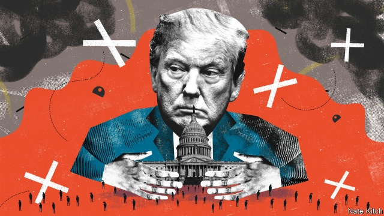
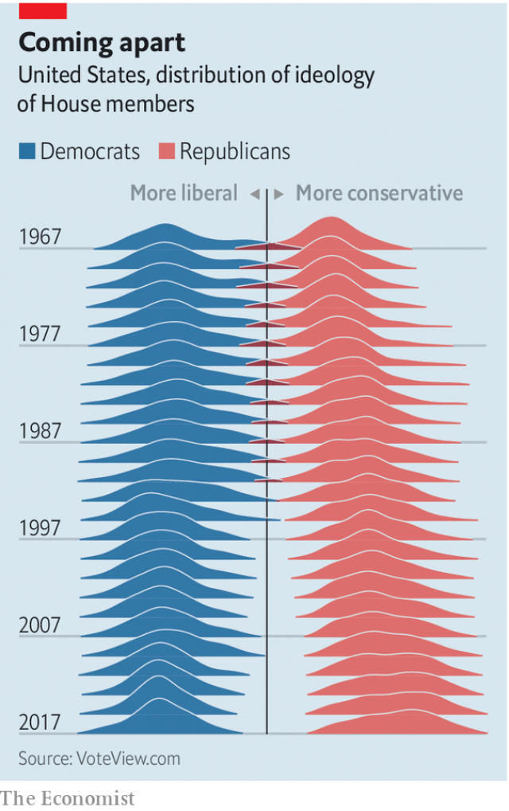

###### This town, shut down

# Before 1980 the federal government did not shut down 

##### Jimmy Carter’s attorney-general changed how America is governed 

 

> Jan 10th 2019 

 

PUBLIC-RELATIONS professionals know that the best time to release bad news is late on Friday afternoons. Hacks and their editors have one foot out of the door; nobody wants to put their weekend plans on hold to start a new story. America has recently discovered that a similar rule holds true for government shutdowns: if it happens just before Christmas, when federal workers are already on holiday and nobody is paying much attention to the news, then the waste and pain will not seep into the headlines for a couple of weeks. 

Now that quiet period has passed. Rubbish is piling up in national parks; farmers cannot get their loans processed; food-stamp programmes are running out of funds; tax refunds may be delayed; and hundreds of thousands of federal workers remain either stuck at home or forced to work without pay. To reopen the government President Donald Trump demands $5.7bn for his border wall. Nancy Pelosi, who presides over the most polarised House of Representatives in recent memory, does not want to give it to him. 

If this shutdown, the third in the past year, stretches into next week it will become the longest in American history. How did the world’s most powerful government become so dysfunctional? The roots of this shutdown lie in two places: an attorney-general’s memo written in 1980, and Mr Trump’s 2016 campaign. 

Before 1980, federal agencies often operated during funding gaps (meaning before Congress had appropriated the required money). They tried to stay lean, to avoid going too far into the red, but reasoned that Congress did not intend to close them; it merely had not yet got around to formally providing their funding. 

In 1980, however, Benjamin Civiletti, then the attorney-general, opined that the only way that agencies could avoid violating the Antideficiency Act—which forbids the government from spending money that has not been appropriated—is to cease operating until Congress funds them (the Act’s authority stems from a constitutional prohibition against the government spending public money unless the people, via their representatives, have authorised it to do so). The only exceptions concerned “the safety of human life or the protection of property”, which exempts active-duty military, who are still working and getting paid, and federal airport-security workers, who are working but not getting paid. 

Mr Civiletti’s determination made funding gaps less frequent. They were no longer technical and ignorable glitches; they became, in effect, temporary closure orders, which made them costly and embarrassing. But it also turned government funding into a hostage-taking mechanism. In late 1995, the Republican-controlled House, led by Newt Gingrich, produced a spending bill with deep cuts to social-welfare programmes that were anathema to then-president Bill Clinton. Mr Clinton refused to sign it, and the government shut down—first for six days, and then for 21. The shutdown ended when Congress and the White House hammered out a budget deal with modest spending cuts and tax hikes. In effect, Republicans caved. 

Although Mr Gingrich received most of the blame for the shutdown (and Mr Clinton was easily re-elected), it arguably pushed the president’s agenda rightward. Still, the opprobrium resulting from the government ceasing to function for nearly a month was sufficient for Mr Gingrich never to try it again. 

Another generation of Republican insurgents tried in 2013, when they insisted, as a condition of passing a budget, that the Affordable Care Act, Barack Obama’s signature achievement, be delayed or defunded. That shutdown, which lasted 16 days, also ended with Republicans surrendering without getting what they demanded. But neither did they pay a political cost; the next year they took control of the Senate. 

Like these two previous shutdowns, this one is Republican-led. Unlike the past two, however, it stems from the president trying to impose his will on Congress, rather than the inverse. Absent Mr Trump’s insistence on $5.7bn for his wall, a spending bill could easily pass both houses of Congress. “This is not a hard shutdown,” says Michael Steel, who was a spokesman for John Boehner, the House speaker during the 2013 shutdown. “Put any number of bipartisan senators in a room with a cocktail napkin and they could figure this out.” 

 

Instead of senators huddled around a cocktail napkin, America was treated to Mr Trump and Democratic congressional leaders making their cases on prime-time TV. Mr Trump called the border “a pipeline for vast quantities of illegal drugs”, though most come through ports of entry and a wall would not stop them. The number of migrants apprehended at the border rose late last year, but from record lows. Overall numbers are far below where they were a decade ago. If there is a crisis, it is in America’s creepingly slow-moving asylum system. Yet that is a far less compelling argument than Mr Trump’s assertion that foreigners are sneaking across the border to behead American citizens, and that the only way to stop them is to build a big wall. Chuck Schumer, the Democratic leader in the senate, reiterated his party’s offer: continue negotiating over border security and pass bills to reopen the other shuttered parts of the government. 

Most Senate Republicans would happily accept this deal. Some who are up for re-election in two years, such as Cory Gardner of Colorado and Susan Collins of Maine, have begun pushing for a resolution without a wall. Even John Cornyn of Texas, the majority whip until recently, backed the sort of hybrid solution—physical barriers, along with technology, drones and more personnel—that Democrats could support. But far more Republican senators face re-election in solidly Republican states next year, and they fear a primary challenge from the right more than losing to a Democrat. Hence Mitch McConnell, the Senate majority leader, vowed not to bring forward a bill that the president does not support, despite having called shutdowns “a failed policy” in 2014, when he also urged the then-Democratic Senate to set “national priorities [rather than] simply waiting on the White House to do it.” 

For his part, Mr Trump feels he holds a winning hand. Immigration hawkishness helped propel him to victory in 2016 and remains crucial to satisfying his base. Though a recent Reuters poll showed that most Americans blame him for the shutdown (perhaps because he accepted blame in a televised interview), earlier polling data suggest that may fade by 2020. During the two previous extended shutdowns, approval ratings for the incumbent presidents both fell, but they rebounded relatively quickly. Yet that pattern may not hold if this shutdown lasts months. 

Members of both parties fear that Mr Trump will reach not for Mr Schumer’s solution but a more drastic one: invoking emergency powers to circumvent Congress and build a wall using previously authorised military funds. That would set a precedent that terrifies conservative senators: what is to stop a future Democratic president from doing the same thing to deal with climate change or guns? 

It would also precipitate a genuine constitutional crisis and a fierce court battle. Perversely, that could suit Mr Trump well. He may not get his wall, but he would get to keep fighting for it, and he would still have useful enemies—judges, Democrats—to blame for it having not been built yet. 

