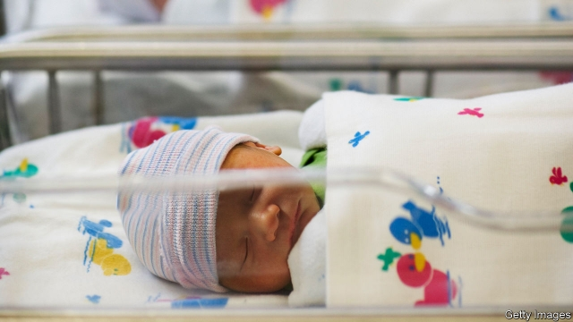
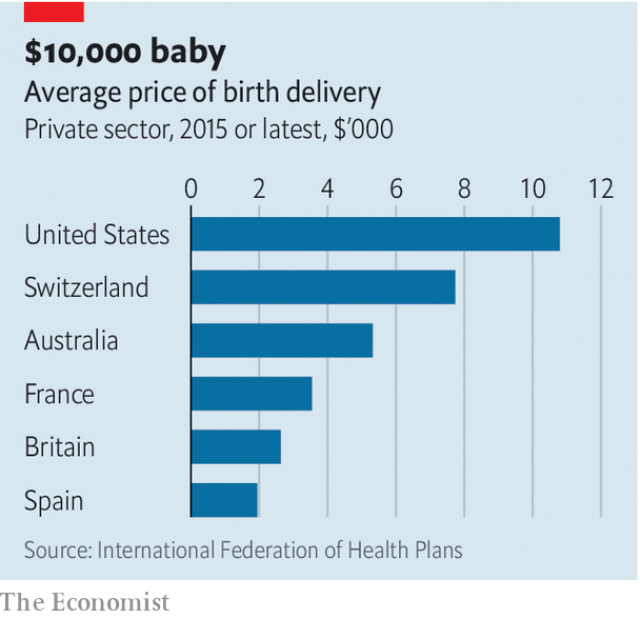

###### Shopping for a splenectomy

# Hospital prices are now public 

##### That is unlikely to push them down 

 

> Jan 10th 2019 

 

FROM THE day it became law, the Affordable Care Act, better known as Obamacare, has been a party piñata for the Republicans. They keep bashing it from all sides, trying to tear it apart. But one of its provisions was embraced and even bolstered by the Trump administration: as of January 1st hospitals are obliged to post online the standard charges for all of their services. 

The idea is, in theory, laudable. Patients, who are otherwise mostly blind as to what their care will cost until the bill arrives, would shop around for lower prices. The biggest winners at first would be the roughly 10% of Americans who do not have health insurance and the 43% covered by cheap plans that require them to pay substantial amounts towards medical bills before their insurance kicks in (known as high-deductible plans). As patients flock to competitors who charge less, hospitals would cut prices to win them back—bringing America’s exorbitant prices closer to those in other rich countries (see chart). 

 

In reality, none of this is likely to happen. The price lists that are being published are of little practical use for patients. Each private insurer negotiates discounted rates with each hospital, in contracts that usually neither side is allowed to make public. An analysis of payments for uncomplicated births in California in 2011, for example, found that discounted prices paid by insurers were, on average, 37% of hospitals’ list prices. 

Uninsured patients, who are most likely to pay the list prices, face a headscratcher: working out which of the thousands of items on the price lists, with descriptions like “ECHO TEE GUID TCAT ICAR/VESSEL STRUCTURAL INTVN”, might apply for their treatment. Even if they manage to nail down the big-ticket items, they will still be missing a major portion of the final bill, because the rates charged by physicians, radiologists and other specialists are not included in hospitals’ lists. To dispel confusion hospitals are posting, alongside their price lists, disclaimers and videos explaining that they are useless. 

The predicament of patients trying to get an idea of what something like a big operation might cost them is laid bare by a study conducted in 2016, in which researchers called 120 hospitals posing as a grand-daughter looking for information on the cash price of hip replacement for her grandmother. Only eight of the hospitals were able to provide a full price, inclusive of physician charges; 53 were unable to provide any estimate. 

Nearby hospitals often have widely different list prices, even for things as standard as an X-ray or an aspirin tablet. Might some hospitals lower prices when they see what their competitors are charging? That, too, seems unlikely. Most states already require hospitals to publish some of their prices. When prices become public, they may go up, not down, says Renee Hsia of the University of California in San Francisco. Antitrust textbooks teach that transparency can push up prices because firms know that discounting might trigger an immediate price war rather than boost their market share. 

America’s health care market poses particular challenges. Hospitals set prices using various multipliers and formulas that are often outdated and not linked to costs or quality—a process that the late Uwe Reinhardt, an economist at Princeton University, once described as “chaos behind a veil of secrecy”. Studies of people in high-deductible plans show that when they have access to prices they reduce their use of services but do not pay less for them. Patients usually go for tests to wherever their doctors refer them. 

The fallacy of pinning hopes on policies such as the new price-transparency rule is that patients in America are viewed as consumers who can easily shop around, rather than people who are unwell and under duress, says Dr Hsia. But knowing in advance how much their care will cost would be a step forward. 

