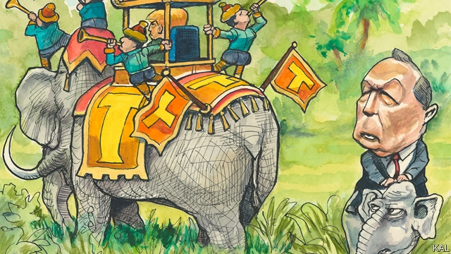

###### Lexington

# John Kasich: conservative orphan 

##### Ohio’s departing governor is a credit to his party and Donald Trump’s biggest critic 

 

> Jan 10th 2019 

 

“YOU GOT 20 minutes,” growled John Kasich. The governor of Ohio had just chaired his last cabinet meeting and was impatient to leave the office which he has occupied for the past eight years and will vacate permanently this week. Several hours later, after an extended discussion of his state, America, why he lost in 2016 to Donald Trump, the damage done by his presidency, politics on the right, golf, faith and Mr Kasich’s electric car (“It’s like driving a space rocket!”), Lexington bade him farewell at a party for his security detail on the other side of Columbus. He had reached it via the governor’s office, car, house and garage, with pauses to chat with Mr Kasich’s wife and teenage twin daughters (“C’mere girls, I brought you a Brit...”) along the way. 

The governor, who is Mr Trump’s biggest Republican critic, does not stand on ceremony. He kicks up a conversational firestorm, racing from topic to topic, showing the same fervent interest in a controversial dam project as in his home suburb’s connection to the Underground Railroad and the future of the West. Unlike many politicians, he is also able to surprise. Bullish and irascible, he is most interested in his own views, trusts his gut where the evidence fails him, and sweeps counter-arguments aside: ignore the polls, evangelical Christians are not the solid Trump constituency many say, he insists, “and I happen to know this”. Yet he periodically backs up, as if suddenly irritated by his own certainty. “Forget that—what do you think?” “Do you think any of us really knows what we’re doing?” 

A more original politician than he appeared to be in 2016, when his upbeat Reaganite message found few takers, Mr Kasich’s governing record reveals the same mix of intensity, single-mindedness and sporadic eccentricity. Inheriting a state in economic crisis, including an $8bn budget shortfall, he slashed spending, privatised services and accepted protest as proof of concept. Doing the right thing, no matter the political cost, is one of his mantras. That usually means the conservative thing. Fairly solidly pro-life and pro-gun, Mr Kasich is not the squishy centrist he is sometimes portrayed as—except when he is. When it comes to helping the poor, incarcerated and addicted, he has long argued that the end justifies the means. His decision to expand Medicaid despite opposition from Republicans illustrated that. Since the election, he has also been thumbing it to Republican orthodoxy more often. 

He signed off on modest gun and abortion controls and campaigned on health care alongside his Democratic counterpart from Colorado, John Hickenlooper. Ideological fixity on the right, he says, mainly reflects a lack of new ideas. “That’s where my party fell short. Maybe there is something in the conservative DNA that makes it easier to be against something than for it.” He believes Mr Trump’s success was based on filling the void. It follows that he considers Republicans to be open to a course correction now. “People are going to get serious about what they want to see in the country,” he says. “So do I think someone like me could stand up and change the whole debate? I do.” Mr Kasich has suggested he will run against Mr Trump in 2020, ideally as a Republican, or else as an independent, if there is enough money and other encouragement available to suggest he can win. 

As things stand, there won’t be. His rather self-serving explanation of why he lost in 2016 is a clue to that. Mr Kasich says he was drowned out by the media’s obsession with Mr Trump. But journalists gave him more time than most Republicans. Even after his mainstream rivals were eliminated, he raised little money, and only won his own state. As Mr Kasich acknowledges, a resentful Republican primary audience was not in the mood for his talk of bipartisan problem-solving. But it also spurned his ideas. It turned out many Republicans had long preferred Mr Trump’s talk of border walls and protectionism to Mr Kasich’s support for immigration and trade. The surveys he disdains suggest they still do. Kasich voters tended to be Republicans hostile to Mr Trump, and are those most likely to have quit the party since his election. Mr Kasich is still popular in Ohio, but more with Democrats than Republicans. After his previous break from politics—following an 18-year spell in Congress—he worked for Fox News and Lehman Brothers. He is about as likely to return to one as the other. His party has left him. 

His record in Ohio, which had 89 cents in its rainy day fund in 2011 and now has $2.69bn, points to the cost of that. It is no coincidence that the most successful Republican governors tend to be moderates, or that they are generally found in states, such as Massachusetts, Maryland and Texas, where Republicans need independent or Democratic voters to win statewide. As the Republican Party becomes increasingly inhospitable to such figures nationally, it is not obvious how it can retain them at the state level. Either it will have to reverse course from Trumpian nationalism, which may take longer—perhaps including a couple of crushing presidential election defeats—than Mr Kasich predicts. Or else the Democrats may seize the opportunity they have been given to expand their coalition. It is not hard to imagine Mr Kasich in the same party as Mr Hickenlooper. “He thinks about things pretty much the same way I do,” Mr Kasich says. 

A third possibility is that Democrats continue marching to the left—creating an opportunity for a third-party candidate to surge through the middle. It seems unlikely; Democratic extremism is often exaggerated and independent candidates face big financial and other barriers. Mr Kasich seems nonetheless most intrigued by this prospect, and in the event of a presidential face-off between, say, Mr Trump and Senator Bernie Sanders, it would be wrong to rule it out. But he might in that case consider a word of advice. He is an innovator who in 2016 came across as rather a stick-in-the-mud. To assemble a new centrist coalition, Mr Kasich should unleash the political cross-dressing maverick that he is. 

