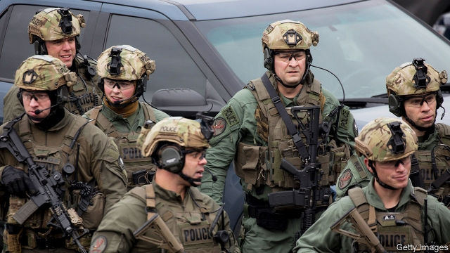

###### Mischief and policing

# Swatting could become a federal crime 

##### False reports leading to SWAT team deployments have doubled since 2011 

 

> Jan 12th 2019 

ANYONE TEMPTED to cry wolf might ponder the fate of Tyler Barriss. On January 30th a federal judge will sentence the Californian to at least 20 years in prison for dozens of hoax 911 emergency calls, including one which resulted in the police in Wichita, Kansas fatally shooting an innocent and unarmed young father. But while Mr Barriss’s mischief-making is over, at least for a spell, police SWAT (special weapons and tactics) teams, which make use of military hardware and techniques, can expect plenty more “swatting” calls, as bogus reports of violence have become known. Due to the lack of a uniform reporting category, no nationwide tally exists. But Kevin Kolbye, a former FBI swatting expert who is now assistant police chief of Arlington, Texas, reckons annual swatting incidents have climbed from roughly 400 in 2011 to more than 1,000 today. 

Part of this increase can be chalked up to smartphone apps and online services that mask a caller’s location and identity, diminishing the risk of the swatter being caught. Another factor is the popularity of streaming videogame play to an online audience. A swatter who targets a rival gamer during a streaming session can watch the victim’s reaction as his room is stormed by cops in tactical gear, weapons drawn. The voyeuristic frisson thus obtained seems to have outclassed the thrill of generating a news report of a SWAT raid on a celebrity’s home, an approach that was more common in years past. (Stars subjected to a swatting include Justin Bieber, Russell Brand, Tom Cruise, Miley Cyrus, Clint Eastwood and Paris Hilton.) 

Most swatters, then, are seeking kicks or the settling of a score. Some, however, are pursuing profit. Drug dealers sometimes swat rivals, hoping their unexpected brush with the law will end up reducing competition, says Robert Pusins, who until recently worked for the sheriff’s office in Broward County, Florida. 

The risk of violence seems to rise in the swatting of victims who have not committed a crime. In the confusion of a raid, a law-abiding citizen is more likely to reckon that his home must be under attack by thugs. Thus unnerved, he is more likely to brandish and use a weapon, which may draw police fire, Mr Kolbye says. During the response to a fake bomb threat in 2015, the police chief of Sentinel, Oklahoma was shot four times by a resident who, investigators said, was not charged because he believed the intrusion was criminal. (A ballistic vest saved the officer’s life.) 

Of late, swatters seem to have become better at making their 911 calls appear to come from near the supposed scene of the crime, says Carrie Braun, spokeswoman for the sheriff’s office in Orange County, California. But even fishy reports of violence must be treated as real—“we will always respond,” she says. All this hits taxpayers hard. The bill for a SWAT raid complete with bomb squad and paramedics can run into six figures, according to the Michigan Association of Police. 

More than a few swatters end up bragging online, an unwise move. To make prosecuting them easier, Congresswoman Katherine Clark, a Massachusetts Democrat, is pushing a bill in Congress that would make swatting a federal crime. In 2016, not long after she had introduced the initial version of the legislation, police with rifles appeared outside her house near Boston. A caller had said that a shooter was inside her home.  

