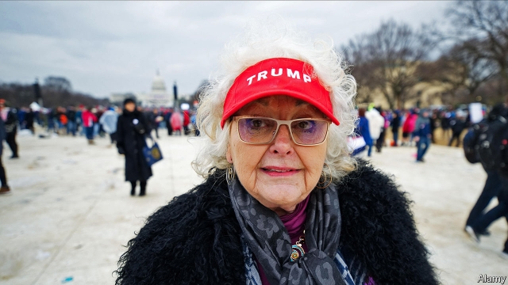
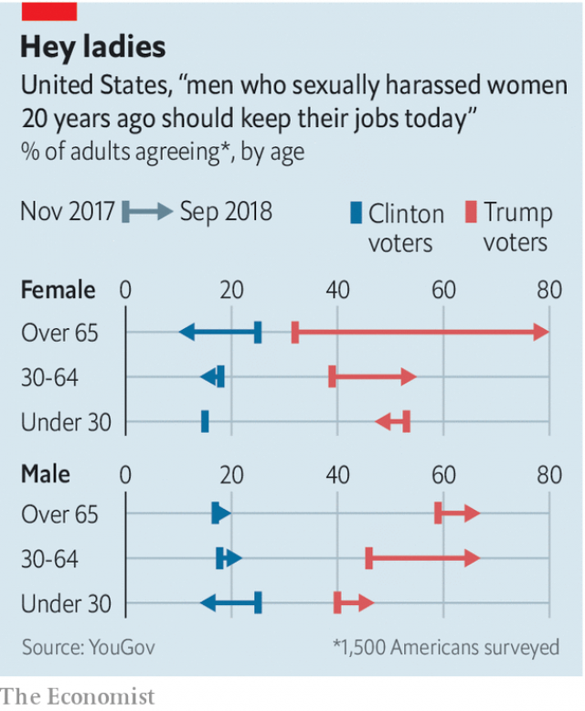

###### Sister sledging

# What group of people is most hostile to #MeToo? 

##### Republican women over the age of 65 

 

> Jan 10th 2019 

 

NO GROUP HAS swung against #MeToo more than older women who voted for Donald Trump. They have gone from barely worrying about false accusations of sexual assault, with only 8% agreeing in November 2017 that these were worse than unreported assaults, to 42% saying so, according to two polls conducted for The Economist by YouGov, a pollster. They are now the most likely group to agree that a man who harassed a woman 20 years ago should keep his job, and that a woman who complains about harassment causes more problems than she solves. 

Two things stand out. First, even though Americans on average, and Republicans in particular, have become more negative about #MeToo over the past year, the change among this particular group is spectacular (chart). Second, a generational gap now yawns between Republican women who are over 65 and those under 30, the cohort least hostile to #MeToo within the Republican Party. 

One obvious difference between the two groups is that many of the over-65s have grown-up sons. In 2018 some of them fell off their pedestals as hundreds of men were publicly named and shamed over sexual misconduct allegations. Many more feared that “some lady” from the past could, with one accusation, destroy them and their family. This lady became personified in Christine Blasey Ford, when in September 2018 she accused Brett Kavanaugh of sexual assault, threatening to derail his nomination to the Supreme Court. All this helped fuel a backlash against #MeToo, and not just among men. Many Twitter threads on #HimToo, the hashtag about false accusations, were posted by worried mothers. 

 

“We saw the split among Republican women widen around the Kavanaugh hearings. A lot of the rhetoric illustrated the generational gap,” remembers Jennifer Pierotti Lim, from Republican Women for Progress, a campaign group. “There’s a feeling amongst that generation that a little light sexual assault is no big deal. For women of our generation that’s hard to understand.” 

Carrie Lukas of the Independent Women’s Forum, a conservative advocacy group, recognises what the movement has done in encouraging people to speak out against prominent men who “people have known were problems”, but wonders whether it has gone too far. “I don’t think the mantra ‘believe all women’ is sufficient,” she says. “Men need to be able to make mistakes, and have conversations with women and not be walking on eggshells.” 

Yet the biggest split on #MeToo, as with any question pollsters ask about gender is not between genders or generations but between political affiliations, says Juliana Horowitz from the Pew Research Centre. Democrats have barely changed their views on #MeToo over the past year, even as Republicans have grown more sceptical. No split separates the generation of Nancy Pelosi and Elizabeth Warren from younger female Democrats. In fact boomer Clinton-voting women have increased their support for #MeToo over the past year. 

The partisan gender gap has already widened. In 2016 Hillary Clinton won 54% of women voters; in the 2018 mid-terms 59% of women voted for Democrats. Republicans appear unconcerned: a recent poll found that 71% of likely primary voters expressed no concern that only 13 of the party’s 200 House members are women (the lowest number in 25 years) and 60% said nothing had to be done to recruit more female candidates. 

One explanation of this partisan gap is that it reflects a difference of opinion over what true feminism is. Some conservative women resist what they see as special treatment for women as vaguely patronising. There is another explanation, too. Ms Pierotti Lim of Republican Women for Progress remembers campaigning in Wisconsin and Michigan in 2016 and being astonished by the number of older women who were afraid to even talk to her and who let their (Republican-voting) husbands fill in their ballots. 

