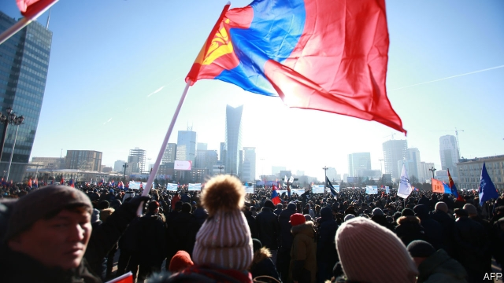

###### Piercing the fog

# Mongolians are getting angry about corruption 

##### Angry enough to protest in midwinter 

 

> Jan 17th 2019 

 

MORE THAN 20,000 Mongolians braved bone-chilling cold on January 10th to rail against their government in Sukhbaatar square in the centre of the capital. It was the second such protest in a fortnight. The demonstrators, who were allowed into the square only after being breathalysed and frisked, had many grievances, including inequality, unemployment and air pollution. But these scourges, they believe, have a common source: the plundering of the country’s wealth by corrupt and feckless political elites. 

The protesters offered only the vaguest of prescriptions. Chants and placards called for the downfall of “oligarchs”, the seizure of their offshore booty and the dissolution of the “fog” that has shrouded politics in the 29 years since Mongolia emerged from Soviet domination. The reference to fog is a clever and now widespread pun. The Mongolian acronyms for the two dominant political parties—the Mongolian People’s Party (MPP) and the Democratic Party (DP)—combine to form the word for fog, manan. 

Both parties are considered responsible for corruption, since the prime minister is from the MPP, but the president is from the DP. The Mongolian currency, the togrog, has declined 40% against the dollar since 2014. Air quality in Ulaanbaatar is horrendous, especially in winter when yurt-dwellers at the city’s edge burn dirty coal for heat. Foreign investment dropped sharply in 2016, and has yet to recover fully. This is partly because of falling prices for Mongolia’s most important exports, including copper and coal, and partly owing to an economic slowdown in neighbouring China, the main customer for them. But Mongolia’s own politicians have not helped. They have repeatedly renegotiated terms for a big mining project led by a foreign firm, stifled new projects with ill-advised taxes on exploration licences and done too little to diversify the economy. 

Most damningly, they have failed to control corruption. Miyegombyn Enkhbold, the speaker of parliament, has been accused of—and has denied—plotting to sell government positions. The protesters want him removed, but there is no legal procedure for that and he has refused to step down. 

Another scandal has angered people even more. A government programme providing cheap loans to small and medium-sized enterprises has instead granted them to businesses and people with connections to politicians. Compared with other scandals, involving mining, energy and land, the SME row is small beer, with individual loans of no more than 2bn togrog ($750,000). But several civil servants and a minister have already lost their jobs over it, and the affair has become a rallying point for disenchanted voters. 

Amid the popular discontent, politicians from other parties see an opening in the next parliamentary election, due next year. Badrakh Naidalaa, leader of the tiny National Labour Party, says the ruling class of “parasite chieftains” needs to be brought under control. “Their time is coming to an end,” he says of the two main parties. 

Nambariin Enkhbayar has a similar message. A former president, prime minister and leader of the MPP, he now heads a splinter party that likewise hopes to make gains. Widely accused of corruption himself during his time in power, he takes pride in having coined the manan pun. He describes politics as a sham in which the two big parties pretend to fight for power while splitting the spoils in back rooms. He proposes far-reaching constitutional changes that would concentrate power in the presidency. He is contemplating a run for parliament in 2020, and does not rule out a bid to return to the presidency the year after. 

All this assumes that big changes do not come sooner. More demonstrations are planned this month, and some protesters are threatening hunger strikes. Dayanjambal, an unemployed office worker with three children who holds a placard reading “Destroy Manan”, says that life is growing harder and patience is wearing thin. “Freedom to demonstrate is not real freedom. We need the freedom to make a living.” 

