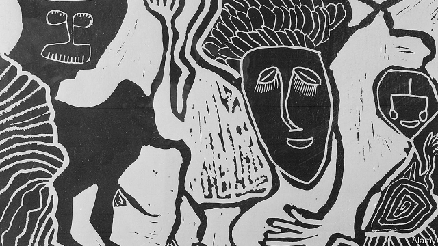

###### Fair is fowl

# Chigozie Obioma’s new novel is a triumph 

##### “An Orchestra of Minorities” is a worthy sequel to “The Fishermen” 

 

> Jan 17th 2019 

 

An Orchestra of Minorities. By Chigozie Obioma. Little Brown; 464 pages; $28 and £14.99. 

THE CHANCES that Chigozie Obioma’s second novel would match, let alone surpass, “The Fishermen”, were slim. Mr Obioma’s debut, a tale of four brothers who play truant and go fishing—and the trouble that ensues—was a hit in 2015. A stage adaptation that transferred from the Edinburgh Fringe to London last year was a sell-out. Happily, his follow-up, “An Orchestra of Minorities”, is a triumph: a wholly unsentimental epic that unspools smoothly over nearly a decade, it is set with equal success across two continents, employing myth and spirituality to create a vibrant new world. 

Chinonso is a poor chicken farmer in Umuahia, in south-eastern Nigeria. His parents are dead and he has been all but abandoned by his only sibling. One evening, having been to market to buy more birds, Chinonso sees a car stopped on one of the city’s bridges. The doors are open and the headlights on. Just beyond the vehicle, a young woman is climbing over the rails, set on leaping into the water. Chinonso stops his van and runs towards her: “No, no, don’t. Please don’t! Don’t do that.” He grabs two of his newly acquired fowls and flings them over the railing instead. “This is what will happen if somebody fall inside there. The person will die, and no one can see them again.” 

A few weeks later Ndali, the woman he saves, seeks him out. She sees that he cares deeply for his poultry and is happy with his simple life, which makes him an unusual Nigerian man. As their relationship deepens into love, she remains circumspect about her own background: she was born overseas, has travelled widely, studies pharmacy and lives in a walled compound in a family that has eight cars. When Chinonso becomes determined that they should marry, Ndali must introduce him to her parents and brother. 

There follows one of the great set-pieces of Nigerian fiction: the ritual humiliation of the humble, uneducated suitor. To try to win over Ndali’s family, Chinonso allows himself to be persuaded by a former school-friend that if he were only to get a degree abroad, all his problems would be solved. The friend tells him that he can enroll him in just such a course, in northern Cyprus. All Chinonso has to do is to sell his chicken farm and pay him €6,500 ($7,400) to cover school fees, accommodation and what the friend calls “maintainanse”. 

Mr Obioma’s narrator is an Igbo chi, a 700-year-old spirit who lives within and loves Chinonso, his “host”, but who cannot always direct him to do what is best. The story is told in hindsight, after Chinonso’s pursuit of Ndali has played out to its tragic end. The chi, and all the other spirits the reader encounters along the way—the evil agwus, the sobbing akaliogolis, “rejected by earth and heaven”, the ndiichies and the ajoonmuo, with its “three heads and torso of a vile beast”—imbue the novel with the richness of Igbo belief, transforming a tale of love and foolishness into a profound study of human frailty and the power of evil over the imagination. In an era of copycats, “An Orchestra of Minorities” is an unusual and brilliantly original book. 

