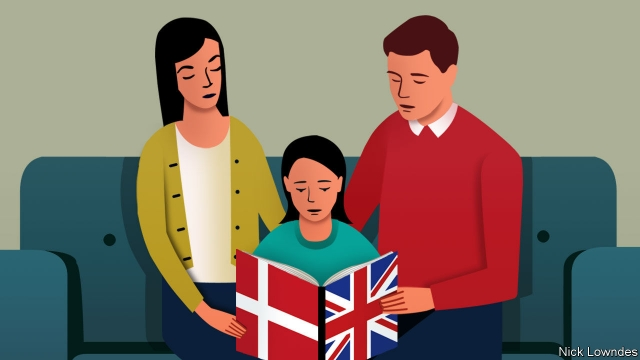

###### Johnson

# Expats often struggle to pass on their languages 

##### The trick is to engage children’s hearts as well as their minds 

 

> Jan 17th 2019 

 

“YOU UNDERSTAND grandmother when she talks to you, don’t you, darling?” The girl nods. Johnson met her—and her Danish mother and English father—at the airport, en route to Denmark. The parents were eager to discuss their experience of bringing up their daughter bilingually in London. It isn’t easy: the husband does not speak Danish, so the child hears the language only from her mother, who has come to accept that she will reply in English. 

This can be painful. Not sharing your first language with loved ones is hard. Not passing it on to your own child can be especially tough. Many expat and immigrant parents feel a sense of failure; they wring their hands and share stories on parenting forums and social media, hoping to find the secret to nurturing bilingual children successfully. 

Children are linguistic sponges, but this doesn’t mean that cursory exposure is enough. They must hear a language quite a bit to understand it—and use it often to be able to speak it comfortably. This is mental work, and a child who doesn’t have a motive to speak a language—either a need or a strong desire—will often avoid it. Children’s brains are already busy enough. 

So languages often wither and die when parents move abroad. Consider America. The foreign-born share of the population is 13.7%, and has never been lower than 4.7% (in 1970). And yet foreign-language speakers don’t accumulate: today just 25% of the population speaks another language. That’s because, typically, the first generation born in America is bilingual, and the second is monolingual—in English, the children often struggling to speak easily with their immigrant grandparents. 

In the past, governments discouraged immigrant families from keeping their languages. Teddy Roosevelt worried that America would become a“polyglot boarding-house”. These days, officials tend to be less interventionist; some even see a valuable resource in immigrants’ language abilities. Yet many factors conspire to ensure that children still lose their parents’ languages, or never learn them. 

A big one is institutional pressure. A child’s time spent with a second language is time not spent on their first. So teachers often discourage parents from speaking their languages to their children. (This is especially true if the second language lacks prestige.) Parents often reluctantly comply, worried about their offspring’s education. This is a shame; children really can master two languages or even more. Research does indeed suggest their vocabulary in each language may be somewhat smaller for a while. But other studies hint at cognitive advantages among bilinguals. They may be more adept at complex tasks, better at maintaining attention, and (at the other end of life) suffer the onset of dementia later. 

Even without those side-effects, though, a bilingual child’s connection to relatives and another culture is a good thing in itself. How to bring it about? When both parents share the heritage language, the strategy is often to speak that at home, and the national language outside. But when they have different languages, perhaps the most common approach is “one parent, one language”. François Grosjean, a linguist at the University of Neuchâtel in Switzerland, emphasises necessity. He recommends reserving occasions on which the only language that may be spoken is the one that needs support. 

Sabine Little, a German linguist at the University of Sheffield, puts the emphasis elsewhere. Making the heritage language yet another task imposed by parents can lead to rejection, she argues. She recommends letting the child forge their own emotional connection to the language. Her son gave up on German for several years before returning to it. She let him determine when they would speak it together. (He decided on the pair’s trips in her car to after-school activities, during which his father, who doesn’t speak German, would not be excluded.) They joke about his Anglo-German mash-ups and incorporate them into their lexicon. Like many youngsters, his time on YouTube is restricted—but he is allowed more if he watches in German. Ms Little suggests learning through apps and entertainment made for native speakers; the educational type smack of homework, she thinks. 

Languages are an intimate part of identity; it is wrenching to try and fail to pass them on to a child. Success may be a question of remembering that they are not just another thing to be drilled into a young mind, but a matter of the heart. 

