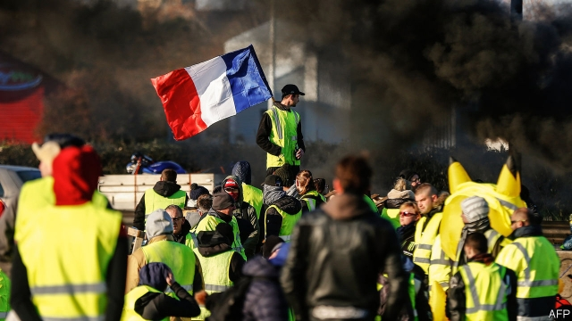

###### The big cheese

# Michel Houellebecq’s new book is eerily prescient 

##### Along with protests, it deals with sex, male angst, consumerism and hummus 

 

> Jan 17th 2019 

Sérotonine. By Michel Houellebecq. Flammarion; 352 pages; €22. 

EVERY FEW years, Michel Houellebecq takes his scalpel to France. It usually hurts, often shocks, and always causes a commotion. His previous novel, “Submission”, set against the backdrop of the election of a Muslim president and the country’s slide towards Islamism, tapped into deep French fears. It also happened to be published in 2015, on the day of the Charlie Hebdo terrorist attacks in Paris. Now Mr Houellebecq’s latest work, “Sérotonine”, is being hailed in France as visionary, because it seems to anticipate the current street protests against President Emmanuel Macron led by activists wearing gilets jaunes (yellow jackets). 

In France there is nothing quite like the arrival of a new Houellebecq novel. Still, at 62, the literary scene’s enfant terrible, he declines to give interviews to French papers or to appear on talk shows. Each novel is nonetheless a mediaevent. His raddled face graces magazine covers; Le Monde writes of the “Houellebecq effect”. Since its publication on January 4th, 800,000 copies of the new book have been sold in the French-speaking world. 

The fascination with Mr Houellebecq is partly to do with the dishevelled chain-smoking figure himself, who embodies a decadent ennui that the French admire, yet who repels them at the same time. With a taste for provocation and loathing of political correctness, he once called Islam “the stupidest religion”. He describes Donald Trump as “one of the best American presidents I’ve ever seen”. Behind the nihilism lurks a sharp self-promotion machine. Mr Houellebecq, says Mr Houellebecq, is simply “the best” writer, anywhere, alive today. 

But his uncanny ability to divine shifts in French society is also part of his appeal. In “Sérotonine”, Mr Houellebecq’s seventh novel, Florent-Claude Labrouste, an agronomist employed to write trade reports, finds his first name “ridiculous” and his life a source of disappointment and regret. Ultimately diagnosed as “dying of sorrow”, and pumped up with Captorix, a new-generation anti-depressant that encourages the production of serotonin but also suppresses libido, he decides to “disappear”. 

Labrouste returns to Normandy, where he once worked promoting Camembert and other regional cheeses. There he stumbles across the distress of local farmers, among them an old college contemporary, Aymeric. The novel’s central, and fatal, drama takes place on a junction of the A13 motorway, where French riot police confront a blockade of armed farmers and blazing agricultural vehicles, all filmed by a 24-hour news channel. The parallel with the gilets jaunes is inexact, not least because Mr Houellebecq’s modest group of rural protesters are farmers, not employees, and their grievance is with the European Union’s policy on milk quotas, not Mr Macron. The sense of provincial neglect, disarray and violence nonetheless feels eerily familiar, as does the uneasy reaction of politicians who agree on the need “to understand the distress and the anger”. 

Those hoping to pursue the parallel further, however, should know that the first two-thirds of the novel are devoted to Mr Houellebecq’s other fixations: sex, male angst, solitude, consumerism, globalisation, urban planning, and more sex. Although there are touching moments, the women who pass through Labrouste’s life, like those who feature in Mr Houellebecq’s previous work, are bleakly two-dimensional, more often than not there to serve the narrator’s (dwindling) sexual needs. One is described as “pre-feminist”. Mr Houellebecq might be called “pre-#MeToo”. 

That said, the novelist’s wit, and his skill at shifting from the quotidian to the existential, are intact. Labrouste detests Paris, “a city infested with eco-responsible bourgeois”, but ends up in a hotel room there, consoled by daytime television and hummus. His life’s possessions are the files on his Macbook: “my past weighed 1,100 grams”. Overhyped he may be, but Mr Houellebecq has once again managed to put his finger on modern French (and Western) society’s wounds, and it hurts. 

