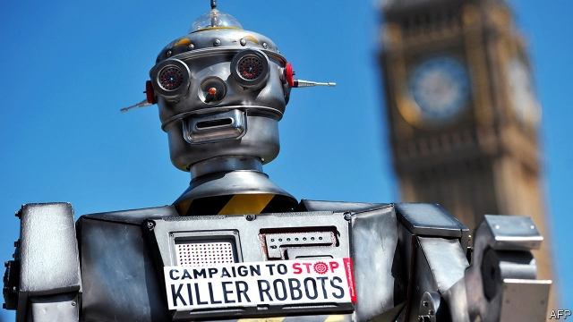
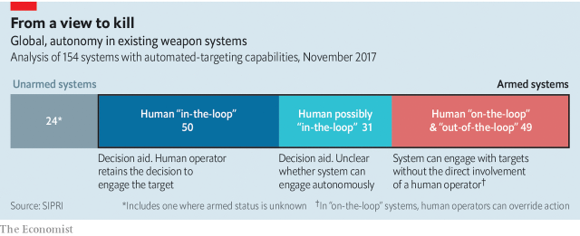
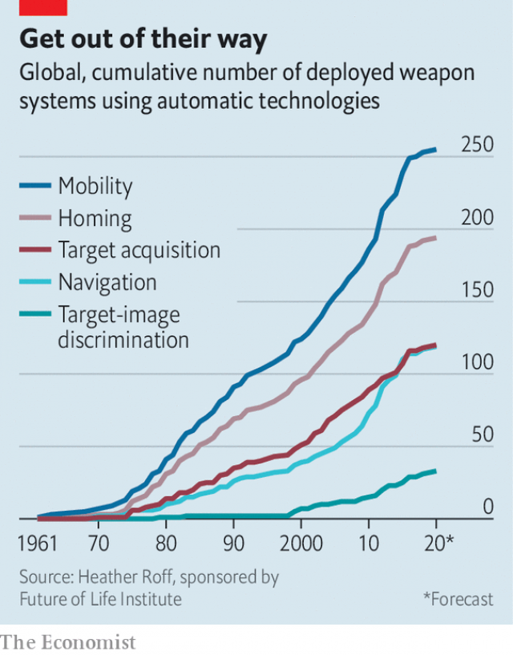
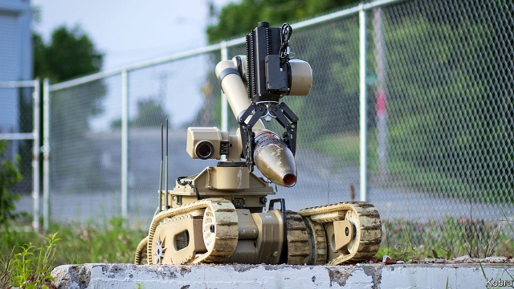

###### Restraining the robots

# Autonomous weapons and the new laws of war 

##### A technology that may prove hard to restrain 

 

> Jan 17th 2019 

 

THE HAROP, a kamikaze drone, bolts from its launcher like a horse out of the gates. But it is not built for speed, nor for a jockey. Instead it just loiters, unsupervised, too high for those on the battlefield below to hear the thin old-fashioned whine of its propeller, waiting for its chance. 

If the Harop is left alone, it will eventually fly back to a pre-assigned airbase, land itself and wait for its next job. Should an air-defence radar lock on to it with malicious intent, though, the drone will follow the radar signal to its source and the warhead nestled in its bulbous nose will blow the drone, the radar and any radar operators in the vicinity to kingdom come. 

Israeli Aerospace Industries (IAI) has been selling the Harop for more than a decade. A number of countries have bought the drone, including India and Germany. They do not have to use it in its autonomous radar-sniffing mode—it can be remotely piloted and used against any target picked up by its cameras that the operators see fit to attack. This is probably the mode in which it was used by Azerbaijan during its conflict with Armenia in Nagorno-Karabakh in 2016. But the Harops that Israel has used against air-defence systems in Syria may have been free to do their own thing. 

In 2017, according to a report by the Stockholm International Peace Research Institute (SIPRI), a think-tank, the Harop was one of 49 deployed systems which could detect possible targets and attack them without human intervention. It is thus very much the sort of thing which disturbs the coalition of 89 non-governmental organisations (NGOs) in 50 countries that has come together under the banner of the “Campaign to Stop Killer Robots”. The campaign’s name is an impressive bit of anti-branding; what well-adjusted non-teenager would not want to stop killer robots? The term chillingly combines two of the great and fearful tropes of science fiction: the peculiarly powerful weapon and the non-human intelligence. 

But the Harop also shows that such weapons, and the issues they raise, are not entirely new. “Fire and forget” missiles that could loiter for a while before picking up the sort of radar signature that they had been told to attack have been around for decades. They were mostly launched from aircraft, they spent a lot less time loitering and they could not go home and wait for another chance if the enemy’s radar refused to play ball. But their autonomous ability to kill was the same. Anti-personnel mines, which have been used for centuries, sit still rather than loiter and kill anything that treads on them, rather than anything which illuminates them with radar. But once such weapons are deployed no human is involved in choosing when or whom they strike. 

Acknowledging the long, unpleasant history of devices which kill indiscriminately, or without direct human command, is crucial to any discussion of the risks, and morality, of autonomous weapons. It should not mask the fact that their capabilities are increasing quickly—and that although agreements to limit their use might be desirable, they will be very difficult to enforce. It is not that hard to decide if a landmine fits the criteria that ban such weapons under the Ottawa treaty. But whether a Harop is an autonomous robot or a remote-controlled weapon depends on the software it is running at the time. 

Weapons have been able to track their prey unsupervised since the first acoustic-homing torpedoes were used in the second world war. Most modern weapons used against fast-moving machines home in on their sound, their radar reflections or their heat signatures. But, for the most part, the choice about what to home in on—which aircraft’s hot jets, which ship’s screws—is made by a person. 

An exception is in defensive systems, such as the Phalanx guns used by the navies of America and its allies. Once switched on, the Phalanx will fire on anything it sees heading towards the ship it is mounted on. And in the case of a ship at sea that knows itself to be under attack by missiles too fast for any human trigger finger, that seems fair enough. Similar arguments can be made for the robot sentry guns in the demilitarised zone (DMZ) between North and South Korea. 

The challenge that modern armed forces, and armsmakers like IAI, are working on is the ability to pick the target out from a field of non-targets. There are two technological developments that make the challenge a timely one. One is that computers are far more powerful than they used to be and, thanks to “machine learning”, getting much more sophisticated in their ability to distinguish between objects. If an iPhone can welcome your face but reject your sibling’s, why shouldn’t a missile be able to distinguish a tank from a school bus? 

The change is that autonomy in the non-killing aspects of military life is spreading like wildfire. Drones, driverless trucks and crewless submarines are all being used for various purposes, most of them entirely non-lethal. At the British Army’s “Autonomous Warrior” exercise in December 2018, on the wet and windswept training grounds of Salisbury Plain in southern England, military officers showed off autonomous vehicles and aircraft designed to watch enemy lines, evacuate wounded soldiers and deliver supplies over the perilous “last mile” up to the front line. “Think C-3PO,” says one officer, “not the Terminator.” 

Autonomous vehicles do not have to become autonomous weapons, even when capable of deadly force. The Reaper drones with which America assassinates enemies are under firm human control when it comes to acts of violence, even though they can fly autonomously. 

 

Satellite remote control, though, involves a time delay which would matter more were the drones being shot at in an all-out war. Co-operation may be better with humans out of the loop, too. The Pentagon’s out-there-thinking department, DARPA, is working on autonomous attack swarms more like a murmuration of starlings than a formation of fighter-bombers. What human operators could co-ordinate such dynamics? This is not just an issue for the future. One of the advantages that MDBA, a European missile-maker, boasts for its air-to-ground Brimstones is that they can “self-sort” based on firing order. If different planes launch volleys of Brimstones into the same “kill box”, where they are free to do their worst, the missiles will keep tabs on each other to reduce the chance that two strike the same target. 

Cost is also a factor in armies where trained personnel are pricey. “The thing about robots is that they don’t have pensions,” says General Sir Richard Barrons, one of Britain’s most senior commanders until 2016. Nor do they have dependents. The loss of a robot is measured in money and capability, not human potential. 

If keeping a human in the loop was merely a matter of spending more, it might be deemed worthwhile regardless. But human control creates vulnerabilities. It means that you must pump a lot of encrypted data back and forth. What if the necessary data links are attacked physically—for example with anti-satellite weapons—jammed electronically or subverted through cyberwarfare? Future wars are likely to be fought in what America’s armed forces call “contested electromagnetic environments”. The Royal Air Force is confident that encrypted data links would survive such environments. But air forces have an interest in making sure there are still jobs for pilots; this may leave them prey to unconscious bias. 

 

The vulnerability of communication links to interference is an argument for greater autonomy. But autonomous systems can be interfered with, too. The sensors for weapons like Brimstone need to be a lot more fly than those required by, say, self-driving cars, not just because battlefields are chaotic, but also because the other side will be trying to disorient them. Just as some activists use asymmetric make-up to try to confuse face-recognition systems, so military targets will try to distort the signatures which autonomous weapons seek to discern. Paul Scharre, author of “Army of None: Autonomous Weapons and the Future of War”, warns that the neural networks used in machine learning are intrinsically vulnerable to spoofing. 

New capabilities, reduced costs, resistance to countermeasures and the possibility of new export markets are all encouraging R&D in autonomous weapons. To nip this in the bud, the Campaign to Stop Killer Robots is calling for a pre-emptive ban on “fully autonomous” weapons. The trouble is that there is little agreement on where the line is crossed. Switzerland, for instance, says that autonomous weapons are those able to act “in partial or full replacement of a human in the use of force, notably in the targeting cycle”, thus encompassing Harop and Brimstone, among many others. Britain, by contrast, says autonomous weapons are only those “capable of understanding higher level intent and direction”. That excludes everything in today’s arsenals, or for that matter on today’s drawing boards. 

Partly in order to sort these things out, in 2017 the UN’s Convention on Certain Conventional Weapons formalised its earlier discussions of the issues by creating a group of governmental experts (GGE) to study the finer points of autonomy. As well as trying to develop a common understanding of what weapons should be considered fully autonomous, it is considering both a blanket ban and other options for dealing with the humanitarian and security challenges that they create. 

Most states involved in the convention’s discussions agree on the importance of human control. But they differ on what this actually means. In a paper for Article 36, an advocacy group named after a provision of the Geneva conventions that calls for legal reviews on new methods of warfare, Heather Roff and Richard Moyes argue that “a human simply pressing a ‘fire’ button in response to indications from a computer, without cognitive clarity or awareness” is not really in control. “Meaningful control”, they say, requires an understanding of the context in which the weapon is being used as well as capacity for timely and reasoned intervention. It also requires accountability. 

Lieutenant-colonel Richard Craig, who leads the British Army HQ’s research on autonomous systems, agrees that context is crucial. In some contexts it might be right to vet every target. In others it is sufficient to understand the threat and act accordingly. For example a Phalanx system, he says, “wouldn’t be in fully autonomous mode unless there was a high threat. Meaningful human control is to turn it on into that mode, and then to turn it off”. 

This means that future robot warplanes, such as those being explored by the French-led nEUROn programme and Britain’s Taranis, both of which are experimenting with automatic target recognition, present the biggest challenge. Long-legged as they are, they may encounter a wide range of target environments that could be hard to anticipate. They could be in or out of meaningful human control depending on where they end up, the competence and experience of the operators, what is likely to step into their path and, potentially, changes to their algorithms made through on-board machine learning. A field day for ethicists; a nightmare for the would-be treaty-makers. 

The two dozen states that want a legally binding ban on fully autonomous weapons are mostly military minnows like Djibouti and Peru, but some members, such as Austria, have diplomatic sway. None of them has the sort of arms industry that stands to profit from autonomous weapons. They ground their argument in part on International Humanitarian Law (IHL), a corpus built around the rules of war laid down in the Hague and Geneva conventions. This demands that armies distinguish between combatants and civilians, refrain from attacks where the risk to civilians outweighs the military advantage, use no more force than is proportional to the objective and avoid unnecessary suffering. 

When it comes to making distinctions, Vincent Boulanin and Maaike Verbruggen, experts at SIPRI, note that existing target-recognition systems, for all their recent improvement, remain “rudimentary”, often vulnerable to bad weather or cluttered backgrounds. Those that detect humans are “very crude”. And this is before wily enemies try to dupe the robots into attacking the wrong things. 

Necessity and proportionality, which requires weighing human lives against military aims, are even more difficult. “However sophisticated new machines may be, that is beyond their scope,” says Major Kathleen McKendrick of the British army. An army that uses autonomous weapons needs to be set up so as to be able to make proportionality decisions before anything is fired. 

More broadly, IHL is shaped by the “Martens clause”, originally adopted in the Hague convention of 1899. This says that new weapons must comply with “the principles of humanity” and “dictates of public conscience”. Bonnie Docherty of Human Rights Watch, the NGO which co-ordinates the anti-robot campaign, argues that, “As autonomous machines, fully autonomous weapons could not appreciate the value of human life and the significance of its loss...They would thus fail to respect human dignity.” A strong argument, but hardly legally watertight; other philosophies are available. As for the dictates of public conscience, research and history show that they are more flexible than a humanitarian would wish. 

Leaving aside law and ethics, autonomous weapons could pose new destabilising risks. Automatic systems can interact in seemingly unpredictable ways, as when trading algorithms cause “flash crashes” on stockmarkets. Mr Scharre raises the possibility of a flash war caused by “a cascade of escalating engagements”. “If we are open to the idea that humans make bad decisions”, says Peter Roberts, director of military sciences at the Royal United Services Institute, a think-tank, “we should also be open to the idea that AI systems will make bad decisions—just faster.” 

 

Beyond the core group advocating a ban there is a range of opinions. China has indicated that it supports a ban in principle; but on use, not development. France and Germany oppose a ban, for now; but they want states to agree a code of conduct with wriggle room “for national interpretations”. India, which chaired the GGE, is reserving its position. It is eager to avoid a repeat of nuclear history, in which technological have-nots were locked out of game-changing weaponry by a discriminatory treaty. 

At the far end of the spectrum a group of states, including America, Britain and Russia, explicitly opposes the ban. These countries insist that existing international law provides a sufficient check on all future systems—not least through Article 36 reviews, which they say should be taken more seriously rather than ducked, as some countries do today. They argue that the law should not be governed by the shortcomings of current systems when it comes to, say, discrimination. 

Some even argue that autonomous weapons might make war more humane. Human warriors break the IHL rules. Properly programmed robots might be unable to. Samsung’s SGR-A1 sentry gun, which used to be deployed in the DMZ, could recognise hands being thrown to the air and weapons to the ground as signs of surrender that meant do not shoot. All sorts of similar context-sensitive IHL-based restraint might be written into its descendants’ programming. But how long until an embattled army decided to loosen such tethers and let slip the robodogs of war? 

Which brings back one of the biggest problems that advocates of bans and controls have to face. Arms control requires verification, and this will always be a vexed issue when it comes to autonomy. “The difference between an MQ-9 Reaper and an autonomous version is software, not hardware,” says Michael Horowitz of the University of Pennsylvania. “It would be extremely hard to verify using traditional arms-control techniques.” 

The urge to restrict the technology before it is widely fielded, and used, is understandable. If granting weapons ever more autonomy turns out, in practice, to yield a military advantage, and if developed countries see themselves in wars of national survival, rather than the wars of choice they have waged recently, past practice suggests that today’s legal and ethical restraints may fall away. States are likely to sacrifice human control for self-preservation, says General Barrons. “You can send your children to fight this war and do terrible things, or you can send machines and hang on to your children.” Other people’s children are other people’s concern. 

