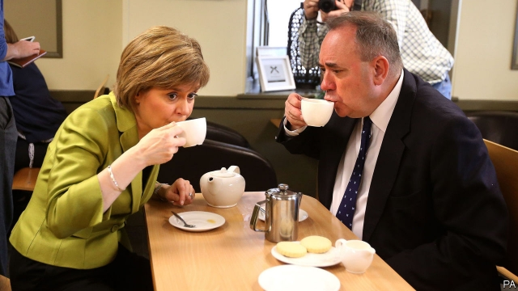

###### Saltires and smears

# A schism in the Scottish National Party threatens its cause 

##### The party’s reputation for competence is damaged by a bungled investigation 

 

> Jan 17th 2019 

 

THE LAST time Alex Salmond entered the Court of Session in Edinburgh, it was to be sworn in as first minister of Scotland. When he emerged from the same building earlier this month, it was to declare victory after suing the government he once led. Mr Salmond had taken the Scottish government to court over its investigation into allegations of his inappropriate sexual behaviour while in office. The former first minister said it had been botched. A judge agreed. The probe was “procedurally unfair” and was “tainted with apparent bias”, the ruling decreed, before awarding costs to the former first minister. 

The government now faces more than a hefty bill. What started as an investigation into Mr Salmond’s conduct has snowballed into a political scandal that threatens to undermine Nicola Sturgeon, his successor as first minister, and to damage the cause of Scottish independence. 

This week MSPs launched an inquiry into how the investigation was handled. An ethics watchdog will examine whether Ms Sturgeon broke the ministerial code. The data-protection regulator will look into how parts of the initial inquiry into Mr Salmond ended up in the newspapers. Amid this, a police investigation into Mr Salmond’s behaviour grinds on. 

Things could turn nastier still. On January 14th stories appeared, sourced to people close to Mr Salmond, suggesting that Ms Sturgeon may have known about the investigation before a meeting with Mr Salmond in April, which is when the first minister told the Scottish Parliament she heard of the inquiry into his behaviour. A spokesman for Ms Sturgeon denied this and labelled the claims an attempt to smear her. Those close to Mr Salmond say it is nothing of the sort, and that their focus is on the civil servants who they think mishandled the probe into his conduct. 

It is an ugly falling-out between what was once the most successful political duo in Britain. Mr Salmond and Ms Sturgeon turned the Scottish National Party into a formidable political machine. They led Scotland to the brink of independence, even if they fell short in the referendum in 2014. The SNP is usually a paragon of unity compared with their squabbling Labour and Conservative rivals. The schism between Ms Sturgeon and Mr Salmond, who is still popular in the party ranks, is a rare and high-profile breach. After a career in which they were nearly inseparable, the duo have not spoken since July. 

The long-running crisis has not yet had an impact on the SNP’s popularity. Its poll ratings are strong for a party that has spent 12 years in government. Over 40% of Scottish voters would support the party in Holyrood elections; the Scottish Conservatives, the SNP’s nearest rivals, poll in the mid-20s. In Westminster elections, too, the party is expected to gain seats. 

Nor is the SNP’s fundamental cause struggling. Support for independence sits in the mid-40s. Before the referendum in 2014 it bobbed along in the mid-30s. In some scenarios, including a chaotic Brexit, more than half of Scots say they would vote in favour of independence. Many would see such a Brexit as the most egregious possible example of Scotland’s destiny being settled by English voters. 

But the SNP’s success owes a lot to having two gifted leaders and a reputation for competence. A series of long, painful inquiries and a public row damages this impression. Likewise, the basic blunders that plagued the Scottish government’s investigation may not increase voters’ desire to hand it more powers through independence. Swapping chaos in Westminster for a soap opera in Holyrood might not seem worth the bother. 

