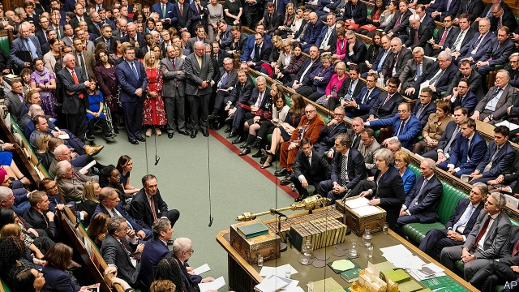
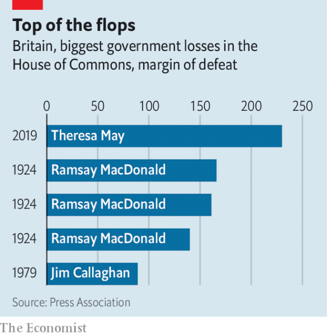
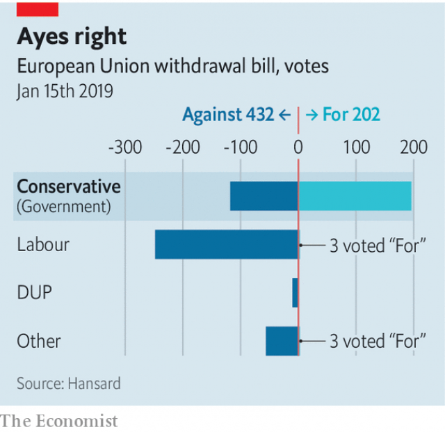
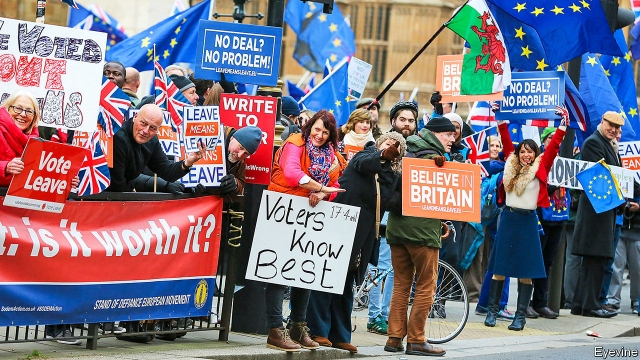

###### The Noes have it

# A seismic defeat throws Brexit plans into chaos 

##### Theresa May’s parliamentary drubbing raises questions about her party and democracy in Britain 

 

> Jan 17th 2019 

 

PARLIAMENT SQUARE was like a circus, with flags, music and a boisterous medley of quarrelling Leavers and Remainers. Inside the House of Commons the mood was more portentous, with MPs talking up their historic moment. Geoffrey Cox, the attorney-general, brought them down to earth by chiding them for being like children in a playground, not legislators. Yet when the vote on Theresa May’s Brexit deal came, late on January 15th, it was lost by the truly historic margin of 432 to 202. The majority of 230 against the government is the biggest parliamentary defeat on record for a ruling party (see chart). Fully 118 Tory MPs defied their whip to vote against Mrs May, the biggest such rebellion since 139 Labour MPs voted against the Iraq war in 2003. 

In more normal times, such a rout would surely be followed by a resignation. Yet the next day Mrs May easily defeated a vote of no confidence in her government proposed by the Labour opposition leader, Jeremy Corbyn. Neither the Tories nor the Democratic Unionist Party (DUP) that props up her government want an election. Mrs May thus confirmed that she is a great survivor. Because she won a Conservative leadership contest shortly before Christmas, she cannot under party rules be challenged again for the next ten months. 

Yet few are happy with her stubborn approach to Brexit. Many people must wonder how the country got into such problems. Before Brexit, Britain had a reputation not just for pragmatism but for sound administration and a predictably sensible legislature. The huge vote against Mrs May’s deal is a blow to that. Some will conclude that it is her fault, as a singularly inept prime minister and poor negotiator. It is true that she has badly mishandled Britain’s exit preparations. Yet there are deeper reasons for the mess. 

 

The first is inherent in Brexit. Some campaigners said that leaving the European Union would be like walking away from any other annoying international organisation. Hence the attraction of a clean break, taking Britain out of the EU’s single market, customs union, freedom of movement and the European Court of Justice. But the truth is that, after 45 years of membership, the EU has become a crucial part of the regulatory and institutional framework within which British business and government operate, ranging from airlines to carmakers, banks to drug firms and the police to the security services. 

Extracting the country from an intricate framework that stretched farther than anyone realised was bound to be extremely difficult and time-consuming. It also meant that Brexit would be a process, not a single event. Pascal Lamy, a French former European commissioner, likens it to taking an egg out of an omelette. As other EU countries have watched this being attempted, even those most irritated by Brussels have concluded that they should not follow suit. 

A second issue is the nature of British democracy, and in particular how badly equipped it is to cope with referendums. Other countries that use them, such as Switzerland or Ireland, have constitutional provisions laying down when and how to do so. But the unwritten British constitution confers total sovereignty on Parliament, as the epitome of a representative rather than a direct democracy. This sits uncomfortably with the notion of asking voters to make policy choices, as David Cameron did when putting Britain’s EU membership to a referendum in June 2016. 

Despite this, Britain has in recent years made extensive use of referendums. Indeed, if one includes regional ones, in the past 20 years it has had more of them than it has had general elections. But the idea that they can settle contentious issues has been repeatedly disproved. The 1975 referendum on membership of the European Economic Community produced a decisive two-to-one result for staying in. Yet within eight years the Labour Party promised to pull out of the EEC without even consulting voters again. 

A more recent example is more embarrassing for Mrs May. This week she argued that the result of the 2016 Brexit referendum must be honoured by all, because a 1997 referendum narrowly backing the creation of a Welsh assembly had been similarly accepted. Yet this overlooked the awkward truth that, along with her Tory colleagues, she had voted against the assembly, despite the referendum. What’s more, eight years later the Tories were campaigning for a second referendum with the option of overturning the result of the first—something she has explicitly ruled out for Brexit. 

A third, related point is the deepening divisions over Brexit. Some had hoped that the narrow result of 52-48% in favour of leaving the EU would create conditions for a middle way. Both sides could have converged on a “soft” Brexit that took Britain out of the EU but kept it closely aligned with most of the rules of its largest trading partner. The model might have been Norway, outside the EU but a full participant in its single market through the European Economic Area. 

In fact the divisions between the two sides have widened. Leavers have become ever more wedded to the desire of hardline Brexiteers for a total break with Brussels. They have taken to deriding Mrs May’s deal as “Brexit in name only”. Remainers, meanwhile, have become increasingly keen on the idea of having a second referendum to reverse the decision of the first. They, too, have gone out of their way to dismiss softer forms of Brexit, on the basis that they are inferior to full membership. This widening gulf has made compromise harder. 

A fourth factor is divisions within parties, especially the ruling Tory party. It has always been a broad church that embraces liberal free-marketeers along with conservatives keener on economic protection. The party is now in its biggest crisis since 1906, when a split put it out of power for almost 20 years. The cause of the split, then as now, was trade. The free-trade wing of the party wanted to stick to the liberal trade policy inaugurated by Robert Peel in 1846. But an imperial-preference faction, led by Joseph Chamberlain, wanted to strengthen relations with the empire by creating a tariff wall around Britain and its dependencies. The split led the Tories into a crushing defeat in the 1906 election. 

 

The parallels with today are striking. The protectionist turn was driven by a charismatic figure in Chamberlain, who used it to advance his leadership ambitions. The Tories lost support among intellectuals and working-class voters fearful that tariffs would mean dearer food. The debate over imperial preference took place on the streets as well as in Parliament. And the Conservative implosion opened the way to a left-wing government that fundamentally changed the balance between capital and labour, and between the landed aristocracy and their tenants. 

All these points help explain why Mrs May has found it so hard to do what she calls her duty and deliver Brexit. But a fifth matters, too: her own character and style. As a lukewarm Remainer before becoming prime minister in July 2016, she could have embraced both sides of the Brexit divide and all parties when deciding how to implement the vote. She could have been upfront with the public about the trade-offs inherent in Brexit, which always pointed towards messy compromise. And she might have discussed options more openly with other EU leaders, knowing that they have to agree the terms of any Brexit deal. 

Yet she chose to do none of this. Without consulting even her own cabinet she decided in October 2016 to lay down “red lines” for Brexit, which amounted to leaving the single market and customs union, ending the free movement of people and escaping entirely the jurisdiction of European courts. These promises pointed inexorably towards a radical break with the EU. She then opted in March 2017 to invoke Article 50 of the EU treaty, which set a two-year deadline for Britain to leave, without being clearer on the detailed course that she wanted. 

Along the way she ignored the advice of experienced officials and diplomats, losing her ambassador to the EU, Sir Ivan Rogers, in early 2017. Instead she fell back on a coterie of familiar counsellors less knowledgeable about Brussels. She also called an unnecessary election in June 2017, again without consulting colleagues, in which she lost her party’s majority, forcing her to rely on support from the DUP, hideously complicating the Brexit negotiations regarding Northern Ireland. And she then conducted the talks largely in secret, not informing her own MPs or even her own Brexit secretary (she is now on her third of them) about what she was doing. 

Many of these failings reflect Mrs May’s introverted nature. She likes to rely on a small, closed circle of advisers and officials, many of whom she recruited during her six earlier years as home secretary. She is unclubbable, seldom seen in the tea rooms or bars of Parliament. She has few close friends in Westminster, even within the cabinet. None of these qualities is necessarily bad—indeed, the conscientious and hardworking Mrs May initially made a refreshing contrast to her predecessor. But faced with a challenge on the scale of Brexit, these characteristics have helped to land her in the mess she is in today. 

What happens next? Mrs May responded to her Commons defeat with defiance. She promised to listen to and consult fellow MPs, including senior members of other parties—though Mr Corbyn is refusing to meet her unless she rules out a no-deal Brexit. She also noted that there was still no clarity about what sort of Brexit Parliament could support. If her consultations produced new ideas, she would go back to Brussels to see what could be negotiated. Yet despite her massive defeat, she refuses to change her red lines and still believes that something close to her deal is the only one realistically available. Brexit is just ten weeks away. Mrs May must set out her plans by January 21st. MPs will then be free to propose amendments that could set Brexit on a new course. 

The prime minister’s instincts will be to build on what she has already secured in the draft Brexit deal. She is ready to go back to Brussels to seek alterations, which will be easier to do in the political declaration about future relations than in the withdrawal agreement, which is a legally binding treaty. The EU is familiar with the need to help countries that have what it calls ratification difficulties. Add a few declarations, offer modest concessions, then ask the country concerned to think again. 

 

This is far harder with Brexit. The scale of Mrs May’s defeat will make negotiators in Brussels conscious that, even if they are ready to make changes, they may not be enough to get the deal past MPs. Moreover, they are adamant that they cannot reopen the much-disliked Irish “backstop”, which guarantees that there will be no hard border in Ireland by, if necessary, keeping the entire United Kingdom in a customs union with the EU. To concede a legally binding end-date for the backstop or to give Britain a unilateral right of exit from it would undermine the scheme’s whole purpose of acting as an insurance policy. 

If minor alterations to the current deal will not work, what else might? Different factions of MPs have different answers. Mr Corbyn has called for a permanent customs union, which is favoured even by some Tory ministers. Mrs May might be tempted. But Mr Corbyn’s idea of a customs union that gives Britain a say in future trade deals is not on offer from the EU. It would also lose Mrs May a few Tory MPs, including some in the cabinet. Some other MPs would prefer to swing to a softer Brexit called Norway-plus, adding a customs union to membership of the single market. But hardliners want to go in the opposite direction, to a more distant free-trade agreement modelled on the EU’s deal with Canada. 

With little time left, negotiating an entirely different form of Brexit to Mrs May’s seems impracticable. Moreover, as she herself points out, for any alternatives the EU would still insist on an Irish backstop. There is no sign that other EU leaders are prepared to override the deep concerns of the Irish government on this point purely to rescue British MPs from their difficulties. The interests of members always trump those of non-members. 

Does this imply a Brexit on March 29th with no deal, the most disruptive outcome and the one business lobbies are most strongly against? Gleeful Brexiteers point out that it is the default option in the absence of other action. Yet it has become clear that a majority of MPs are against it. Commenting after the Commons vote, Mrs May also leaned against the idea. She has equally softened her hostility to suggestions of seeking an extension of the time limit set by Article 50. It would still not be straightforward. It would need the unanimous agreement of other EU governments, although Mujtaba Rahman of the Eurasia Group, a consultancy, believes this would be forthcoming to avoid no deal. It could also mess up the elections to the European Parliament (see article). But it would at least postpone the prospect of dropping out with no deal in place. 

For now, though, Mrs May is against the idea of extension. That is one reason why some MPs are toying with taking charge of the Brexit process themselves. To this end Nick Boles and Sir Oliver Letwin, two Tory MPs, have a plan temporarily to scrap parliamentary rules that give precedence to government business. With help from Labour MPs, they would then pass a bill instructing the government to seek an extension of Article 50 until at least the end of the year. That would take no deal off the table, as well as creating breathing space for MPs and ministers to reflect once again on what form of Brexit to pursue. It might also give enough time to debate whether to hold a referendum on the final deal. 

The crisis in which Britain finds itself in large part reflects the problems and contradictions within the idea of Brexit itself. Even so, beset by the ticking clock, rebellious MPs and an intransigent EU, Mrs May will find the next few weeks exceptionally trying. Many will sympathise with her. In truth, though, her own misjudgments have made her task harder. 

