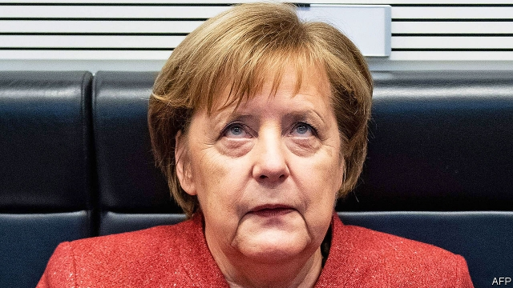

###### Waiting for Angela

# Brexiteers’ hopes of a European about-turn will be dashed 

##### The script in Brussels is familiar: the ball is in Britain’s court 

 

> Jan 17th 2019 

 

THE DAY before the Brexit vote in Westminster, some on Fleet Street thought they had spied a last-minute get-out for Theresa May. The Sun, a right-wing tabloid, reported that Angela Merkel had offered the prime minister concessions on the Brexit deal in a phone call the day before. The report turned out to be incorrect. A German government spokesman said that the chancellor had made “no assurances” going beyond the deal sealed between Mrs May and the European Council in November. It was just the latest instance of the British press’s habit of seeing the German government as a deus ex machina that will make a crucial intervention in the closing acts of the Brexit drama. 

After the parliamentary vote on January 15th, the reaction of the rest of the EU followed a common script: the ball was in Britain’s court. “We are now waiting to see what the British prime minister proposes,” said Mrs Merkel a day later. Peter Altmaier, her economy minister and a close ally, declared on German radio that “we should give the British the chance to clarify their position.” Michel Barnier, the European Commission’s chief Brexit negotiator, told the European Parliament, to storming applause, that “this vote is not a clear manifestation of a positive majority”. Privately, too, Brussels officials have said that all now depends on what the British government decides to do next. 

This is true, but somewhat disingenuous. The EU knows full well that its role will be crucial. The commission has been game-planning a rejection of Mrs May’s deal for weeks and intensive talks about how to proceed followed the defeat in Westminster. Most in Brussels accept that if—as is now widely expected—Britain were to request an extension to the Article 50 deadline of March 29th for Brexit, it should win the unanimous approval that it needs in the European Council. 

This is true to form. The remaining 27 EU governments have negotiated with a remarkably common front over the past two years. They have maintained their unity despite repeated British predictions that it would fracture. On how to respond to the chaos in Westminster, however, small cracks are emerging. 

Thus even as the likes of Mrs Merkel and Mr Altmaier preach patience, the French are growing restless. At a public gathering in northern France this week, Emmanuel Macron responded to a question about fishing rights after Brexit with a strikingly frank prediction about what would happen next. The Britons would seek a better deal, the French president predicted. This would prompt few concessions from the remaining members of the EU, he added, going on to foresee an extension to the negotiating period. The French president is a lot less willing to spend time fiddling with the existing Brexit deal. 

There is also some dispute over how long to extend Article 50. Many favour only a short extension to keep up pressure on London and avoid a clash with the European elections at the end of May. Yet such considerations could be trumped by the need to avoid a no-deal Brexit. This could be not just disruptive to Europe’s economies, but also expensive. A new paper by the Bruegel think-tank in Brussels puts the cost in unpaid bills to the EU alone at some €16.5bn ($18.8bn). 

Do not neglect the power of exasperation in all this. Europe faces myriad urgencies, ranging from euro zone reform to defence integration, that have little to do with Brexit. Time spent on British neuralgias is time not spent on these. No force is stronger in Brussels at the moment than the desire to get Brexit out of the way. 

