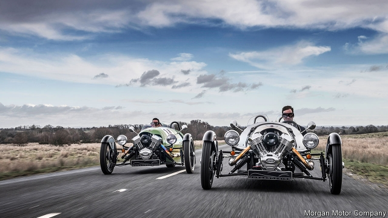

###### Blast from the past

# Morgan, the carmaker that thrives by doing everything wrong 

##### While other firms fret about electrification and autonomous technology, Morgan cheerfully ignores the rules 

 

> Jan 17th 2019 

 

MORGAN’S OPEN-TOPPED sports cars, with their long louvred bonnets and rakishly swept wheel-arches, almost require the driver to wear a tweed cap and silk scarf. Today, as they have for a century, they pootle out of the company’s HQ in Worcestershire, satisfying Britons who yearn for the past and foreigners fond of a certain kind of Britishness. The car industry is in a bad state, with Jaguar Land Rover this month announcing 4,500 lay-offs (see article). But while other firms fret about electrification and autonomous technology, Morgan is thriving by ignoring the established rules of carmaking. 

A small company museum seems superfluous in a factory that resembles an industrial-heritage centre. Whereas most carmakers now assemble their vehicles from cutting-edge materials, largely put together by robots in near silence and operating-theatre cleanliness, the most immediate assault on the senses in Morgan’s 1920s workshops is smells of engine oil, glue or leather, and the noise of hammering. Much of the appeal is that “Moggies”, as dedicated owners call them, are mostly handmade. Aluminium is battered into shape. Wooden frames, abandoned by other carmakers long ago, are sawn and bent. Louvres are cut with a machine so ancient that no employee can accurately date it, and not by using lasers and computers, but by the unerring eye of a long-serving worker. 

The company, still owned by the family that founded it in 1909, does not pursue the relentless growth that other carmakers crave. It has cut production to around 850 cars a year from 1,100 in 2010, because that overstretched a firm where apprentices take four years to master the old techniques. Nevertheless, it made a record pre-tax profit of £2m ($2.7m) in 2017 and should do as well when it reveals results for last year, partly because it has brought production processes such as cutting most of its raw aluminium into shape back in-house, rather than trusting a network of suppliers like the rest of the industry. 

Its supply chain is distinctly local, which could be a useful insulation against Brexit. The large aluminium wings, which need to be pre-formed, come from Worcester, eight miles up the road, and ash for the frames from Lincolnshire. But it is stockpiling engines, imported from Europe and America, and worries about exports after Britain leaves the EU. Around 70% of its cars are sold abroad, mainly to Europe. 

Whereas other carmakers fret about offering additional comfort and technology, Morgan has successfully taken them away. Removing a wheel has proved a particular hit. Three-wheelers, based on the cars that the company made in its first six decades, were reintroduced in 2011 and now make up almost a third of production. 

Yet even Morgan hasn’t completely ignored the modern world. Its cars may look like classics, but all have up-to-date engines. The Aero 8, launched in 2000, has an Art Deco feel, but features an aluminium chassis and paddles to change gear. It is Morgan’s most expensive model, costing around £140,000, over three times the price of a Plus 4. 

Some concessions to modernisation are evident in a corner of the factory that is packed with computer screens rather than antique tools. IFS, a consulting firm, was brought in to help streamline ordering, stock levels and the like in 2014. As Colin Boden, Morgan’s finance director, says, the firm cannot afford to “bumble along”. 

On that basis it expects to strike a partnership to develop electric vehicles in two or three years. That may dismay owners, who like Morgan just the way it is. The firm’s fans include many car-industry bigwigs, who presumably relish the raw driving experience of yesteryear to take their mind off running companies facing so many problems. Indeed, Sergio Marchionne, a late former boss of Fiat Chrysler and one of the wisest analysts of the industry’s shortcomings, offered this advice after he visited the factory a few years ago: “Don’t change anything.” 

