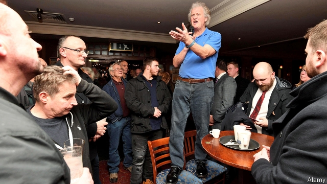

###### Me and my Spoons

# Wetherspoons serves punters cheap booze and intoxicating views 

##### Tim Martin’s “Free Trade Tour” emulates anti-protectionist public meetings of the early 1900s, with added Bacardi Breezers 

 

> Jan 17th 2019 

 

IF YOU HAVE ever drunk in a Spoons, you would recognise the Queen’s Hotel in Newport. Tim Martin’s 900-odd pubs all offer similar fare. There is a blackboard with the number of pints poured last week and a Saltire advertising a “Burns week” special (haggis, neeps and tatties for £6.45, or $8.30). Punters sit on wine-coloured banquettes or tread the patterned carpet to a counter groaning with mustard and HP sauce. Unusually, though, Mr Martin stands at the centre of it all, his grey mane flowing in all directions like an unkempt terrier. 

This is the latest stop on his “Free Trade Tour” of 100 JD Wetherspoon pubs, emulating the spirit of the anti-protectionism public meetings of the early 1900s but with added Bacardi Breezers. The self-described “contrary bastard” is challenging the “Oxbridge orthodoxy” that leaving the European Union will be disastrous. In 40 years running the business, he has learned to “boil your case down to one sentence”. In this instance, it is “No deal is better than a deal”. And—in the Queen’s, at least—it is as popular as a Jägerbomb on a Friday night. 

A few dozen locals (mostly blokes) cluster round when he enters at 10.30am. They grip mugs of coffee or, in a few cases, the day’s first pint. Several take videos. One man holds his pint up to his camera so he can snap the Spoons founder and chairman through a beery foreground. Mr Martin talks for 20 minutes, then takes questions for half an hour. 

He has three main arguments. First, leaving without a deal would allow Britain to skip its £39bn exit bill. Second, he says, it would be better for the fishing industry. (“Exactly!” shouts a woman at the back, flinging her arms in the air.) Third, he claims, it would allow Britain to drop tariffs on goods from the rest of the world, allowing for freer and cheaper trade. His pubs have swapped champagne for English sparkling wine and even Jägermeister, chief ingredient of the aforementioned bomb, has been replaced with “Chorley’s number one herbal liqueur”. 

The hour offers a snapshot of the intensity of some Brexiteers’ antipathy towards the stasis in Westminster. “We’re sat here today re-fighting it all because of what they’re doing in Parliament,” says one man, flourishing a leaflet sent to all households before the referendum in which the government promised to implement either verdict. Another punter asks Mr Martin how the “common man” can “fight back” now that politicians have rejected Theresa May’s Brexit deal. “We’ve given you [politicians] a strict instruction and we expect you to honour that instruction,” he says. “Should I pay my tax?” 

Mr Martin laps it all up. His Wetherspoon shares lost £18m after the Brexit referendum (though they have since rebounded) and some of his staff (at least one in 20 of whom are EU migrants) have told him to shut up. But in a few minutes he will be off to Neath, the next stop on the tour. All this, he says, is basically just an outlet for his emotions. He has always recognised himself in Charles Dickens’s description of Oliver Twist’s workhouse superintendent as “a very great experimental philosopher”. But, he adds, “I don’t think it was a compliment.” 

