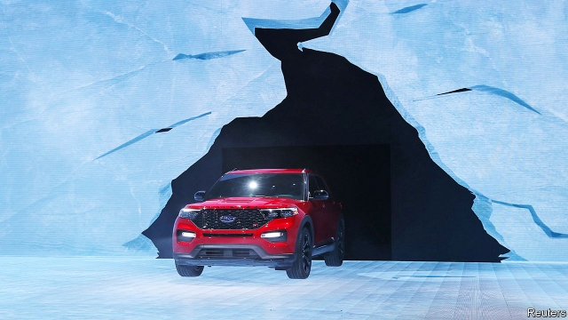
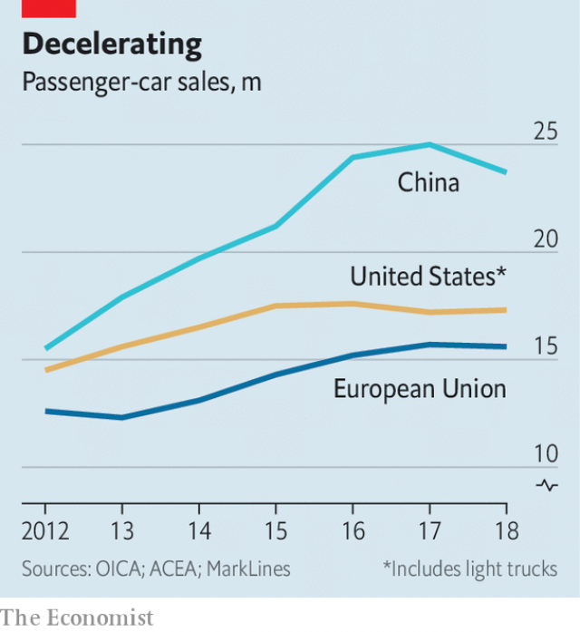

###### The big freeze

# Carmakers scramble to prepare for a chilly future 

##### Alliances and cost-cutting may not be enough to cope with upheavals to come 

 

> Jan 17th 2019 

 

DETROIT’S MOTOR show, which opened on January 14th, is taking place in the winter for the last time before the event moves to the summer months in 2020. Escaping an icy chill is also at the forefront of the minds of the carmakers gathered there. A rash of recent announcements about restructurings, a new alliance between Ford and Volkswagen (VW) and the likelihood of more to come are aimed at avoiding pain in an industry heading for a downturn and preparing for longer-term upheavals. The risk is that none of them proves to have been big or radical enough. 

Cutting costs is a priority for many firms as car sales look likely to fall, and the need to invest in new technology becomes more urgent. Last week Ford unveiled the European end of a global effort to cut costs by $14bn a year, which may see 24,000 of its 200,000 workers laid off. Jaguar Land Rover (JLR), owned by Tata Group of India, also said that it will lay off 4,500 employees as part of a plan to save £2.5bn ($3.2bn). On January 15th Ford and Volkswagen gave details of a cost-sharing alliance that Jim Hackett, Ford’s boss, calls the “next industry-transforming event”. The next day poor preliminary results sent Ford’s shares sliding, emphasising the plan’s urgency. 

All carmakers are worried that a global slowdown could turn into a rout as cyclical declines and a trade war bite at the same time. Their foremost concern is that years of bumper growth in the most profitable markets is coming to an end. Both America and Europe are still on a high in terms of sales (see chart) but China, a vital source of profits for most firms, is causing a severe headache. The world’s largest car market shrank for the first time in over 20 years in 2018. Sales fell by 2.8% to 28.1m vehicles and slid by 13% in December, giving a taste of what may be in store this year. 

 

Trade troubles and other problems could add to the cyclical pain. Donald Trump has foreign carmakers in his sights. To redress what he regards as an iniquitous trade deficit with Europe, he has threatened import tariffs on its cars. UBS, a bank, reckons that the worst case—tariffs of 25%—would see the American market shrink by 12% next year. Europe faces not only the disruption of Brexit but declining sales of diesel-powered vehicles. 

Even if coping with these problems were not enough, carmakers also need to make big investments in electric cars, autonomous vehicles and “mobility” services, such as car-sharing and ride-hailing. Take-up of the latter could cause car sales to plummet. Bain & Co, a consulting firm, says that America’s driving-age population is not growing (a trend mirrored in the rest of the world), while a generational switch to mobility services, such as robotaxis, will hit sales further. The firm reckons that the American market, currently 17m cars a year, could shrink to 10m by 2025. 

Even before the latest round of announcements, carmakers had been downsizing and leaving loss-making countries or market segments. They have then been reassigning investments to where they make most difference. GM announced big lay-offs and factory closures last year and in 2017 sold Opel, its European arm, to France’s PSA, for example. The French firm, loss-making until Carlos Tavares took over in 2014, has stopped making less profitable models. Also in 2017, Fiat Chrysler Automobiles (FCA’s chairman, John Elkann, sits on the board of The Economist’s parent company) likewise stopped making saloon cars in America to concentrate on higher-margin SUVs. Ford is said to be considering an exit from South America. 

Cutting costs and boosting profits to shore up balance-sheets is one way of insuring against a turbulent future. Another is to share costs. The tie-up between Ford and vw is the most prominent recent example of the web of alliances that characterise the car industry. Some alliances are explicitly aimed at preparing for the future. In 2017, for example, Toyota teamed up with Mazda and Denso, a Japanese partsmaker, to develop EVs. 

Yet Ford and vw disappointed many investors who had hoped their alliance might be closer. There had been rumours of imminent collaboration on electric vehicles, autonomy and mobility services, but the two firms in fact said they would make only conventional vans and pick-ups together. They have firmly ruled out equity ties that could deepen their relationship. 

Pressure for alliances or full mergers among firms is unlikely to go away. Consolidation may be the only way to bring the scale of cost savings that the industry needs in order to take on American tech giants, such as Google, that have transport in their sights. Both Sergio Marchionne, FCA’s boss until he died unexpectedly last year, and Carlos Ghosn, who built the Renault-Nissan-Mitsubishi alliance, the world’s biggest carmaker (who is detained in a Japanese prison on charges of financial misconduct), have in the past called for more consolidation. Sanford C. Bernstein, an equity research firm, says that 2019, too, will be a year of “endless M&A rumours” as demand wobbles and costs soar. 

Yet big alliances, not to mention crossborder transactions, are fiendishly hard to handle. Mr Ghosn’s detention has put in serious doubt the future of the world’s biggest tie-up. Indeed, many believe the charges against him have been trumped up by Nissan as a way to block his plans for a full merger. Mr Marchionne’s death has robbed the industry of a big personality who wanted consolidation and who had proved that a big transatlantic deal could work. 

Most car bosses who remain are not the sort of imposing characters who could initiate and see through a mega-merger. The only candidate is probably Mr Tavares, who has turned around both PSA and Opel in quick time. But his hands are full completing that deal. As the cold bites, the industry may struggle to cope. 

