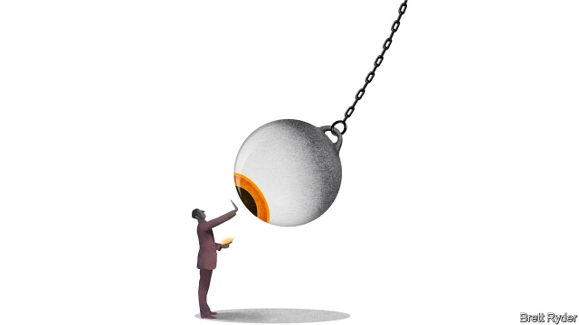

###### Schumpeter

# Is Google an evil genius? 

##### Big Tech does not control its users, however much it may want to 

 

> Jan 17th 2019 

 

AS A CHILD, Shoshana Zuboff accompanied her grandfather as he walked through his factory, greeting workers. He was an inventor and had made his fortune creating a mechanism to release drinks from vending machines. It was a blissful time, both for her and for American business, she recalls. In the 1950s and 60s, “business had integrity. Those companies barely exist any more.” 

That sense of loss clearly lies behind Ms Zuboff’s latest book, “The Age of Surveillance Capitalism”. For the work of a professor emerita at Harvard Business School, it is written with unusual outrage. Its arch-villain is Google, a company as far removed from a blue-collar production line as can be imagined. It sweeps beyond business to society at large, where it warns of an “overthrow of the people’s sovereignty” by the surveillance capitalists. Clearly the halcyon days of her youth, when America’s big business was trusted, are long gone. Her zeal recalls that of another writer yearning for a lost past; Ida Tarbell, whose journalism helped end the monopoly of John Rockefeller, the oil baron who ruined her father. But as muckraking goes, Ms Zuboff lays it on too thick. 

To be sure, this is a good time to draw attention to the dark forces at work on-screen. Surveillance capitalism, a phrase Ms Zuboff coined in 2014, is a good way of explaining the Faustian bargain at the heart of the digital economy: the services that users enjoy free of charge are costing them more than they think. It describes the compulsion Silicon Valley’s data-gatherers have to mine ever larger portions of people’s daily existence—how they shop, exercise or socialise—to turn into products that predict and shape their behaviour. 

She argues that users are sleepwalking into this new world of “smart” devices and smart cities, created more for the benefit of those who hoover up their data than for them. In order to get the best use out of their robo-vacuum cleaner, or “sleep-tracking” mattresses, or internet-enabled rectal thermometers, they consent to surrendering their most intimate details, not realising these are put up for sale in “behavioural futures markets”. Beyond the home, little do they know how their phone doubles as a tracking device, enabling firms to geotag them for advertisements. More Americans used apps that required location data in 2015 than those who listened to music or watched videos on their phones, she notes. Because all this is unprecedented, it is ill-defined in law and regulation. Actions against monopoly and privacy do not quite cut it. 

In this drama Google makes for a compelling evil genius. It started life as a force for good. In 1998 its founders, Larry Page and Sergey Brin, wrote a landmark paper explicitly warning that advertising-led search engines would be biased against the true needs of consumers. But their idealism was coshed by the dotcom crash of 2000-01, which forced them to turn a profit. Like Tarbell combing through Standard Oil’s court documents, Ms Zuboff picks apart Google’s patent applications to find evidence of its switch to surveillance as the means for its power grab. It was transformed from a “youthful Dr Jekyll into a ruthless, muscular Mr Hyde, determined to hunt his prey anywhere, any time”, she writes. 

Several factors need to be taken into account, however, before reaching such a damning verdict on Google, Facebook or any of the tech companies in her sights. First, in her 691-page book she barely mentions the benefits of Google’s products, such as search, maps and Gmail. No company has taken the age-old tools of discovery and communication—quests, voyages and messages—and made them more widely available. It may be true, as Apple’s Tim Cook has said, that “if the service is ‘free’, you are not the customer but the product”. But arguably, only religions do a better job of providing something for nothing. In a sign that people value “free” stuff despite the surveillance costs, a National Bureau of Economic Reseach paper has calculated that users of search engines would need to be paid over $1,000 a month to give up access to the service. 

Second, if people become fed up with Google’s tactics, they can always switch. DuckDuckGo, a smaller search engine, assures users that it does not track them. A competitive market for digital privacy is heating up. Amid all the potentially creepy internet-of-things devices at the recent Consumer Electronics Show in Las Vegas, Apple made privacy a marketing pitch with its ad: “What happens on your iPhone, stays on your iPhone.” Ad blockers and subscription services, such as Netflix, are a reminder that advertising’s stranglehold is not invincible. As Tim Wu says in his book “The Attention Merchants”, popular revolt has often been triggered when advertising becomes too intrusive. There is eventually a political reaction, too. Witness the congressional grillings of Facebook when the Cambridge Analytica scandal surfaced. The political furore is one reason why its share price has slumped. 

But in a book that calls surveillance capitalism “a threat to human nature in the 21st century”, perhaps the biggest shortcoming is taking the genius of Silicon Valley—evil or not—too seriously. One of Ms Zuboff’s sharpest criticisms is of “inevitablism”: the belief, from Karl Marx to the tech giants, that Utopia can be predicted with certainty—in tech’s case, that “everything will be connected”. 

Others, too, find this unconvincing. In his book “Life After Google”, George Gilder notes that, since Marx, intellectuals have often erred in thinking that their own eras were the final stage of human history, ie, that they had reached the peak of human achievement. The tech titans do too, he says, not least because this serves to endorse the significance of “their own companies, of their own special philosophies and chimeras—of themselves really”. Ms Zuboff, while highlighting the phenomenon, falls into its trap. Shining a light on the way data can mess with people’s heads is fine. But defining surveillance capitalism as a Big Brother autocracy that threatens human freedom? However dystopian, that has the whiff of inevitablism all over it. 

