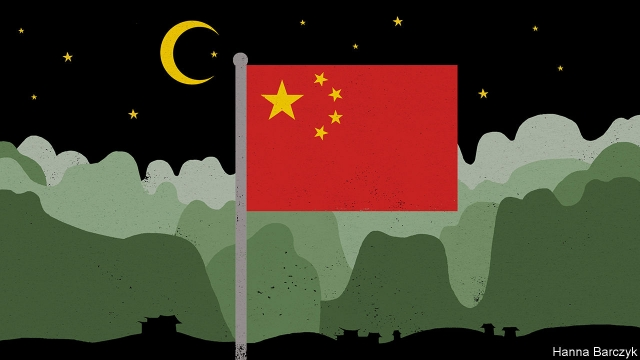

###### Chaguan

# History shows the folly of China’s paranoia about Islam 

##### Crude attempts to sinicise the faith will alienate Muslims 

 

> Jan 17th 2019 

 

IT IS A shame that so few Chinese remember General Bai Chongxi, a brilliant tactician during the war against Japan in 1937-45. He showed China that it is possible to be at once a patriot and a devoted Muslim. Bai was a complicated figure. A warlord capable of ruthlessness, he was also a reformer who wanted education to free his fellow Chinese Muslims from isolation and poverty. As a commander of Kuomintang (or Nationalist) troops, he was involved in massacres of Communists. Still, when Chaguan this week visited Bai’s home town in Guangxi province, in the south, locals praised his victories over the Japanese. The Bai family mansion is a protected historical site. Austere and grey-walled, it sits amid rice fields and limestone peaks straight from a scroll painting. Its empty interior offers no explanation as to why Bai matters. 

He was once one of China’s best-known Muslims. Under the autocratic Nationalist rule of Chiang Kai-shek, Bai became head of a body representing the Hui minority, a diverse group of about 10m Chinese united by their Muslim faith. Often indistinguishable from China’s ethnic-Han majority, their ancestors include Persian merchants and Central Asians imported by 13th-century Mongol rulers. The body headed by Bai, the China Islamic National Salvation Federation, recruited Muslim troops and made the religious case for war with Japan. It supported Muslim schools and job schemes for refugees. Bai encouraged Hui delegations to tour the Muslim world to seek diplomatic backing for China’s war effort. 

The general, who died in Taiwan in 1966, might have had useful advice to offer today. China is drawing up a five-year plan to “sinicise” Islam, as if the religion had been polluted by links to the outside world. In recent months Hui communities from Ningxia and Gansu in the north-west to Yunnan in the south have seen private Arab-language schools closed, mosques raided for providing “illegal religious education” and Islamic-style domes removed from buildings. Officials renamed the Aiyi river in Ningxia, a region that is home to around 2m Hui, because its name was “Arabic-sounding”. In December Chinese media reported that Gansu and six other regions were abolishing local standards for halal, or Muslim-approved, foods, in the name of fighting extremism and foreign influences. If such measures stir thoughts of repression in the far-western region of Xinjiang, where as many as a million Muslims from the Uighur minority have been sent to re-education camps, that is no coincidence. Ningxia officials recently toured Xinjiang, pledging to learn from its “good practices”. 

The Hui have faced suspicions of disloyalty before. In 1280 a Mongol emperor of China, Kublai Khan, outlawed halal food and other Islamic customs, reputedly incensed because Muslim merchants had refused a banquet he offered them. In a forthcoming essay for the Rubin Museum in New York, Johan Elverskog of Southern Methodist University describes a panic that gripped the Qing dynasty in the 1760s. Amid reports that Arab-educated Islamic hardliners were stirring up trouble, local officials were told to report all Muslim misdeeds. A new law deemed three or more Muslims found with any weapon to be criminals. “As might have been expected,” the professor writes, officials inundated the Qing court with reports of dangerous Muslims, prompting still-harsher laws and further radicalisation of the Hui. In time, rebellions followed. 

Yet long before Communist bosses vowed to regulate Islam, Hui elites crafted what amounted to their own sinicised versions of Islam, advocating political loyalty to China’s rulers alongside eternal allegiance to Allah. One age of co-operation, about 400 years ago, generated the “Han Kitab”, texts that reconciled Confucianism and Islam, teaching Muslims to obey any emperor who upheld a social order aimed at moral perfection. Jump to the 1920s, and a reformist scholar, Wang Jingzhai, promoted the phrase aiguo aijiao or “loving our country is as one with loving our faith”, which hangs in Chinese mosques. The expression had authority because it was both patriotic and Islamic. It is ascribed to the Prophet Muhammad. Wang translated it after studying in Mecca. 

If it is a shame that Bai Chongxi is largely forgotten, it is heartbreaking to find how defensively he is remembered in places that know his name. Bai’s kinsfolk still live in villages near Guilin city. Chaguan found some of them preparing ducks for curing ahead of Chinese new year. Alas, even mild questions about whether their ancestor protected the Hui caused disquiet. “Just stop talking,” hissed a woman to an old man surnamed Bai, who had begun answering as he salted duck neck-bones. “We are very happy and there is no ethnic discrimination,” said the woman. 

In nearby Jiu village, home to a century-old mosque, Wang Yisehakai, the ahong or imam, blandly praised General Bai as a pious man who prayed in the heat of battle. He added, improbably: “The most important thing about Bai is that he cared for his parents.” Asked about politics, Mr Wang said his community’s only ills come from lost faith. He grumbled that fewer than a dozen elderly Hui pray each week at his mosque, which looks like a Chinese temple with its tree-filled courtyard and curving roof. 

At the Bai family mansion, Chaguan bumped into four male travellers from Ningxia, sporting straggly beards, long robes and the white prayer caps of pious Hui. One, surnamed Zhou, hailed General Bai’s strong faith but scorned any link between Islam and patriotism. “We are put on Earth to have our faith in Allah tested. We are not interested in politics at all,” he said. “Such things as aiguo aijiao are spoken only by those who don’t understand.” 

Such a historically ignorant vision of Chinese Islam would appal Bai Chongxi, as would official attacks on halal rules. The general was a pragmatist. During wartime rows about dietary codes he proposed creating Hui units with their own food so they could get on with fighting. Communist bosses seem not to care for such approaches. They prefer sullen submission to shared loyalties. 

