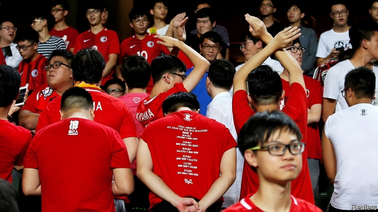

###### Facing the music

# Hong Kongers could be jailed for disrespecting China’s anthem 

##### A tough new law aims to boost patriotism. It won’t 

 

> Jan 17th 2019 

 

THE BOOS can be heard around Mong Kok stadium, the home of Hong Kong’s football team. Some young supporters clad in red home jerseys cup their hands around their mouths, amplifying their displeasure. Such scenes are common anywhere when a player is penalised. But the rowdy fans on this brisk October evening at the club’s most recent home match are not angry with the referee. They are trying to drown out China’s national anthem, which is played before every game featuring Hong Kong’s team. At some matches locals have turned their backs or waved banners reading “Hong Kong is not China”. 

Embarrassingly for the central government in Beijing, local fans did not boo “God Save the Queen”, Britain’s anthem, when it was played at fixtures before 1997, the year Hong Kong was returned to Chinese sovereignty. Why such outrage over China’s song? It stems from the failure of the “Umbrella Movement” of 2014, which, among other things, demanded direct elections for Hong Kong’s chief executive. In its wake many Hong Kongers concluded that what China meant by “one country, two systems” was really just one country, with the Communist Party in charge of it and with Hong Kong enjoying only a semblance of the “high degree of autonomy” that China promised it could have for at least 50 years after Britain’s withdrawal. 

China continues to fuel that outrage. It now insists that Hong Kong should pass a law banning deliberate disrespect for the anthem, “The March of the Volunteers”, and requiring all primary and secondary schools to teach their pupils how to sing it with due decorum. Such a bill is due to be presented to Hong Kong’s legislature, known as Legco, on January 23rd. It says that those who “publicly and intentionally insult” the anthem could be fined HK$50,000 ($6,375) and jailed for up to three years. It is all but certain to be adopted. The party has engineered Hong Kong’s political structure to ensure that lawmakers who support its policies control Legco. 

The new law says its purpose is to “enhance citizen awareness of the People’s Republic of China” and “promote patriotism”. Some students may indeed enjoy singing the song, even though it is in Mandarin, which is not typically spoken in Hong Kong and some residents have difficulty pronouncing. It is a call-to-arms from the era of China’s war against Japan in the 1930s and 1940s: “Brave the enemy’s gunfire, march on!”, it urges, without mentioning the party. But some young people are angry. In December 2017, as Hong Kong began to mull the law, two students protested against it during a graduation ceremony at the Hong Kong College of Technology by sitting down while the anthem was playing. In November a group of students at the Chinese University of Hong Kong also disrupted such a ceremony with chants denouncing plans for the law. 

Pro-democracy legislators say they will vote against the bill because it infringes on freedom of speech, which is guaranteed by Hong Kong’s constitution (and China’s). They may also be worried about how it will affect them. The law requires that the national anthem be “played and sung” when lawmakers take their oaths of office. Previously the anthem has not been involved. One legislator worries that its “totally unnecessary” introduction may provide a pretext for the government to disqualify China-sceptic members-elect who fail to demonstrate what it deems to be sufficient respect for the song. 

An official at the government’s bureau which drafted the bill suggests there will be no punishment of legislators who do not sing along for reasons such as a sore throat. But worries are justified. Since the umbrella protests, calls have been growing for Hong Kong to be granted far greater autonomy from China, if not outright independence. In response, China has become more paranoid, directing Hong Kong’s pliant officials to nip any sign of separatism in the bud. Independence-leaning politicians have been kicked out of Legco for failing to take their oaths properly. Others have been barred from running for election. Taiwanese academics critical of China have been refused entry to Hong Kong. Last September the tiny pro-independence Hong Kong National Party was banned. It was the first political group in the territory to be outlawed since 1997 (its leader has appealed against the ruling). 

Such restrictions are not endearing the Chinese government to Hong Kongers. A survey by the University of Hong Kong found that in May 54% of respondents lacked confidence in “one country, two systems”—a near-record high. At the time of the handover fewer than one in five had misgivings about the idea. Over the same period those who expressed distrust in the central government rose from fewer than a third to nearly half of those surveyed. A poll last month conducted by the same university found that Hong Kongers would sooner call themselves “global citizens” than “Chinese”. 

The government in Beijing clearly believes that the best way to cope with this is to get even tougher. But it has yet to deploy a much-feared weapon, known as Article 23. This refers to a clause in Hong Kong’s constitution that requires the territory to pass laws against treason, secession, sedition and subversion. An attempt by Hong Kong’s government to do so in 2003 was abandoned after hundreds of thousands of protesters took to the streets. The anthem law may be the central government’s way of testing the waters before pressing Hong Kong to have another go. 

One dedicated football fan and self-professed anthem-booer says the anthem law scares him “only a bit”. Supporters “can always wear masks”, he explains. Yet he may be wrong to be so nonchalant. Tucked into the anthem bill is a clause that allows the police to take up to two years to bring charges against members of any “large crowd of unidentified culprits”. (In less serious cases, the usual time limit for prosecuting people is six months.) The government, it appears, has planned one step ahead. Yet by obsessing over the means, it may have let the end slip away. 

