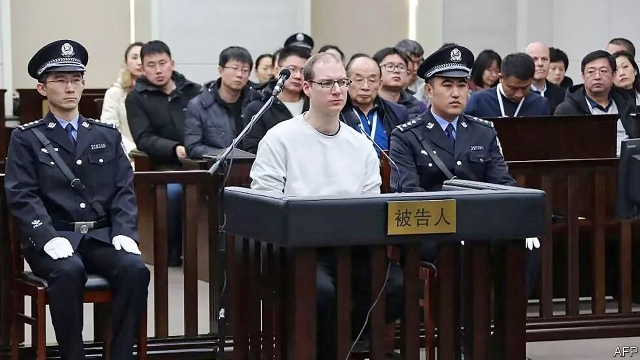

###### No mercy

# In China’s feud with Canada, the gloves are off 

##### A distinctly elitist logic appears to guide China’s behaviour 

 

> Jan 17th 2019 

 

WHEN EUROPE’S medieval princes met in battle, a grim change could be signalled by raising a red banner, revealing that bellum hostile—during which high-ranking prisoners could expect to be ransomed and returned unharmed—had become guerre mortelle, or a fight to the death. China’s modern-day rulers appeared to send a similar message on January 14th, when a Chinese court sentenced a Canadian man to die for drug-smuggling after a one-day retrial, organised after Canada arrested a well-connected Chinese executive. 

The court in Dalian, a northern port, deliberated for only about an hour before imposing the sentence on Robert Schellenberg, a 36-year-old former oilfield worker who says he was framed. He was convicted of trying to smuggle 222kg of methamphetamine to Australia, hidden in tyres. Mr Schellenberg’s first trial, which saw him sentenced in December to 15 years in prison, took more than two-and-a-half years. Prosecutors said at his retrial that he was part of an international network, justifying a harsher penalty. 

A distinctly elitist logic has seemingly guided China ever since Canadian officials arrested Meng Wanzhou, the chief financial officer of Huawei, a telecommunications giant, on an American warrant. Ms Meng, the daughter of the firm’s founder, is on bail at her Canadian home, waiting to hear if she will be extradited to the United States, where prosecutors want her to face charges of deceiving banks about business transactions with Iran that breached American sanctions. Members of China’s elite and the general public alike have not concealed their outrage that so powerful a figure—a member of the corporate aristocracy—could be arrested by a country as puny as Canada. They frame the case as a test of strength between China, Canada and America, rather than a question of law. 

Before Mr Schellenberg’s latest sentencing China had already taken what looked a lot like two hostages. Alleging unspecified actions that endangered China’s national security, secret police in December detained Michael Kovrig, a former Canadian diplomat turned analyst for the International Crisis Group, a think-tank, and Michael Spavor, a businessman from Canada who has led tour groups into North Korea. Both men are being held in secret detention sites. Unlike Ms Meng, who has high-octane lawyers and is free to roam Vancouver on bail, neither man has been allowed to meet a lawyer or family members. 

China’s foreign ministry has spent weeks denying that detained Canadians are, in effect, being held for ransom against Ms Meng’s release. The trading became a little more visible at a foreign-ministry press conference on January 16th, when a spokeswoman, Hua Chunying, was asked if China was open to Canadian appeals for clemency for Mr Schellenberg. Drug smuggling is a serious crime, Ms Hua replied. Possibly referring to Ms Meng’s detention she added: “Canada has been repeating that it is a law-abiding country. We hope that it could earnestly take some concrete actions to show its respect for the rule of law.” 

Meanwhile, Ms Meng’s father, Ren Zhengfei, the 74-year-old founder and president of Huawei, offered foreign journalists a rare interview at his headquarters in Shenzhen. He sought to dispel his firm’s sulphurous reputation in America, where officials have urged allies to shun Huawei on security grounds when building new super-fast 5G networks. 

Saying that he missed his daughter “very much”, Mr Ren responded to critics who call Huawei a tool of China’s intelligence agencies. He cited official denials that China’s cyber-security laws require “back doors” in high-tech equipment. He said he had never received a request from any government to provide improper information. And, in an unexpected touch, Mr Ren called Donald Trump “a great president” for passing tax cuts. The telecoms tycoon seemed to send the American leader a direct message, suggesting that Chinese investments in America might be scared away by “the detention of certain individuals”; that would not be in America’s interests. Spoken like one prince to another. 

