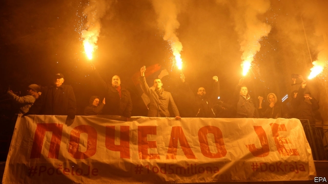

###### Dissent in Belgrade

# Is Serbia still on course to join the European Union? 

##### Protests are rocking the country 

 

> Jan 19th 2019 

 

IT IS BACK to the future, but this time with iPhones and selfies. As thousands of Serbs protest against their president, Aleksandar Vucic, it is easy to recall the heady days of the 1990s when people marched against Slobodan Milosevic. When he fell in 2000, their slogan was “It is over!” Today’s banners proclaim “It has begun!” 

The number of protesters who have marched for the past six weeks is disputed. But days before a visit by Russia’s President Vladimir Putin on January 17th, they showed no sign of abating. The protests started after Borko Stefanovic, leader of a small leftist party, was coshed and kicked as he arrived on November 23rd for a meeting in the town of Krusevac. The perpetrators, he says, were thugs connected to a local businessman close to Mr Vucic’s ruling party. Serbia is a front-runner to join the EU, whose leaders, says Mr Stefanovic, indulge Mr Vucic because they want the Balkans to remain stable and for him to clinch an agreement with Kosovo, which declared independence from Serbia in 2008. 

Mr Vucic’s critics say he is an authoritarian who controls the national news, especially on television and in newspapers that older Serbs still rely on. Middle-class Serbs in Belgrade, the capital, form the core of the protests, though they have occurred in smaller towns as well. Srdjan Bogosavljevic, a veteran pollster, says his Ipsos monthly data show that 44% of Serbs think the country is heading in the right direction, whereas 33% think the opposite. If Mr Vucic called an election, as he may, 65-75% are thought likely to vote for him or an allied party. Serbia’s economy grew by 4.4% last year, unemployment has been dropping and foreign investment is flowing in. 

Mr Bogosavljevic says that Serbs are less poor than they were, especially outside Belgrade. Still, up to 50,000 people emigrate every year. Ana Brnabic, Serbia’s prime minister, says no decision has been made to call an election. She says she still has lots to do—and is “always interested in constructive criticism”. But the protesters’ complaints are “not based on facts.” She wants to continue reforms and investments in education and digitalisation. 

The leaders of Serbia’s opposition, who have formed an alliance, do not make speeches to the protesters because they are so diverse that any one of them would be greeted with abuse by supporters of the others. They range from liberals to arch-nationalists. For instance, the enemies of Bosko Obradovic, the leader of Dveri, call him a clerical fascist. He says he is a “modern conservative”, keen on democracy and family values. He talks of restoring Serbian rule over Kosovo and of uniting in one state with Bosnia’s Serbs. Mr Vucic, he says, is committing “high treason” for talking of a possible exchange of territory with Kosovo’s Albanians. Mr Obradovic lauds Mr Putin, Italy’s Matteo Salvini and Hungary’s Viktor Orban as Europe’s future: Serbia “should catch this new geopolitical train”. He and the rest of the opposition would boycott an election, he says. 

That puts Mr Vucic in a bind. A new parliament full of his supporters but without the bulk of the opposition represented would tarnish Serbia’s image as a rough but soon-to-be EU-ready democracy. Mr Obradovic sneers at Mr Vucic as “the last believer in the EU”. 

