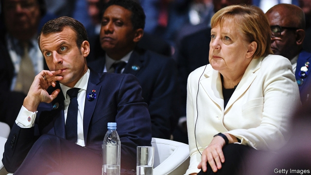
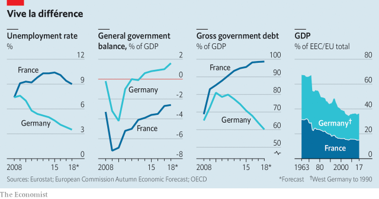

###### Charlemagne: The Aachen treaty

# Macron and Merkel renew their vows 

##### But underlying relations are troubled 

 

> Jan 17th 2019 

 

“GENTLEMEN, NEVER forget that for France there can be no other alternative but friendship with Germany.” Half a century after Charles de Gaulle uttered these words to his ministers, the relationship between France and Germany remains the most important in Europe: an emblem of peace and reconciliation, and the foundation stone of European integration. 

To renew and strengthen this essential bond, President Emmanuel Macron and Angela Merkel, Germany’s chancellor, will meet on January 22nd in the German border town of Aachen (Aix-la-Chapelle in French), where they will sign a 16-page treaty. The ceremony takes place 56 years to the day after de Gaulle and his West German counterpart, Konrad Adenauer, met at the presidential palace in Paris to sign the Elysée treaty, capping the two countries’ move from Erbfeinde (hereditary foes) to partners in what a later West German chancellor would call the entente élémentaire. 

The inauguration in 2017 of Mr Macron, a passionate European who spoke of seizing a historic moment to face down nationalism, seemed to offer the best chance in years to restart the Franco-German motor. For Mrs Merkel, who had grown used to disappointment under three previous French presidents, Mr Macron looked like a serious reformer, ready to improve French competitiveness and steady its public finances. Mr Macron hoped to inspire Germany to join him in reforming the euro area and bolstering the EU’s resilience. He filled his government with Germanophiles, from his prime minister and finance minister down, and rarely acted before weighing the German response. 

Yet a harsh reality has since set in. Despite the ambitions laid out by Mr Macron in a sweeping speech at the Sorbonne in September 2017, the sense of possibility that dominated those early months has mostly evaporated. This is reflected in the low ambition of the new treaty. In place of grand plans for an EU army or commonly guaranteed bonds, you find hopeful language on co-ordinating decisions and plans to deepen municipal co-operation in border regions. An agreement between the countries’ parliaments will establish a 100-member joint assembly. Officials speak of turning the model of co-operation embodied in the Elysée treaty into a platform for Franco-German “convergence”. But it is aspirational at best. “Fifty-six years on, everyone knows the Elysée treaty,” says Henrik Enderlein of the Hertie School of Governance in Berlin. “I doubt anyone will look at the Aachen treaty in 50 years.” 

Its meatiest provisions concern defence and security co-operation. France and Germany account for almost half the EU’s military-industrial capabilities, says Claudia Major at the SWP think-tank in Berlin. If they don’t agree, things don’t move. The French have welcomed German help in their operations in the Sahel, and the pair work together in the so-called Normandy format with Russia and Ukraine. 

Yet there remains a gulf in strategic understanding. “Germany does not need a strong army for its understanding of sovereignty,” says Wolfgang Schäuble, president of the Bundestag and one of Germany’s great Francophiles. “France is a different story.” The Germans strongly opposed the French intervention in Libya in 2011, and remain suspicious that schemes like Mr Macron’s European Intervention Initiative, set up outside the EU, are a ruse to get other Europeans to pay for French action in Africa. French officials are frustrated by German unwillingness to deploy troops, and consider PESCO, a framework for EU defence projects promoted by Germany, as woefully unambitious. This leads to a split-the-difference approach, reflected in Aachen’s dispiritingly Eurocentric proposal for France to back a permanent seat for Germany on the UN Security Council. 

On the euro zone Mr Schäuble, finance minister in the 2010-12 crisis, says that German positions, including in his centre-right Christian Democratic Union, have notably softened: “Compared to the positions in my parliamentary group six years ago things are much better.” Yet it is hard to ignore the gap between achievement and aspiration. Mr Macron had sought a euro-zone budget worth “several points of GDP”, as well as a special parliament and finance minister. The budget the euro zone agreed to consider in December is an order of magnitude less ambitious. Banking union proceeds at a glacial pace, thanks in part to German fears about Italy’s wobbly lenders. 

Inside Europe, the pairing has proved most effective when the two governments have first battled to secure agreement among themselves. “The strength of the relationship is that we come from different directions and find a joint position,” says Michael Roth, Germany’s Europe minister. Hard-fought compromises tend to endure, and, despite the occasional fear of a Franco-German stitch-up, can sweep up other countries who feel their interests are roughly represented by one or other of the big two. 

Yet in an enlarged EU other groups, like the central European Visegrad four or the Dutch-led “New Hanseatic League”, can make the weather; the Hanseatics represent at least as big a roadblock to Mr Macron’s euro-zone plans as Germany. And the motor often sputters. Proposals to harmonise the two countries’ corporate-tax systems as the basis for an EU-wide agreement, for example, have been around since 2011. Similarly, a much-heralded French push for an EU tax on digital giants like Google and Facebook has struggled to gain traction in Berlin. In frustration Bruno Le Maire, France’s finance minister, has applied a digital tax unilaterally. 

 

The difficulties stem in part from diverging analyses of Europe’s place in the world. Mr Macron is impatient to bolster what he calls “European sovereignty” in the face of an increasingly assertive China and an unreliable America. Germany is not immune to such arguments; its manufacturers are belatedly waking up to the Chinese threat, for example. That has helped motivate Germany’s push with France to lean on sceptical competition authorities in Brussels to allow the merger of the rail operations of Siemens and Alstom. 

Yet as one French official puts it, “Germany is a slow-moving country, and doesn’t like big visions.” Few Germans share Mr Macron’s instinct to turn politics upside-down. To many, compromise sounds suspiciously like watering down rules, or paying for French indiscipline or military adventures. Economically, Germany’s strong performance has bred complacency at home and an outsized fear of indiscipline abroad. The French case is not helped when Italy seeks to bail out failing banks with state money or Greek finance ministers threaten to blow everything up. 

The ties will endure, if only because France has nowhere else to turn and Germany, especially after Brexit, has no better partners. “Yes, it’s difficult,” says an adviser to Mr Macron. “But is there anybody else who has ideas?” The heady ambitions of the Sorbonne speech already belong to a different time. There is little chance of progress in 2019 owing to EU and German state elections, and Mr Macron’s troubles with the gilets jaunes (his trip to Aachen will be his first outside France for nearly a month). Addressing well-wishers during his first visit to Berlin in 2017, Mr Macron said he wanted “even bigger” crowds five years later, once he and Mrs Merkel had brought results. Good luck with that. 

