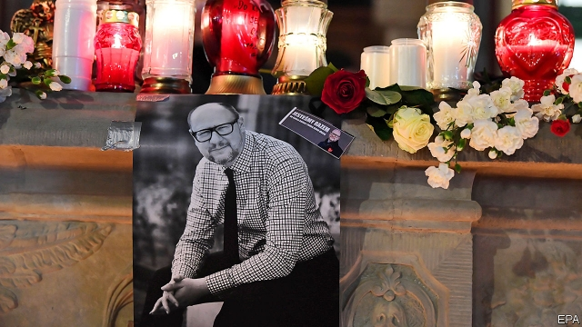

###### Gdansk weeps

# Poland is horrified by the murder of Gdansk’s mayor 

##### Some see a reflection of the country’s turbulent politics 

 

> Jan 17th 2019 

ON THE AFTERNOON of January 13th Pawel Adamowicz, the mayor of Gdansk on Poland’s Baltic coast, had been out on the street collecting money for an annual charity fundraiser. Hours later, he was stabbed on stage at the charity’s evening gala, a knife plunged deep into his chest by a lone attacker. People queued up to give blood. But despite doctors’ efforts, Mr Adamowicz died the following afternoon. He was 53 years old. 

The attack has shaken Poland. Politicians of all stripes expressed their condolences, including Jaroslaw Kaczynski, the reclusive leader of the ruling Law and Justice (PiS) party. PiS and the centrist Civic Platform opposition, to which Mr Adamowicz originally belonged (though he ran for mayor as an independent), are at loggerheads. Many commentators have been anxious to stress that this should be no time for political point-scoring. Yet some inevitably see the attack as a symptom of the polarisation of politics since PiS came to power in 2015. 

Mr Adamowicz, who had held the post of mayor of Poland’s sixth-largest city since 1998 and was re-elected last autumn, was known for his liberal views. Defying the government’s anti-immigration rhetoric, he was one of a dozen Polish mayors to sign a declaration on the “friendly admission of immigrants” in 2017. Like other opposition politicians, he was routinely attacked in the PiS-controlled public and pro-government private media. Others note that the attack took place at the gala of the Great Orchestra of Christmas Charity, an NGO that raises millions of euros for equipment for children’s hospitals every year, yet has been attacked in right-wing circles. As a large non-government outfit, it is regarded with considerable suspicion by paranoid statists. 

The attacker, a 27-year-old man from Gdansk who had recently been released from prison, is being questioned by police. Speaking from the stage after the attack and before he was arrested, he accused Civic Platform, which was in power in Poland from 2007 to 2015, of putting him in prison. Little is known about his precise motives, or indeed his sanity. But as Poland enters a crucial year, leading up to parliamentary elections in the autumn, Mr Adamowicz’s shocking death will weigh heavily. 

