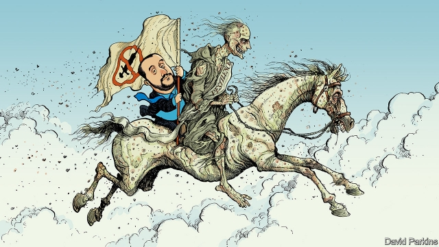

###### Charlemagne: the bio-populists

# The campaign against vaccination 

##### Disease will be a major political battleground in the coming decades 

 

> Jan 17th 2019 

 

JENNY ARDUINI only ever wanted the best for her young son. The 36-year-old mother from Emilia-Romagna in Italy read that the government was banning unvaccinated children from pre-school classes. That seemed autocratic. The state was imposing its will on families rather than letting them make their own decisions. Ms Arduini had heard that vaccinations could cause autism. “I was really angry,” she recalls: “I wanted to defend my child from something bad.” Most of all, she felt stifled: “I wanted time to understand, time to work it out, I didn’t want to be forced into a choice.” A leftist, Ms Arduini is generally sceptical of authority. That made her a supporter of the Five Star Movement, an Italian populist party then in opposition and now in government that preaches direct democracy and parental choice on vaccinations. 

So incensed was she that she messaged IoVaccino, a pro-vaccination campaign group, to lambast them for inspiring the law. Ms Arduini’s email reached Stefano Zona, a father of three and a doctor specialising in epidemiology. “Jenny was really frustrated and angry,” he remembers. Over several months the two discussed vaccinations by phone and online. Often they would talk about fear. What was there to be afraid of? How should one cope with risk? Gradually Ms Arduini came round, Mr Zona appealing to her as a parent of a similar age. Early last year she sent her son for his jabs and remains happy with her choice: “I’m very lucky that my anger ended in dialogue with experts.” 

Across Europe, the rise of populism is damaging public health. A common feature is scepticism of vaccines. Immunisation rates are declining and the diseases they are designed to stop are on the rise. Measles cases are at a 20-year high. In Italy, which used to be a model of good vaccination practice, take-up has fallen since 2005 to a level lower than that of Ghana. Between 2016 and 2017 the number of measles cases rose sixfold, to around 5,000. France, Serbia and Greece have also seen notable spikes, but the trend applies across almost the entire continent. 

Emilia-Romagna, the region where Ms Arduini and Mr Zona live, is the hub of the battle. A prosperous, well-educated place that lies between Florence and Milan and has a tendency towards progressive politics, it made vaccines obligatory for schoolchildren in 2016, the first part of Italy to do so. The government in Rome, at that time centre-left, rolled out a similar law across the whole country in 2017. Yet Emilia-Romagna is also the heart of the “anti-vax” campaign. In 2012 a court in Rimini applied a debunked paper linking autism and vaccines to a parental-choice case, sparking pro-choice movements. Andrew Wakefield, a disgraced British doctor now loved by Hollywood stars, who had written the paper, presented his film on the supposed dangers of vaccinations there. It is also in Rimini, an Adriatic beach resort and a Five Star stronghold, that the powerful anti-vaccination campaign “Comilva” has its Italian headquarters. 

The Five Star Movement was anti-vaccinators’ first keen political voice. Beppe Grillo, the scruffy blogger who founded the party, has long spread doubt about vaccines. When it entered government last June, Five Star helped elect as prime minister Giuseppe Conte, a lawyer known for defending stamina therapy, a debunked medical method used to treat illnesses like cancer. But now the party is coming round. Last week Mr Grillo even signed a pro-vaccination “pact for science” launched by Roberto Burioni, a campaigning medical professor from Milan. But the right-wing Northern League is stepping into the void left by its governing partner’s conversion. Hungry for the votes of anti-vaxers, Matteo Salvini, Italy’s interior minister and the League’s leader, has adopted Mr Grillo’s lines. He calls vaccines “useless and in many cases dangerous, if not harmful”, and is trying to reverse obligatory vaccinations, although his bid to do so last summer fell apart. 

Like their counterparts in Italy, populists elsewhere—such as Heinz-Christian Strache in Austria and Marine Le Pen in France—have argued for “parental choice”, even though vaccines only work to control diseases as contagious as measles if 95% of a population is covered. Grasping for an alternative cause of disease, some settle on migrants. In fact, they are often better immunised than natives, embrace local health care and do not fuss about vaccines. Yet Ms Le Pen rails against “bacterial immigration” while Viktor Orban, the populist Hungarian prime minister, calls migrants “poison”. A social-media animated video by the governing Freedom Party shows “Ali”, a patient wearing a fez and a moustache, trying and failing to scam his way into a hospital. The government in Vienna has also reversed a planned ban on smoking in public places. 

These disparate phenomena point to the rise of what one might call bio-populism. It is increasingly clear that Europe’s populists want for the body what they want for the nation: purity, unity and self-governance. Populist health policies mean citizens being free from outside influences—whether vaccines devised by doctors, regulations invented by politicians or diseases supposedly carried by migrants—and in control of their own epidemiology. They are fuelled by fear (“No one else will defend you,” notes Ms Arduini) and a curious combination of me-first libertarianism and anti-expertise herd mentality. 

Emilia-Romagna shows that there is an antidote to this bio-populism. Many, like Ms Arduini, are changing their minds. Mr Burioni, with his myth-busting Facebook page and bestselling books such as “Vaccines are not an Opinion” and “Why Science can’t be Democratic”, feels he is making progress. Yet a broader spectre looms. At least one pandemic will probably sweep the interconnected world in the next decades. A Europe sceptical of medical expertise, determined to blame illnesses on outsiders and wrapped in national flags may find it harder to cope with such a crisis. Viruses, after all, know no borders. 

