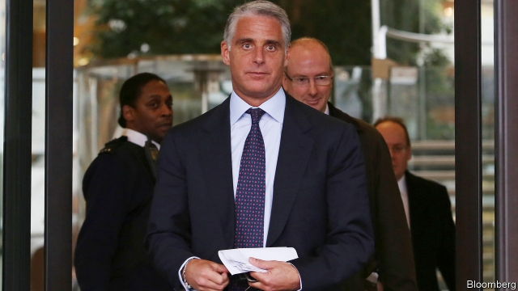

###### Deal? No deal

# Andrea Orcel’s move from UBS to Santander falls through 

##### A new signing proves too pricey 

 

> Jan 17th 2019 

 

IN ONE LUDICROUSLY well-paid profession, January is a month for big-money moves. Stars grin for the cameras, are lauded by their new bosses and gush about their future teammates. Sometimes deals collapse at the last minute—occasionally, embarrassingly, in public. So much for football, where such pratfalls are merely part of the show. But not, surely, at Spanish banking’s equivalent of Real Madrid? 

On January 15th Santander, Spain’s biggest bank (and the euro area’s, by market capitalisation) declared that Andrea Orcel would not, after all, be its next chief executive. Until September Mr Orcel was head of the investment bank at Switzerland’s UBS. He had been due to succeed José Antonio Álvarez in April, after “gardening leave”. 

Santander now says Mr Orcel is too expensive. Mr Álvarez, instead of becoming chairman of its domestic arm, will stay. Compensating Mr Orcel for deferred pay, in not-yet-vested shares and convertible bonds, from his seven years at UBS would cost more than the “considered estimate” it made when it appointed him. Reportedly €50m ($57m), the sum would be “unacceptable for a retail and commercial bank such as Santander”—not least politically, in a country that suffered severely in the financial crisis. “Even”, said Ana Botín, Santander’s executive chairman, for “one as talented as Andrea”. 

The bulk of Mr Orcel’s pay was deferred, thanks to post-crisis regulation intended to tie bankers’ fortunes to their banks’ long-term health. Such rules force early leavers to forgo a lot of money. UBS took the view that it was up to Santander, having pinched Mr Orcel, to see him right—as the Swiss bank did when he quit Bank of America Merrill Lynch in 2011. Santander, though, had expected UBS to foot some of the bill. Among other things, it argued that it was not a direct rival. To no avail. 

It is unclear how much Mr Orcel will now keep. He had made no secret of wanting to head a bank. He may not have made it at UBS, whose chief executive, Sergio Ermotti, is just three years his senior. Santander may have seemed an odd choice for an investment banker. But Mr Orcel knows it well. He used to advise Emilio Botín, Ms Botín’s father, who ran the bank before her. He knows now that he won’t run it too. 

