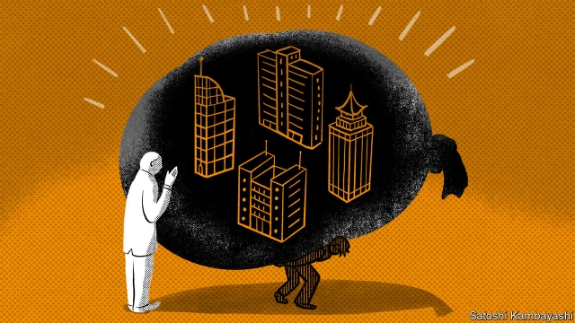
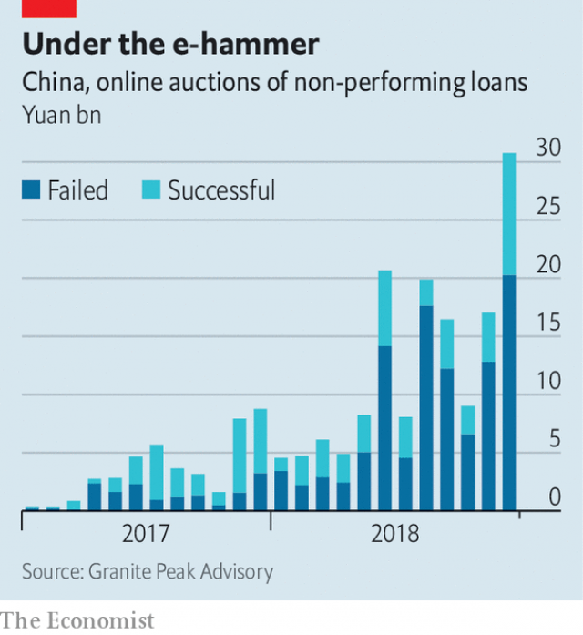

###### So bad it’s good

# As China’s debt soars, the market for buying bad loans revs up 

##### Where most see peril, a hardy few see profits 

 

> Jan 17th 2019 

 

FOR MANY investors, debt in China is something to fear, a shadow over the world economy. But for a different breed, it looks more like a terrain of untapped profits. This dichotomy has been sharpened by a run of weak data in recent days. Worries about a sharp slowdown in China have rattled global markets. But for the opportunists, it is a time of plenty—a chance to snag assets from banks at a discount. 

Both camps start from the same point. They see that debt in China has soared over the past decade and conclude that lending must be tamed. Yet there are clear economic downsides to doing so. Barely any progress has been made on reining in credit, but economic growth is already suffering. In the past few weeks business orders have declined, imports have fallen unexpectedly and weak price data have raised the spectre of deflation. 

This, though, is where the small but hardy group of investors diverges from the mainstream gloom. To repair their balance-sheets, banks are under pressure to sell off failed loans, mostly channelling them through an array of state-owned “bad banks”. Outside buyers can then buy these assets and, with some work, earn good returns on them. Though they have little chance of collecting repayment from the original borrowers, they take possession of the collateral—almost always property—at knock-down prices. 

It is a niche market, but, as with any product, the crucial variables are supply and demand, both of which have shifted in buyers’ favour. Chinese banks have long had plenty of lousy assets. They categorise more than 5% of their loans—nearly 5.6trn yuan ($830bn)—as either non-performing or “special mention”, meaning they might soon run into trouble. But they are now restructuring them at a faster clip to make room for the next wave. Last year they wrote off 988bn yuan in non-performing loans, up more than a third from 2017, according to official data. “They are preparing for tougher times ahead,” says Nicholas Zhu of Moody’s, a credit-rating agency. On top of that, regulators are getting stricter. They, for instance, now require that banks classify loans that are overdue for more than 90 days as non-performing, as is normal in developed markets. 

On the demand side, buyers were, as recently as 2017, rushing to scoop up bad loans. Inexperienced investors such as peer-to-peer firms, flush with cash, thought they could turn an easy profit. They had not grasped the complexity of dealing with bad loans. “They were pricing them as if they could collect 100% of the market value of the collateral, which never happens in real life,” says Benjamin Fanger, founder of ShoreVest, a Guangzhou-based debt investor, and a rare veteran of China’s bad-loan market. 

Many of these local investors have now exited. A bear market in stocks has dampened enthusiasm. And regulators have once again played a critical role, placing more restrictions on funds that invest ordinary savers’ cash. One measure of how fast the landscape has changed is the growing number of online bad-loan auctions that ended with no buyer. Though two-thirds of online auctions succeeded in 2017, just 41% did last year, according to Granite Peak Advisory, a consultancy based in New York (see chart). 

 

At the same time a few big foreign firms have started dipping their toes in the water. Bain Capital, one of the world’s largest investors in alternative assets, has bought three portfolios of bad loans in China over the past two years, worth $650m in principal. Kei Chua, a managing director at the firm, recalls balking at the market in the early 2000s. It was so chaotic that several people would claim ownership of the same building. Times have changed: China now has, among other things, a system for checking claims on property. “It’s professional, it’s predictable,” he says. Given the amount of bad debt coming down the pipeline, at least the pipes themselves seem to be in reasonable shape. 

