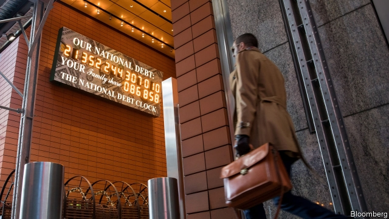
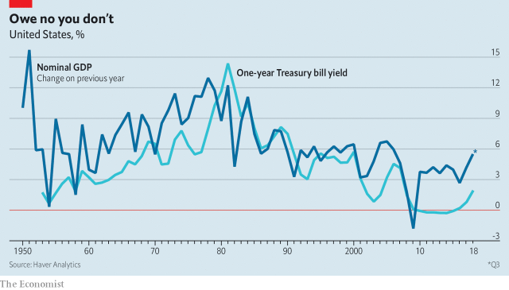

###### Free exchange

# Economists reconsider how much governments can borrow 

##### The profession is becoming less debt-averse 

 

> Jan 17th 2019 

IN THE LAST three months of 2018 America’s federal government borrowed $317bn, or about 6% of quarterly GDP. The deficit was 1.5 percentage points higher than in the same quarter the year earlier, despite the fact that the unemployment rate fell below 4% in the intervening period. In cash terms America borrowed in a single quarter as much as it did in all of 2006, towards the peak of the previous economic cycle. 

Such figures might once have sent the country’s deficit scolds into conniptions. But scolds are in short supply, at least within the halls of Congress. Republicans were the architects of President Donald Trump’s budget-busting tax plan. Some Democrats are less content than ever to tie their hands with the fiscal rules that Republicans routinely flout. Early this year progressive Democrats urged Nancy Pelosi, the speaker of the House of Representatives, to abandon “PAYGO” rules, which require that new spending be paid for with matching tax increases or offsetting spending cuts. 

Even more surprising is the reaction among economists. Heterodox schools of thought have long questioned the view that government spending must be paid for by taxes. “Modern monetary theory”, which synthesises such views, is proving increasingly popular among left-wing politicians. The charismatic new congresswoman from New York, Alexandria Ocasio-Cortez, is a fan. 

Orthodox economists have traditionally been more cautious. “Government spending must be paid for now or later,” wrote Robert Barro, of Harvard University, in a seminal paper published in 1989. “A cut in today’s taxes must be matched by a corresponding increase in the present value of future taxes.” 

Interest-rate wobbles once sent shock waves across Washington. In 1993 James Carville, a Democratic political adviser, mused that if reincarnation existed he wanted to come back as the bond market. “You can intimidate everybody,” he quipped. More recently Carmen Reinhart of Harvard University, Vincent Reinhart of Standish Mellon Asset Management and Kenneth Rogoff, a former chief economist of the IMFnow at Harvard, have published research that argues that periods in which government debt rises above 90% of GDP are associated with sustained slowdowns in economic growth. 

But government borrowing looks less scary than it used to, and some mainstream economists are reconsidering the profession’s aversion to debt. They once feared “crowding out”—that government bonds would lure capital that would otherwise finance more productive private-sector projects. But real interest rates around the world have been falling for most of the past 40 years, suggesting that there are too few potential investments competing for available savings, rather than too many. Indeed, government borrowing could “crowd in” new private investment. Public spending on infrastructure might raise the returns to private investment, generating more of it. 

 

That still leaves bills to be paid. Yet here, too, things are less clear cut than one might suppose. The experience of Japan, where gross debt as a share of GDP exceeds 230%, suggests that even very high levels of debt may not scare away creditors, at least in advanced economies that borrow in their own currencies. And in a recent lecture Olivier Blanchard, another former chief economist of the IMF, pointed out that when the pace of economic growth exceeds the rate of interest on a country’s debt, managing indebtedness becomes substantially easier. In such cases debt incurred in the past shrinks steadily as a share of GDP without any new taxes needing to be levied. Debt might nonetheless rise if annual deficits are sufficiently large, as they are in America now. Even so, at prevailing interest and growth rates and with deficits continuing to run at 5% of GDP, it would take more than a century for America’s ratio of gross debt to GDP to reach the current Japanese level. 

Of course, interest rates could rise. But most commonly growth rates tend to exceed the rate of interest. Since 1870, Mr Blanchard noted in his lecture, the average nominal interest rate on one-year US government debt has been 4.6%, while the average annual growth rate of nominal GDP has been 5.3%. Growth rates have surpassed interest rates in every decade since 1950, except the 1980s. Nicholas Crafts of the University of Warwick wrote that the difference between growth and interest rates did more to reduce British debt loads in the 20th century than budget surpluses. Indeed, austerity-induced deflation in the 1920s frustrated attempts to pay down war debts. 

In a pinch, governments have tools to manage unwieldy debt burdens. Ms Reinhart and Belen Sbrancia, of the IMF, noted that financial repression was a critical debt-reduction tool in the decades after the second world war. During this period inflation pushed real interest rates (ie, adjusted for inflation) into negative territory. This effectively imposed a tax on savers that, owing to restrictions on the movement of capital, could not easily be avoided. Repression is not costless; it limits the extent to which capital flows towards its most productive uses. But it is unlikely to be devastating for a mature modern economy. 

Governments cannot borrow without limit. Whether or not creditors mind, a government can throw only so much cash at its citizens before their spending exhausts the economy’s productive capacity and pushes up prices at an accelerating pace. 

Yet for much of the past decade politicians have stimulated economies too little. Rich countries have spent far more time below their productive capacity than above it—at grave economic cost. An overdeveloped fear of public debt, nurtured by economists, is partly to blame. But experience suggests that governments face looser budget constraints than once thought, and enjoy more freedom to support struggling economies than previously believed. Economists, happily, are taking note. 

