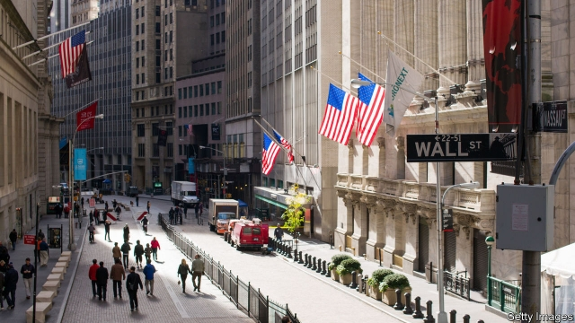
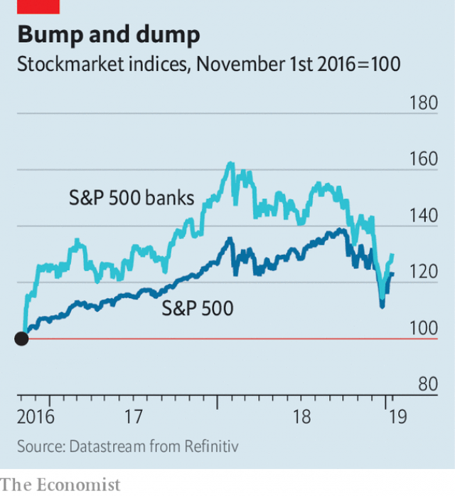

###### American banks in rude health

# The big beasts of American banking rumble on 

##### There is a cycle, but who knows when it turns? 

 

> Jan 17th 2019 

 

AMERICA’S BANKS ended 2018 as stockmarket pariahs. For a year or more after Donald Trump was elected president, their shares had been borne aloft by looser regulation, tax cuts and rising interest rates. But investors began to fret that those forces were fading, the long economic expansion would soon end and banks’ profitability was therefore at its peak. In the last four months of last year some lenders’ stocks dropped by 20%-plus, far more than the S&P 500’s 13.6%. The result was “recession prices without a recession”, according to Mike Mayo, an analyst at Wells Fargo. 

Now it seems things aren’t quite so bad after all. Prices have perked up (see chart). The fourth-quarter earnings season, which started on January 14th, has brought reassurance, rather than renewed worry, at least for the very biggest. Of the leading banks that had published their numbers when The Economist went to press on January 17th, only Citigroup and Bank of New York Mellon recorded a return on equity below 10%. The industry probably enjoyed its best year since the crisis. 

To be sure, not all the quarter’s news was good. Mighty JPMorgan Chase, the country’s biggest bank, for once fell short of analysts’ profit forecasts. Investment bankers had mixed fortunes in tempestuous markets. Bond investors stayed away as credit spreads widened. Betsy Graseck of Morgan Stanley points out that high-yield spreads rose by the most since 2011, when Standard & Poor’s, a rating agency, downgraded the American government. Fixed-income revenues slid—by 21%, year on year, at Citigroup. Underwriting stalled for most, as companies were wary of launching share and bond sales on choppy waters. Still, merger business stayed buoyant and the stockmarket’s volatility helped equity trading: revenues rose by 17% at Goldman Sachs. (Morgan Stanley, Goldman’s great rival, was due to report on January 17th.) 

 

Away from Wall Street, there are few signs yet that profitability is faltering. Despite Mr Trump’s blustering on trade, the shutdown of the federal government and the sheer longevity of the boom, employment and growth data remain healthy. Net interest margins have widened, although banks have had to pay more for deposits as customers have shifted cash out of accounts that don’t pay interest into those that do. Commercial and industrial lending—which had hitherto grown steadily rather than spectacularly—even accelerated, to 10.3%, at an annual rate, in the fourth quarter. Guy Moszkowski of Autonomous Research adds, however, that companies may be tapping bank credit lines as capital markets tighten. 

Some think 2019 could be even better than 2018. According to Mr Mayo, who expects another record year for earnings, improving efficiency is the “most unappreciated” factor. The biggest banks, he thinks, are starting to reap the benefits of scale and enormous investments in technology. In the fourth quarter Bank of America boasted a cost-to-income ratio at its retail bank of 45%, down from 60% in mid-2015. 

That, plus the reinforcement of balance-sheets forced on banks since the crisis, should equip lenders for a downturn and increased credit losses when the weather finally turns. “We don’t exactly know where we are in the cycle,” Jamie Dimon, JPMorgan’s boss, told analysts on January 15th. All he, or anyone else, knows is that there is one. And that banks are in much better nick than a decade ago. 

