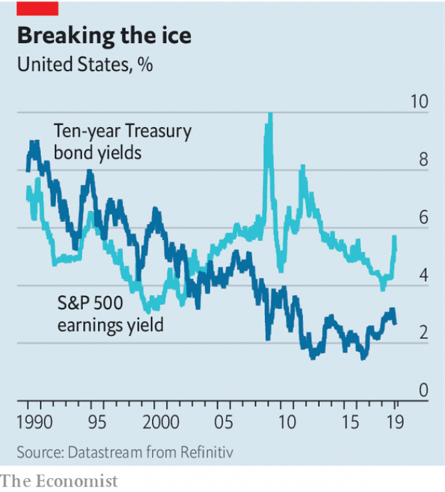

###### The Albert call

# The view from a long-standing stockmarket bear 

##### The risks of a hard landing in China remain, and the euro will break up 

 

> Jan 19th 2019 

 

IN UNCERTAIN TIMES Albert Edwards is someone you can rely on. For more than two decades, latterly as global strategist at Société Générale, he has been a steadfast prophet of gloom. As he stood to address the 400 or so investors gathered at his annual conference (or “bear-fest”) in London this week, he made a typically confident forecast. “We work at a French bank,” he said. “So we’ll be sure to get you away by five o’clock.” 

That was the only cheerful prediction of the day. His colleague Andrew Lapthorne and guest presenter Gerard Minack (formerly of Morgan Stanley and a kindred spirit) struck similar notes. The core message has not changed much, but neither has Mr Edwards’ popularity. With unfailing regularity he is ranked number one in his category in surveys of global investors. He admits to getting it wrong a lot. But his talent for imagining the worst is valuable. If you have a vague anxiety, Albert will give it form. “When I’m right, it’s very painful,” he says. 

Like a lot of non-conformist preachers, Mr Edwards started out in the lower clergy, or the finance profession’s version of it—as a researcher at the Bank of England. He has scarcely had a good word since for the established church of central banking. In the early noughties, when a callow Buttonwood was a colleague, he charged Alan Greenspan, the Federal Reserve chairman, with near-criminal negligence for his easy-money policy. At a sales meeting, he likened Japan’s policy of quantitative easing (QE) to necrophilia: if the economy is twitching, it does not mean it has come back to life. At this week’s bear-fest he scoffed at the confidence central bankers have expressed in their ability to reverse QE. 

When Mr Edwards first developed his “Ice Age” thesis in the 1990s, he stood out from the general cheerleading of stockbroker strategists. The template was Japan. Debt and disinflation would lead to rising bond prices (and falling yields). At the same time, there would be a “derating” of equities, so that prices would fall relative to earnings (and the earnings yield would rise). One part of this was right. The trend in bond yields has been down (see chart). But the derating of equities did not happen. This was because of “massive, massive QE”, he explains. 

Now that QE is being withdrawn, it is no surprise that markets are jumpy. Recessions of recent vintage began when a fairly modest tightening in monetary policy led to a blow-up in finance, he argues. High levels of corporate debt in America mean the next one will be deep. Mr Edwards is no more sanguine about other economies. The risks of a hard landing in China have not abated. And the euro is doomed to break up. Mr Edwards cites a survey that shows how younger Italians are far more hostile to the European Union than older ones. Italy’s steep unit-wage costs militate against the jobs the young crave. Trapped in the euro, it cannot easily lower them. 

When things get rough, what then? “Fat-cat QE” has led only to rising asset prices, reckons Mr Minack. Politicians will instead turn to “People’s QE”, a policy (favoured by Jeremy Corbyn, leader of the opposition Labour Party in Britain) of personal tax cuts paid for by printing money. Mr Edwards concurs—but of course he goes further. When recession bites, “Corbyn will be seen as a moderate!” The pressure on policymakers to do something will be hard to resist. 

 

To protect themselves, investors should favour cash and gold. Mr Edwards thinks the yields on Treasuries will plummet to below zero in the next recession. So bonds will offer protection in the short term. But they will suffer a painful reckoning, if the authorities are eventually able to create inflation. Mr Lapthorne puts in a word for Japan as the best equity market to be in, comprising as it does cheapish, profitable firms that have run down their debts. 

Mr Edwards is often dismissed as a perma-bear. It is true that he does not update his views very often. In this he resembles an old-school Marxist or a modern-day Eurosceptic. They all believe that in the end they will be proved right; the twists and turns in the meantime are of minor importance. 

In at least one sense Mr Edwards is already vindicated. His pet themes of disinflation, the dangers of debt, the vices of central bankers and the perils of complacency are now also found in the PowerPoint packs of rival strategists. There were hints at the bear-fest of a post-Ice-Age era, in which bonds are to be avoided and inflation hedges are the thing to own. Until then, the message is the same as always. The world is ending. But at least you’ll be home in time for tea. 

