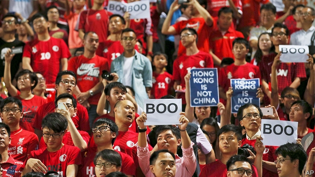

###### Hong Kong: One country, two song-sheets

# A new law aims to stop the booing of China’s national anthem 

##### The harsh bill is another blow to the territory’s freedoms 

 

> Jan 17th 2019 

 

“ARISE! ARISE! ARISE! Millions of hearts with one mind,” go the lyrics of China’s national anthem, “The March of the Volunteers”. Yet many people in Hong Kong are not of one mind with China’s government. The territory has been a part of China since Britain handed over the former colony in 1997. But its football fans routinely boo and turn their backs when the Chinese anthem is played. At pro-democracy protests, a few people sometimes even wave the British colonial flag. Some youngsters are also beginning to demand greater independence from China. In 2016 such “localists” gained one-fifth of the popular vote in elections to Hong Kong’s legislature, known as Legco. 

The Communist Party in Beijing has responded as it always does when confronted: by flexing its muscles. It engineered the expulsion of six localists from Legco. It cheered the local government’s decision last year to ban a pro-independence group and expel a British journalist who had had the temerity to invite the group’s leader to speak at an event. Now, at the party’s behest, Hong Kong is preparing to introduce a law that would punish those who deliberately insult the national anthem with up to three years in jail and a stiff fine (see article). Schools will be required to teach pupils how to sing the tune with proper decorum. And students had better pay attention: the age of criminal responsibility in Hong Kong is ten, as it is in England (in mainland China it is 14). By the party’s design, Legco is dominated by Hong Kongers who are the Communists’ cheerleaders. It is certain to pass this draconian bill. 

Hold on, the party’s critics might say, what about China’s promise to let Hong Kong run itself under the slogan of “one country, two systems”? Why is it asking Hong Kong to pass a law that so clearly challenges the freedoms the territory enjoyed when China took over and which the party said it would keep? Under British rule, it was never illegal for Hong Kongers to mock “God Save the Queen”. China’s answer is, in effect, that “one country” is the more important part of the deal. In 2017 it passed its own national-anthem law. It then tweaked Hong Kong’s constitution to require it to do the same. There is a precedent for that. At the time of the handover, Hong Kong had to pass a law against desecrating the national flag because China had such a law, and insisted. 

But even the flag law was contentious. In 1999 the territory’s Court of Appeal overturned the conviction of two men for violating it, ruling that the bill was unconstitutional. The case went to the supreme court which, to the horror of pro-democracy politicians, upheld the original verdict of guilty. The introduction of the anthem law looks vindictive. China introduced its own such law only after Hong Kong’s football supporters took to booing the song. That was in the wake of Hong Kong’s “Umbrella Movement”, with its weeks-long protests in 2014 demanding an end to party-rigged elections—a great idea to which the party and the government in Hong Kong responded with a resolute no. Displays of contempt for Chinese symbols of state were born out of justifiable bitterness at China’s refusal to allow full democracy, which Britain had never established in Hong Kong but the party had once appeared to promise the territory might one day enjoy. 

The irony is that China’s obduracy is to some extent self-defeating. Unlike the people of Hong Kong, who were given little say over the terms of the British handover, the 24m citizens of Taiwan have more freedom. Their democracy is thriving, and there is no colonial government to tell them what to do. Taiwan, too, has been offered China’s ill-defined notion of one country, two systems, if the island agrees to let China absorb its territory. However, the more China abuses Hong Kong’s liberties, the less unification will appeal to the Taiwanese. 

In a speech on January 2nd, much ballyhooed by China’s state media, China’s leader, Xi Jinping, said that peaceful reunification with Taiwan under one country, two systems was the “best way”. But he also said that China would not renounce the possible use of force against the island. And reunification, he said, was “inevitable”. Taiwan’s president, Tsai Ing-wen, was right to scoff at his remarks. China’s behaviour has amply demonstrated that the party’s pledges are not to be trusted. It wants one country with only one party ever allowed to rule it; as for two systems, it is clear which one will have primacy. The anthem law in Hong Kong is a warning of what the future may hold for Taiwan. 

