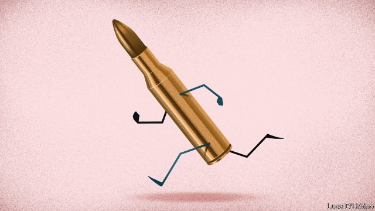

###### Taming terminators

# How to tame autonomous weapons 

##### As military systems get cleverer, humans must keep up 

 

> Jan 17th 2019 

 

FOR THOUSANDS of years, weapons went where humans thrust, threw or propelled them. In the past century, they have grown cleverer: more able to duck and weave to their targets; more able to select which of many ships, tanks or aircraft to strike; and more able to wait for the right target to turn up. Increasingly, such weapons can be let loose on the battlefield with little or no supervision by humans. 

The world has not entered the age of the killer robot, at least not yet. Today’s autonomous weapons are mostly static systems to shoot down incoming threats in self-defence, or missiles fired into narrowly defined areas. Almost all still have humans “in the loop” (eg, remotely pulling the trigger for a drone strike) or “on the loop” (ie, able to oversee and countermand an action). But tomorrow’s weapons will be able to travel farther from their human operators, move from one place to another and attack a wider range of targets with humans “out of the loop” (see article). Will they make war even more horrible? Will they threaten civilisation itself? It is time for states to think harder about how to control them. 

The UN’s Convention on Certain Conventional Weapons (CCW) has been discussing autonomous weapons for five years, but there is little agreement. More than two dozen states (including Austria, the Vatican, Brazil and nuclear-armed Pakistan), backed by increasingly vocal activists, support a pre-emptive ban on “fully autonomous weapons”. They point to campaigns against anti-personnel landmines, cluster munitions, and biological and chemical weapons as evidence that this can succeed. Most big powers—among them America, Russia and Britain—retort that the laws of war are already good enough to control autonomous weapons. Some argue that such weapons can be more accurate and humane than today’s. 

A third group of countries, led by the likes of France and Germany, is urging greater transparency and scrutiny. Autonomous systems make wars more unpredictable and harder to supervise; and they make it harder to assign responsibility for what happens during conflict. This third group is surely right to try to impose at least some controls. 

The laws of war are still the right place to start. They do not seek to ban war, but to limit its worst excesses. Among other things, they require that warriors discriminate properly between combatants and civilians, and ensure that collateral damage is proportionate to military gains. Military actions must therefore be judged in their context. But that judgment is hard for machines to form. 

In addition, new rules will be difficult to negotiate and monitor. For one thing, it is hard to control what does not yet exist and cannot be precisely defined. How long may a drone hover above the battlefield, empowered to strike, before it has slipped out of the hands of the humans who sent it there? The difference between machines under human control and those beyond it may be a few thousand lines of secret code. 

That said, two principles make sense. First, the more a weapon is permitted to roam about over large areas, or for long periods, the more important it is that humans remain “on the loop”—able to supervise its actions and step in if necessary, as circumstances change. That requires robust communication links. If these are lost or jammed, the weapon should hold fire, or return. 

A second tenet is that autonomous systems, whether civilian ones like self-driving cars or those that drop bombs, should be “explainable”. Humans should be able to understand how a machine took a decision when things go wrong. On one point, at least, all states agree: that the buck must stop with humans. “Accountability cannot be transferred to machines,” noted a report of the CCW in October. Intelligent or not, weapons are tools used by humans, not moral agents in their own right. Those who introduce a weapon into the battlefield must remain on the hook for its actions. 

A good approach is a Franco-German proposal that countries should share more information on how they assess new weapons; allow others to observe demonstrations of new systems; and agree on a code of conduct for their development and use. This will not end the horrors of war, or even halt autonomous weapons. But it is a realistic and sensible way forward. As weapons get cleverer, humans must keep up. 

