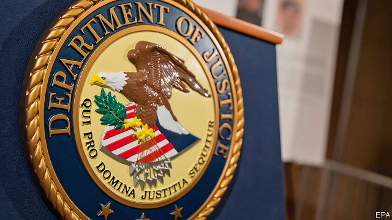

###### Judge dread

# The trouble with America’s extraterritorial campaign against business 

##### Facing little scrutiny from the courts, prosecutors have overreached 

 

> Jan 17th 2019 

 

FOR EUROPEAN firms operating in Asia, or Latin American and Asian firms hustling in Africa or the Middle East, business risks abound. Surprisingly high on the list of things that keep bosses awake with cold sweats at night is falling foul of America’s Department of Justice (DOJ) or its Treasury Department. 

The United States leads the world in punishing corruption, money-laundering and sanctions violations. In the past decade it has increasingly punished foreign firms for misconduct that happens outside America. Scores of banks have paid tens of billions of dollars in fines. In the past 12 months several multinationals, including Glencore and ZTE, have been put through the legal wringer. The diplomatic row over Huawei, a Chinese telecoms-equipment firm, centres on the legitimacy of America’s extraterritorial reach (see article). 

America has taken it upon itself to become the business world’s policeman, judge and jury. It can do this because of its privileged role in the world economy. Companies that refuse to yield to its global jurisdiction can find themselves shut out of its giant domestic market, or cut off from using the dollar payments system and by extension from using mainstream banks. For most big companies that would be suicidal. 

Wielding a stick is often to be applauded. Were it not for America’s tough stance against FIFA, for instance, the dodgy officials who ran world football would not have been brought to book. But as the full extent of extraterritorial legal activity has become clearer, so have three glaring problems. 

First, the process is disturbingly improvised and opaque. Cases rarely go to court and, when they are settled instead, executives are hit with gagging orders. Facing little scrutiny, prosecutors have applied ever more expansive interpretations of what counts as the sort of link to America that makes an alleged crime punishable there; indirect contact with foreign banks with branches in America, or using Gmail, now seems to be enough. Imagine if China fined Amazon $5bn and jailed its executives for conducting business in Africa that did not break American law, but did offend Chinese rules and was discussed on WeChat. 

Second, the punishments can be disproportionate. In 2014 BNP Paribas, a French bank, was hit with a sanctions-related fine of $8.9bn, enough to threaten its stability. In April ZTE, a Chinese tech firm with 80,000 employees, was banned by the Trump administration from dealing with American firms; it almost went out of business. The ban has since been reversed, underlining the impression that the rules are being applied on the hoof. 

Third, America’s legal actions can often become intertwined with its commercial interests. As our investigation this week explains, a protracted bribery probe into Alstom, a French champion, helped push it into the arms of General Electric, an American industrial icon. American banks have picked up business from European rivals left punch-drunk by fines. Sometimes American firms are in the line of fire—Goldman Sachs is being investigated by the DOJ for its role in the 1MDB scandal in Malaysia. But many foreign executives suspect that American firms get special treatment and are wilier about navigating the rules. 

America has much to be proud of as a corruption-fighter. But, for its own good as well as that of others, it needs to find an approach that is more transparent, more proportionate and more respectful of borders. If it does not, its escalating use of extraterritorial legal actions will ultimately backfire. It will discourage foreign firms from tapping American capital markets. It will encourage China and Europe to promote their currencies as rivals to the dollar and to develop global payments systems that bypass Uncle Sam. And the DOJ could find that, having gone all guns blazing into marginal cases, it has less powder for egregious ones. Far from expressing geopolitical might, America’s legal overreach would then end up diminishing American power. 

