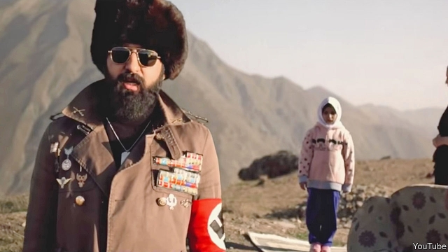

###### Rebel music

# An Iranian pop star challenges the regime 

##### Once a favourite of the mullahs, Mehdi Yarrahi’s music is now testing their tolerance 

 

> Jan 17th 2019 

 

THE POP star Mehdi Yarrahi was once a favourite of Iran’s ayatollahs. In 2017 he won the award for best pop album from the Ministry of Culture and Islamic Guidance. But now the regime thinks Mr Yarrahi is singing out of tune. In a video for the song “Pare Sang” (Broken Stone), the Arab crooner wears a jacket adorned with military medals—and an armband with a swastika on it. Devastating images appear around him: a man seems to have set himself on fire, buildings collapse and families queue at a dry tap. “Another generation went to war and did not return,” he sings. “I’m the last one of this tribe, a tribe with no food and no water.” 

The response to Mr Yarrahi’s work highlights the tension between Iran’s Persian core and its restless ethnic minorities. He is a hero in his home province of Khuzestan, which is mostly Arab and borders Iraq. Three decades on from Iran’s war with Iraq, the region still lies in ruins. The scenes from the video are pulled from its recent history. “The duty of artists is to ask questions and convey the voice of the people to the authorities,” says Mr Yarrahi. 

Regime loyalists see things differently. They denounce Mr Yarrahi as a traitor and say he is insulting Iran’s war dead. Khuzestan has been the scene of anti-regime protests and separatist attacks. Gunmen killed 25 people at a military parade in Ahvaz, the provincial capital, last year. After the video was released Mr Yarrahi was summoned for questioning. But the Ministry of Guidance scotched reports that he had been banned. Rather, it says, he has repented. 

By their own standards, the mullahs are showing a soft touch. Some think they are trying to avoid trouble ahead of Islamic Revolution Day next month. Hardliners don’t like it. “The more we relax, the more there is dissent,” complains a nervous regime hand. At the end of Mr Yarrahi’s video a clock ticks and a bell tolls as the words “to be continued” appear on the screen. 

