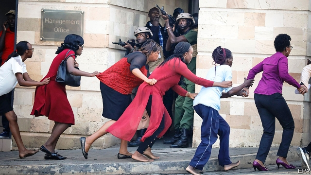

###### Kenya attacked

# Another terrorist outrage in Nairobi 

##### Despite a long military campaign against al-Shabab, the group can still inflict bloodshed 

 

> Jan 17th 2019 

 

KENYA HAS a reputation, often deserved, for being among Africa’s most successful states. Yet its vulnerability to terrorism has long been a weakness. So there was universal dismay, but little surprise, when jihadist gunmen attacked a hotel and office complex in one of Nairobi’s most affluent districts on January 15th. 

At least five gunmen forced their way past a security barrier at the 14 Riverside complex, in the suburb of Westlands, in mid-afternoon. One reportedly blew himself up. Others ran through the grounds firing automatic weapons and lobbing grenades. Late lunchers were killed in their seats at a restaurant near the entrance. Office workers and hotel guests hid where they could, as the killers prowled the corridors. “They were literally hunting us, banging on doors and calling us to come out,” said a researcher who cowered in an office loo. Kenyan security forces rescued hundreds and killed the gunmen. But at least 21 people died, according to official figures. 

Nairobi has been here before. In September 2013 gunmen unleashed slaughter at the Westgate shopping mall, barely a mile away, killing 67 people. Al-Shabab, a Somali group of jihadists linked to al-Qaeda, have claimed responsibility for both attacks; retaliation, they say, for a Kenyan incursion into Somalia. 

The latest attack was designed to inflict more than just mortal wounds. As at Westgate, 14 Riverside is frequented by both foreigners and rich Kenyans. Western businessmen liked to stay at its plush hotel. Multinational companies, such as Colgate-Palmolive and BASF, had moved into its five office blocks. The jihadists clearly hoped again to punish the Kenyan elite, unnerve investors and deter tourists. Al-Shabab have carried out massacres elsewhere in Kenya, but breaching the gilded suburbs of the enemy’s citadel is particularly satisfying for them. After Westgate, jittery members of Nairobi’s middle class demanded a withdrawal of Kenyan troops from Somalia. Mr Kenyatta held firm, but he is likely to face renewed pressure. 

Given the five-year lull in attacks on Nairobi, the Riverside massacre demonstrates both the limits of al-Shabab’s abilities and the grandiosity of their ambitions. It also suggests that they are far from beaten. African Union (AU) troops have been fighting them in Somalia since 2007. Kenya mounted its own invasion in 2011. More than 300 jihadists have been killed since Donald Trump, America’s president, expanded air strikes last year. 

Though al-Shabab have been pushed out of cities and towns they once held, they have proved resilient. In the past three years their fighters have launched devastating attacks on AU bases and have repeatedly struck Mogadishu, Somalia’s capital. In 2017 one of their bombs killed nearly 600 people. The group is also fighting a low-level insurgency in north-eastern Kenya. 

Financial nous partly explains the group’s success. Al-Shabab impose duties on farm produce and livestock sales. Somalis braving the roads pay up more willingly at al-Shabab checkpoints, which sometimes seem less predatory than those manned by Kenyan troops. One roadblock may bring in the equivalent of $10m a year, reckons the UN Monitoring Group on Somalia and Eritrea. For all the casualties it has suffered, the movement is battle-hardened and adapting. Commanders who run successful operations are promoted. 

Air strikes alone are unlikely to stop them. Yet a further ground offensive looks unlikely to happen. The AU has 20,000 men in Somalia, but many of them are reluctant to risk their lives as they count the days until they can go home. The AU wants to cut its force by about 1,000 this year, but it has repeatedly delayed the withdrawal because of the slow pace of training Somali soldiers to take over. The Somali government’s intelligence agencies, meanwhile, have been extensively penetrated by al-Shabab. 

Kenya will therefore have to focus on defending its own borders. Some lessons have been learned since 2013. The army’s response to Westgate was badly bungled. Police and army units squabbled over who was in command. When assaulting the building, soldiers opened fire on a special police unit advancing from another part of the mall and killed its commander. The army was also accused of prolonging the siege in order to loot shops, and may have blown up part of the building to cover its tracks. By contrast, army and police units at Riverside fought alongside each other under the single command of the head of a paramilitary unit whose efficacy belies its unofficial motto of “Try it and see”. 

Under British and American tutelage, intelligence-gathering has become more effective. An attempt to hit Nairobi last February was thwarted after police intercepted a vehicle carrying explosives, grenades and guns in northern Kenya. Yet corruption has undermined progress. Under interrogation, the driver said that the would-be attackers were able to slip in and out of Somalia by bribing border guards. This week they got another chance. 

