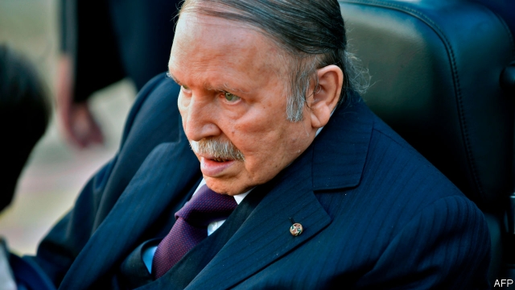

###### Who’s got the power?

# As Abdelaziz Bouteflika fades, Algeria considers a successor 

##### But the country’s ruling elite cannot agree on who should replace the elderly president 

 

> Jan 17th 2019 

 

NOBODY WOULD call him quick and lithe. But Abdelaziz Bouteflika has something in common with the cheetahs that dart across the Sahara: he is rarely seen. Algeria’s 81-year-old president has made few public appearances since suffering a stroke in 2013 and being confined to a wheelchair. Last month a meeting with Muhammad bin Salman, Saudi Arabia’s crown prince, was cancelled ostensibly because Mr Bouteflika had flu. 

Yet the president, who has ruled since 1999, will probably win a fifth term in an election scheduled for April. Algeria is hardly democratic. It opened its political system in 1989, but Islamists won the first round of parliamentary polls in 1991 and the army cancelled the rest of the election. Since then elections have not been free or fair. Mr Bouteflika won the last one with a whopping 82% of the vote, even though he hardly campaigned. 

Whether he runs (and wins) this time will be up to the cabal of generals, businessmen and politicians, known as le pouvoir (the power), that rules Algeria. They have left Mr Bouteflika in place despite his ailments, in large part because they cannot agree on a successor. Even now, most probably support his re-election. Disagreements are usually kept within the shadowy clique. But as the vote approaches, some in le pouvoir are raising questions, in public, over the president’s future. 

Last month, in an interview with El Watan, an influential newspaper, Ali Ghediri, a retired general, called on General Ahmed Gaid Salah, the head of the armed forces, to stop “adventurers” within the government from extending the president’s tenure. This month Mouloud Hamrouche, a former prime minister, wrote a long essay in El Watan bemoaning the state of governance in Algeria. Some politicians have called for the vote, the date of which has not been set, to be postponed. 

General Gaid Salah, though, says he supports Mr Bouteflika’s re-election. In response to Mr Ghediri’s suggestion, he warned that people with “devious intentions” should not speak on behalf of the armed forces. In October he dismissed five generals for corruption, a move widely interpreted as a purge. Some also see his hand behind the sudden resignation, in November, of the head of the largest party in parliament, who was seen to be jockeying for influence in anticipation of Mr Bouteflika’s death. “There is an appearance of stability in the Algerian system,” says John Entelis of Fordham University. “But go deeper and you see a constant struggle to control the state apparatus.” 

Mr Bouteflika, who may not be able to speak, has not formally announced his candidacy. But as he drifts towards victory, the problem of his succession remains unresolved. There is no post of vice-president. General Gaid Salah and Mr Bouteflika’s brother, Said, have amassed power as the president’s health has declined. But the general is approaching 80, and many in le pouvoir oppose a dynastic succession. Some speculate that the job of president may eventually fall to Ahmed Ouyahia, the prime minister, or one of his predecessors. 

No one knows for sure. After the death of President Houari Boumédiène in 1978, those in power could not decide between Mr Bouteflika and another candidate. They settled on a third man whose rule led to a period of turbulence before Mr Bouteflika’s ascent. One thing is clear: ordinary Algerians will have little say in who rules them. 

