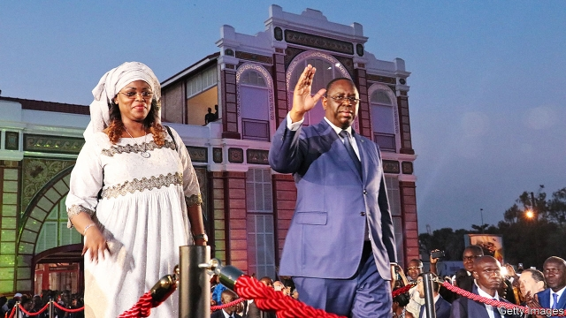

###### Plain sailing for Sall

# Macky Sall, Senegal’s president, will probably win a second term 

##### His main opponents are barred from running 

 

> Jan 17th 2019 

 

SEVERAL TIMES a week, police block off Dakar’s roads and 4x4s tear through the Senegalese capital. It is election time and Macky Sall, the president, has no time to waste in pesky traffic jams as he races from opening infrastructure projects to meetings at plush hotels. 

He need hardly bother. Mr Sall (pictured) looks far too powerful to be unseated in the presidential election on February 24th. Although Senegal has avoided the worst of the corruption—not to mention the coups and civil wars—that have plagued its neighbourhood, it is hardly the model democracy it is often held to be. 

Last year the government introduced a law that made it harder to qualify as a presidential candidate. Thousands protested against the act which, by reducing the number of contenders, was widely seen as a way of improving Mr Sall’s chances of winning more than 50% of the vote and thus avoiding a run-off. 

Sure enough, on January 14th the constitutional court released the shortest candidate list in three decades, with just five names. Mr Sall’s two most threatening rivals, the former mayor of Dakar, Khalifa Sall (no relation) and the son of a former president, Karim Wade, have been disqualified because of convictions for fraud and corruption respectively. Many voters think the charges were politically motivated. “This is an ill democracy,” says Alioune Tine, a former regional director of Amnesty International, a human-rights group. None of the remaining candidates seems powerful enough to force a second round in which, with a united opposition, they might have unseated the incumbent. 

Yet two still stand out. Ousmane Sonko is a former tax inspector who gained prominence when he published a book exposing corruption around Senegal’s gas discoveries. Mr Sonko’s firebrand call to abandon the CFA franc, which is pegged to the euro, may strike a chord with young voters. But he is campaigning on a shoestring budget and is barely known in the countryside. The other noteworthy candidate is Issa Sall (no relation to either the president or Khalifa Sall), who is backed by the Tijaniyyah Muslim brotherhood and has a following among conservative voters. 

The president, in contrast, has all the advantages of incumbency. He won office in 2012 against Abdoulaye Wade, whose term was marred by allegations of corruption and who had sparked huge protests when he contorted the constitution so that he could run for a third term. Although Mr Sall is unpopular among urban voters, he has a large following in the countryside and villages, where his government has built roads and water supplies. 

Dakar’s streets are lined with campaign posters of the president. One shows him next to a new motorway to the holy city of Touba, an offering to his backers, the Mourides, Senegal’s most powerful Muslim brotherhood. Another shows him next to a sports stadium in Diamniadio, a futuristic new city that is intended to ease pressure on Dakar. Looking at the posters and the motorcade, you might think that Mr Sall is sure to win. He probably will. 

