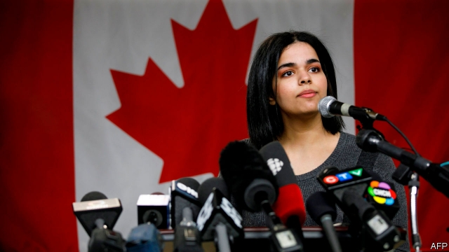
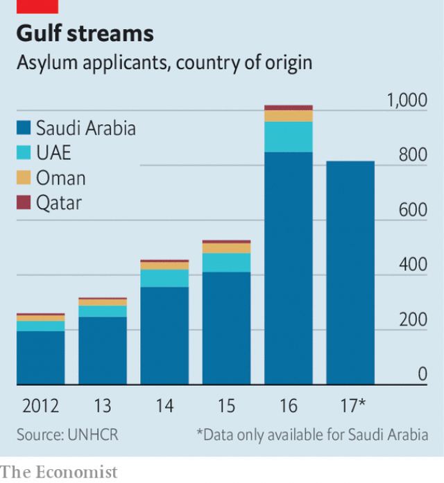

###### Voting with their feet

# Thousands of Gulf Arabs are abandoning their homeland 

##### Fed up with social restrictions and political repression, Saudis are leading the way 

 

> Jan 17th 2019 

 

CANADA LIES far north of her intended destination, but Rahaf Muhammad is happy to be enduring its harsh winter. The 18-year-old Saudi hoped to end up in Australia after escaping her allegedly violent family. But she was stopped on the way, in Bangkok. Saudi authorities pressed Thailand to send her back home. Ms Muhammad warned that her father, a provincial governor, would kill her. After several harrowing days in an airport hotel she was granted asylum in Canada, where she arrived on January 12th. 

Her case drew global attention, but thousands of other Saudis have been making a quieter exodus from the kingdom. Some, like Ms Muhammad (who dropped her family name, al-Qunun), are women escaping a rigid patriarchy. Others flee because of their political activism. The absolute numbers look small: 815 Saudis applied for asylum in 2017, according to the United Nations’ refugee agency. But that is a 318% increase over 2012 (see chart). 

The trend is not limited to Saudi Arabia. About three times as many from the United Arab Emirates (UAE) sought asylum in 2016 as in 2012. Tiny Qatar saw its count more than double in the same period. Saudi Arabia has seen the steepest increase, though. It would be tempting to blame this on Muhammad bin Salman, the crown prince, who has overseen a ruthless campaign of repression. Yet the increase started even before he became heir apparent in 2017. 

 

Though most Gulf states weathered the Arab spring without serious unrest, the revolutions elsewhere unnerved them. The UAE stepped up domestic surveillance and rounded up activists. Qatar passed a “cyber-crime” law that is broad and easily abused. Political activity was never encouraged in the Gulf, but after 2011 it was ruthlessly punished. 

Asylum claims do not tell the full story, because it is a step that many are unwilling or ineligible to take. Jamal Khashoggi would not have shown up on the UN’s tally. But the Saudi journalist took himself into exile in America, fearing he would be unsafe back home—a fear that was confirmed when Saudi agents murdered him in Istanbul last October. Liberal-minded Saudis who can afford to leave the country often cool their heels in London or Washington. 

Barely two years ago young people were flocking home to work with Prince Muhammad. Many found the kingdom’s social strictures stifling. In the crown prince, though, they saw a kindred spirit, a fellow millennial who wanted to reform the economy and culture. He delivered on the latter, permitting women to drive and allowing once-banned cinemas and concerts. 

“And then everything changed,” says one 30-something who took a government job. Hardly a fire-breathing dissident, she supports the monarchy and the goals of the Saudi-led war in Yemen (if not Saudi tactics there). But after Khashoggi’s murder and the arrests of hundreds of activists at home, she is planning to resign. 

The kingdom, as is its wont, blames foreigners for the case of Ms Muhammad. A state-backed “human-rights” group said other countries were “inciting” young women to leave. Saudi Arabia cut ties with Canada in August after the Canadian foreign minister, Chrystia Freeland, criticised the arrest of women’s-rights activists. Diplomats have given up hope of resolving the spat, so Ms Freeland was there to welcome Ms Muhammad to Toronto. 

Ms Muhammad, for her part, hopes to use her new-found freedom and platform to campaign for other Saudi women. But one of the first things she did on arriving in Canada was buy some warm clothes. 

