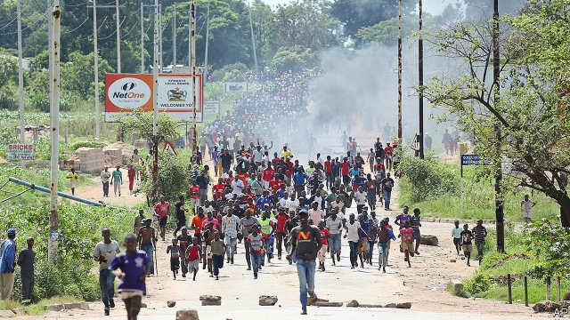

###### Zollarisation

# Zimbabwe’s economic crisis prompts protests and repression 

##### People have taken to the streets against a higher fuel price 

 

> Jan 19th 2019 

 

ON JANUARY 16TH Zimbabweans awoke to a text message from Econet, the country’s main internet provider. Citing a warrant from the office of the president, the firm said that the day before it had suspended its services. “The matter is out of our control,” it added. 

States do not order blackouts unless they have something to hide. In response to protests sparked by a rise in fuel prices announced on January 12th, security forces unleashed a violent crackdown. According to local activists, soldiers and police went door-to-door in townships, beating or shooting at protesters. In the capital, Harare, roadblocks manned by thugs from Zanu-PF, the ruling party, stopped the wounded reaching hospitals. Amnesty International says at least eight people have been killed and more than 200 arrested. 

The threat of violence served only to encourage participation in the national “stay away” called by trade unions. As The Economist went to press, schools, shops and offices in the main cities had been closed since January 14th. “The whole country is at home,” said Eddie Cross, a 78-year-old former opposition MP. “I’ve never in all my life seen anything like this.” 

After Emmerson Mnangagwa succeeded Robert Mugabe in a coup in late 2017, the new president claimed that Zimbabwe would be “open for business”. The events of the past week make that sound hollow. And the crisis has no end in sight. 

That is because the ruling junta is more willing to attack protesters than tackle Zimbabwe’s fundamental economic problems. After the profligate printing of money prompted a bout of hyperinflation in 2008-09, a government of national unity (with a finance minister from the opposition) cut spending and abolished the Zimbabwe dollar. The American one became the main currency, quenching inflation. The economy recovered swiftly. 

But the parsimony did not last after Zanu-PF took full control of the government in 2013. Unable to print real dollars, it made its own version, known locally as “zollars”. Though the government insists that a zollar is worth the same as a greenback, the black market says otherwise. On January 16th the zollar was fetching just a quarter of a dollar. 

Zimbabweans’ frustration was apparent even before the rise in the fuel price. In November official inflation reached 31% (many think this is an understatement), its highest level for a decade. Earlier this month doctors, teachers and nurses went on strike, demanding to be paid in real dollars. Many businesses are on the brink. On January 11th Olivine Industries, which produces cooking oil, halted business and sent home workers, saying it owed its foreign suppliers $11m. 

To start to bring an end to the Ponzi scheme of zollars and dollars, the government would need to give up the myth of parity. But Zanu-PF has a vested interest in this arrangement. Some members of its ruling elite can convert a zollar to a dollar at the central bank, while letting ordinary Zimbabweans starve. 

Instead of facing reality, Mr Mnangagwa has left the country. After announcing a rise in the price of petrol from 1.32 to 3.31 zollars, he boarded a private jet bound for Russia, the first leg of a jaunt that ends in Davos. In Moscow he signed a deal to give Alrosa, a Russian company, access to the country’s diamond fields. This may help a few real dollars trickle into the pockets of Zanu-PF bigwigs, but is unlikely to improve the lot of the rest of the country. 

Later on January 16th the internet was switched back on. Social media carried pictures of bloodied bodies. The blackout is over. But Zimbabwe’s darkness remains. 

