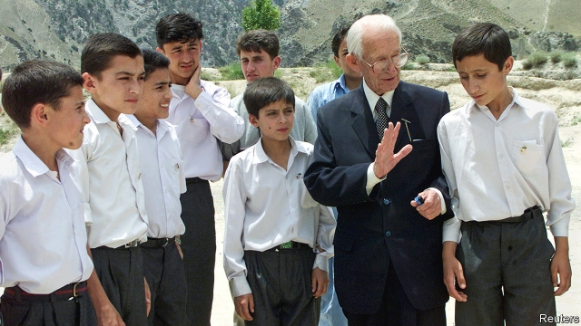

###### The last Britisher

# Obituary: Geoffrey Langlands died on January 2nd 

##### The revered teacher of British ways to Pakistan was 101 

 

> Jan 17th 2019 

 

AS A MAN of simple habits, Geoffrey Langlands liked to start his days in a time-honoured way. The reassuring tones of the BBC news at 5am. A hearty bowl of Quaker Oats. Two eggs, lightly done in a poacher from Selfridges. A cup or two of Lipton’s tea. A brief glance at the paper and then, in dark suit and tie or well-pressed navy blazer, a brisk stroll to the main school building. There he would be greeted by beaming pupils chorusing “Good morning, Sir!”—to which he would reply, in a voice crisped by King’s College, Taunton and six years of officer training, “Good morning!” 

The scene might be any public school in Britain; but appearances were deceptive. Breakfast was prepared by a servant. The paper was usually some days old. That walk to school wound down a rocky track high in the Hindu Kush, overlooking a staggering green view of the Chitral Valley; the cricket pitch was often above the clouds. In his office the electric light shone dim and intermittent, and there was no heating, even in winter snows. The school uniform was grey trousers and white shirts for the boys, but the girls wore white hijabs. In short, the major was a long way from Croydon, where his teaching career had started. 

This particular school, renamed Langlands School and College in 2006 in his honour, was the third English-language school in which he had taught British values, as well as mathematics, in Pakistan over six decades. The end of the war had found him training officers in the sub-continent, under orders not to leave his post; so he stayed, shifting to Pakistan after Partition in 1947 to help build the new country’s army and, from 1953, to educate its future leaders. At Aitchison College in Lahore, “the Eton of Pakistan”, as he liked to call it, he taught the often idle sons of the rich, some of whom became prime minister. (He vividly recalled Imran Khan, the present one, as a star cricketer even at 13, but an inattentive boy.) From 1979 he was headmaster of Razmek Cadet College, a school inside an ancient fort in lawless Waziristan. And then to Chitral, remotest of all, the last outpost of British India in a region known only for poverty. Yet under him the local public school grew from 80 to 900 pupils, many winning scholarships to the best universities. For even if Pakistan was getting worse and worse, he meant to make his own little bits of it better and better. 

He did so by instilling in the young the virtues of hard work, fair play and, above all, discipline. At Aitchison, during the Indo-Pakistan war of 1971, he was exasperated when the college cooks could not be drilled into a decent Home Guard, but took refuge under the banyan trees when Indian planes roared over. And he was shocked, in Waziristan, by the warlords’ indiscipline. In 1988 one of them kidnapped him—but then laid on rather a good dinner in his village, took a group photograph and even handed him a gun, inviting him to target practice. An utter shambles. Partition itself had been dreadfully handled, of course. It could have been done so much better. The Pakistani government, despite his efforts, seemed in chronic chaos, and ministers often advised him to leave. 

That, of course, he ignored. He had a job to do. His work, besides drumming in algebra and calculus, was making pupils stand in line, backs straight, for assembly, stressing punctuality, inculcating ideas of duty and service, ensuring fair treatment for rich and poor, boys and girls (whom he expected, like the boys, to go to university). And testing them. At Aitchison he took teenage pupils, including young Khan, on 250-mile treks through the mountains, where they often found their bony teacher, in school cap, owlish glasses and Aertex shirt, effortlessly overtaking them. 

Discipline was also the core of his private life, especially at Chitral. A tot of whisky only on Saturday evenings. Baked beans on toast for supper, and travel down the steep zigzagging roads in an open lorry like everyone else. A shabby book-filled bungalow to live in, on pay of £50 a week. With the magical peaks all round him, he did not want more. He never had, finding his own happiness wherever he ended up. Until his army days, which started when he signed up, instantly, in 1939, he was a solitary boy. At 12 he had been orphaned. He set his own rules then and a motto, “Be good, do good”, to live by. As a master he was firm but kind, and did not often raise his voice to parade-ground volume. He hectored only when approaching leaders for money for his schools, baldly telling Benazir Bhutto, Pervez Musharraf or Nawaz Sharif: “Now, what I want from you is a million rupees.” Mr Musharraf gave him 50m, about $14,000: the basis of an endowment for Chitral that might have worked better if so many ragged pupils had not been let off the fees. 

In advanced old age he let himself down once, trying to use his influential former pupils, including the provincial chief minister and the Pakistani interior minister, to frustrate the plans of his successor at Chitral. He relented quickly. But it was hard to leave a place where he had managed everything, including setting out the chairs at cricket matches, and hard to accept a woman from Chelsea as head, when he had hoped a seasoned British army officer would take over. Battle-hardened Britishness was, as he saw it, the great quality he brought to all his schools. Prolonging it after the end of the Raj was, however, tricky. 

It was also a Britishness that had become detached, in many ways, from Britain. He acknowledged that and, after all, he was detached himself. He never went back, even to see John, his twin brother, in Blackpool. Obviously he no longer knew the place, and almost no one there knew him. To Britain he had done his duty in the war; to Pakistan he had made a contribution, to the best of his abilities, which he wished to see through. So this country, with all its tumult and frustrations, was his home and chosen burial ground. And in far away Chitral he could still insist, even to himself, on doing things the British way. Reading last year’s Spectators in the evenings, by a fitfully fading bulb; or taking a constitutional, with properly shined shoes and walking cane, among the towering Himalayan rocks. 

