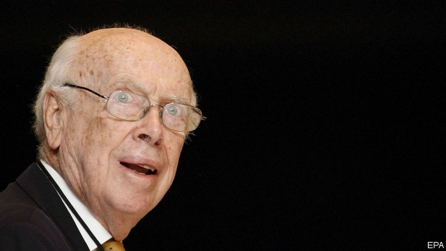

###### James Watson

# A pioneering biologist is reprimanded for unscientific, offensive views 

##### A great career comes to a sad end 

 

> Jan 17th 2019 

JAMES WATSON, Nobel laureate and co-discoverer with Francis Crick of the structure of DNA, has never deemed it necessary to hold in what he thinks, no matter how controversial. It would be acceptable to abort a fetus, he has said, if it carried genes that might mean the resulting adult was gay. He has suggested there is a link between sunlight and libido, once telling a lecture hall that this explains why there are “Latin lovers” but only “English patients”. Women in laboratories made it more fun for the men, he said, but they are probably less effective than the men. 

These dubious statements have not prevented Dr Watson, who delights in being a free thinker and agent provocateur, from holding the position among the world’s scientific elite that he and Crick acquired when they published their historic discovery in 1953, when he was just 25. Now, at the age of 90, he may, at last, have lost it. 

In a documentary aired recently on the Public Broadcasting Service (PBS) in the United States, “American Masters: Decoding Watson”, Dr Watson re-stated his view that black people are less intelligent than white, because of their genetics. Scientists everywhere condemned his comments. Cold Spring Harbor Laboratory on Long Island, New York, to which he has been affiliated for more than 60 years, immediately stripped him of his remaining links, including his honorary title of Chancellor Emeritus. Dr Watson’s comments, they said, were “reprehensible, unsupported by science...the laboratory condemns the misuse of science to justify prejudice.” 

The defenestration has been a long time coming. Dr Watson had already been forced to leave active duty at Cold Spring Harbor after he told a British newspaper in 2007 that he was “inherently gloomy about the prospect of Africa [because] all our social policies are based on the fact that their intelligence is the same as ours, whereas all the testing says, not really.” Although he wished everyone were equal, he said, “people who have to deal with black employees find this not true.” Though Dr Watson apologised for his comments at the time, his reputation suffered a big shock. 

In the recent PBS film Dr Watson was asked if his views on links between race and intelligence had changed since 2007. “No, not at all,” he said, in an apparent reversal of his earlier apology. “I would like for them to have changed, that there be new knowledge that says that your nurture is much more important than nature. But I haven’t seen any knowledge. And there’s a difference on the average between blacks and whites on IQ tests. I would say the difference is, it’s genetic.’’ He adds that he takes no pleasure in “the difference between blacks and whites” and wishes it didn’t exist. 

Dr Watson’s views about race and intelligence seem to stem from his keen interest in “The Bell Curve”, a book published in 1994 by Charles Murray and Richard Herrnstein, that, among other things, argued African-Americans were less intelligent than white Americans and genetic differences between ethnicities played a role in the difference. Modern genetic research has largely discredited these ideas. 

Biologists know that there is a substantial genetic component to intelligence. Depending on the precise measure of intelligence being studied and the statistical model being used, it can range anywhere from 20-60%. And observational research from the 1980s, cited by the authors of “The Bell Curve”, showed that, if you ask people to self-identify on the basis of ethnicity and then measure their mental performance in some way, for example IQ or the number of years in education, you will find differences in the mean attainment levels between different groups. 

Genetics, however, cannot be the main reason for any observed differences, says Ewan Birney, director of the European Bioinformatics Institute, in Cambridge, because self-identification of ethnicity does not easily map onto genetic ancestry. “African-Americans have a substantial amount of European genetic ancestry—you should in fact call them ‘African-European-Americans’,” observes Dr Birney. 

Dr Watson has easy access to these scientific insights, which are emerging thick and fast in a field of research that he helped invent. But if he knows about these latest ideas, he has not acted on them. 

“Jim Watson,” says Dr Birney, “is one of these scientists who has used his gut to think a lot, often with remarkable success, but this is a case where his gut is plain, flat wrong. He has had many people tell him that he is wrong and he has decided not to listen to that. And he has decided not to engage with people who know more than him in this area.” 

Dr Watson himself was unable to respond to his critics this week. According to family members who spoke with the New York Times, he has been in hospital following a car accident in October last year. 

Like any other group of people, scientists can be complicated, controversial and do not have to be loved by all. Even so, Dr Watson’s lifelong desire to provoke might write a bitter epitaph to an otherwise-great scientific career. 

