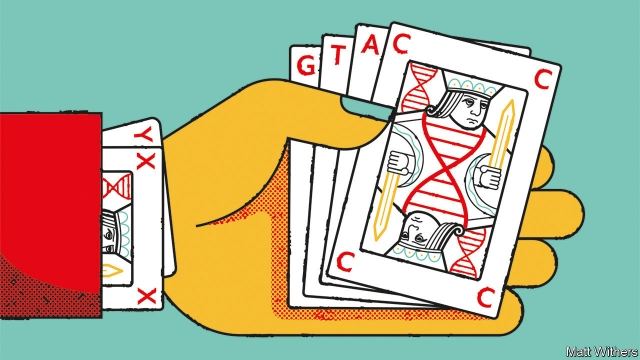

###### Extending the genetic code

# Adding new DNA letters make novel proteins possible 

##### One such, a cancer drug, is now in development 

 

> Jan 17th 2019 

 

THE FUZZY specks growing on discs of jelly in Floyd Romesberg’s lab at Scripps Research in La Jolla look much like any other culture of E. coli. But appearances deceive—for the DNA of these bacteria is written in an alphabet that has six chemical letters instead of the usual four. 

Every other organism on Earth relies on a quartet of genetic bases: A (adenine), C (cytosine), T (thymine) and G (guanine). These fit together in pairs inside a double-stranded DNA molecule, A matching T and C, G. But in 2014 Dr Romesberg announced that he had synthesised a new, unnatural, base pair, dubbed X and Y, and slipped them into the genome of E. coli as well. 

Kept supplied with sufficient quantities of X and Y, the new cells faithfully replicated the enhanced DNA—and, crucially, their descendants continued to do so, too. Since then, Dr Romesberg and his colleagues have been encouraging their new, “semisynthetic” cells to use the expanded alphabet to make proteins that could not previously have existed, and which might have properties that are both novel and useful. Now they think they have found one. In collaboration with a spin-off firm called Synthorx, they hope to create a less toxic and more effective version of a cancer drug called interleukin-2. 

In a normal cell, protein-making is a factory-like operation. DNA is first transcribed into RNA—also a string of bases, but a single, rather than a double strand. The RNA’s bases are then read, in groups of three known as codons, by a molecular machine called a ribosome. Sixty-one of the 64 possible codons correspond to one of 20 versions of a type of molecule called an amino acid. The other three act as “stop” signals. When a ribosome reads a codon, it links it with another molecule that carries the appropriate amino acid. The resulting string of amino acids is a protein. 

This arrangement has long been exploited to make natural proteins for use as drugs. The potential of semisynthetic cells is to do something similar, but with an un-natural protein as the result. That would permit a wider range of properties. 

Others have tried to achieve this by repurposing superfluous “stop” codons to encode novel amino acids, and one firm, Ambrx, has succeeded in doing so industrially. But this approach can add a maximum of only two amino acids to the existing set. Dr Romesberg’s process has already beaten that, with two published successes and another eight awaiting publication. His system could, in principle, provide 152 extra codons on top of the existing 64. 

Dr Romesberg and Laura Shawver, Synthorx’s boss, picked interleukin-2 in particular to work on because of the mismatch between its potential and its reality. Though it is useless at low doses—actually suppressing the immune response to tumours rather than enhancing it—at high doses it is extremely effective at promoting such an anti-tumour response. Unfortunately, a side-effect is that it damages the walls of blood vessels, causing plasma to leak out. When this happens in the lungs, the patient may drown. As Dr Shawver puts it, some people have been cured of their cancers thanks to interleukin-2, “but they have to live to tell the tale”. 

Interleukin-2 works by binding to, and stimulating the activity of, immune-system cells called lymphocytes. The receptor it attaches itself to on a lymphocyte’s surface is made of three units: alpha, beta and gamma. Immune cells with all three form a strong bond to interleukin-2, and it is this which triggers the toxic effect. If interleukin-2 can be induced to bind only to the beta and gamma units, however, the toxicity goes away. And that, experiments have shown, can be done by attaching polyethylene glycol (PEG) molecules to it. 

The trick is to make the PEGs stick. This is where the extended genetic alphabet comes in. Using it, Synthorx has created versions of interleukin-2 to which PEGs attach themselves spontaneously in just the right place to stop them linking to the alpha unit. Tested on mice, the modified molecule has exactly the desired anti-tumour effects. Synthorx plans to ask permission for human trials later this year. 

Dr Shawver sees THOR-707, as the new interleukin is known, as just the beginning. Synthorx already has synthetic versions of several others in the pipeline. And the wider possibilities are endless. The beauty of Dr Romesberg’s system is that it works without disrupting a cell’s normal function, making it possible to hijack cells’ factory-like properties to produce almost any “designer” protein. These might have properties not normally seen in organic molecules—semi-conductor proteins that can be woven into soft materials, perhaps. 

Nor need those who worry about genetically modified organisms escaping from the lab fret about this particular system. Without a steady supply of X and Y, any escapee would not get far in the wild. 

