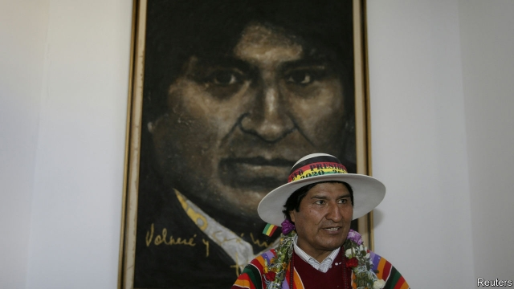

###### Adamant Evo

# The movement to stop Bolivia’s President Evo Morales 

##### Disregard for the constitution has provoked a backlash 

 

> Jan 17th 2019 

UNLIKE OTHER Latin American presidents with authoritarian leanings, Evo Morales has dominated his country less through coercion than through consent. Bolivia’s economy has grown by an average of nearly 5% a year during his 13 years in power, double the Latin American average. Although it remains South America’s poorest country, extreme poverty has fallen by more than half, according to the World Bank. Indigenous and mestizo Bolivians, a majority of the population, have made social and economic progress under the first president with indigenous roots. In 2017 he celebrated those achievements by building a museum in his home town whose collection features portraits of himself. 

Mr Morales, a former leader of a coca-growers’ union, has won three elections fairly and by large margins. He hopes to win a fourth in October. But his attempts to prolong his presidency have become increasingly high-handed. He has tightened his hold over the supposedly independent electoral commission. The government has leaned on the press, for example by withdrawing advertising from critical newspapers. Although Mr Morales might win a fair election in October, many Bolivians are worried that he will hold on to office whatever the vote. That fear has provoked a backlash, which has given heart to a divided opposition. 

Mr Morales’s candidacy is itself a cheat. On December 4th the supreme electoral tribunal granted his petition to be allowed to run for a fourth consecutive term. This builds on a ruling in 2017 by the constitutional court, which is as tame as the electoral authority, that all elected officials are entitled to run for re-election as many times as they want. Both decisions contradict the constitution adopted in 2009, which says that office-holders may not serve more than two consecutive terms. The rulings also flout the result of a referendum that Mr Morales held in February 2016, in which a narrow majority voted that he should not be able to seek re-election. 

On January 27th Bolivia will hold its first-ever primaries to select presidential candidates for each party, under a law passed last August. The opposition denounces them as a device for giving Mr Morales’s candidacy a spurious legitimacy. 

The grassroots 21F movement, named after the date in February when the referendum was held, has staged strikes and demonstrations since the constitutional court’s ruling. Its members are mostly from the middle class, which has grown during Mr Morales’s presidency and is now the largest socio-economic group, according to Captura, a consultancy. “Evo should leave power because he lost a referendum,” says Eli Peredo, a psychologist who took part in a march on December 6th in La Paz, Bolivia’s seat of government. The institutions he now threatens “were set up under a constitution that he was instrumental in bringing to life”, she points out. 

Some indigenous and social movements that once supported Mr Morales are having doubts. The government “has no right to violate the constitution,” says Cristóbal Huanca, an Aymara indigenous leader from a village near Oruro, south of La Paz. The government “treats us as though we are right-wing enemies if we disagree with him,” he says. Mr Morales’s foes are also indignant about corruption, an old problem that he has failed to control. 

Protests late last year turned violent. A woman died on December 6th in the northern city of Riberalta when she fell after challenging anti-government demonstrators who had forced shops to shut down. On December 11th the electoral tribunal’s regional headquarters and a branch of the government-owned telephone company were destroyed in Santa Cruz, an anti-Morales stronghold. The government blamed the demonstrators, mostly university students. Some witnesses claim that government agents had provoked the vandalism. After a lull, protests may well resume soon. 

21F avoids aligning itself with any political party. But Mr Morales’s rivals for the presidency hope to turn its anger into votes. The politician with the best chance of unseating him is Carlos Mesa, a centrist former president. In 2003, when he was Bolivia’s vice-president, he broke with the then-president, Gonzalo Sánchez de Lozada, over Mr Sánchez’s suppression of protests against the export of natural gas. That earned Mr Mesa, a historian and journalist by profession, popular respect. Some polls suggest he could beat Mr Morales. 

But many Bolivians regard Mr Mesa as a representative of the white ruling class, whose political hegemony Mr Morales ended. The opposition, which spans the political spectrum, has so far failed to unite behind him. Six other candidates plan to challenge Mr Morales. Some have called for a boycott of this month’s primaries. 

The president has reserves of strength. He is the left’s only leader of national stature. His party, the Movement towards Socialism, remains powerful in rural areas. Luis Paredes, a bus driver and coffee farmer who has prospered under Mr Morales, worries about slipping backwards if he loses. The president is not a dedicated democrat, Mr Paredes admits. But “frankly, making sure I have a stable income is more important to me than respecting the constitution”, he says. Mr Morales is sure to exploit that sentiment. 

