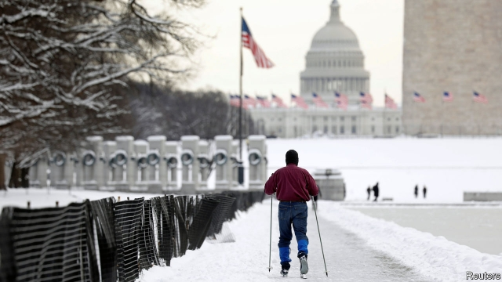

###### Snowing on the parade

# America’s government shutdown is an act of economic self-harm 

##### Its costs are mounting 

 

> Jan 17th 2019 

 

BEER BREWERS are facing bottlenecks. Airline passengers are facing queues. Around 800,000 federal employees are not being paid. These are the casualties of America’s government shutdown, which began on December 21st and is now the longest on record. It shows few signs of ending; its costs are climbing. 

Historically, such shutdowns seem barely to have budged the juggernaut that is the American economy. Economists at the Bureau of Economic Analysis (BEA) estimated that the 16-day funding lapse in October 2013 lowered real GDP growth in that quarter by 0.3 percentage points. This time, as only around 40% of federal employees are affected, most estimates of the weekly impact are even smaller. Economists at Moody’s, a rating agency, reckon that for each week it continues, the dent to GDP growth will be 0.04 percentage points. 

There are reasons to think that these numbers understate the impact of the shutdown. Kevin Hassett, chairman of the Trump administration’s Council of Economic Advisers, said on January 15th that after taking into account unpaid government contractors, his officials had recently doubled their estimates to a hit worth 0.1 percentage points per week. Congress has passed legislation to ensure that federal employees receive back pay. Although the government will have to pay its contractors (with interest) once the shutdown ends, in the past many of those companies did not pass the cash along to workers. 

Another caveat is that these figures measure the economic impact of the shutdown by valuing the public services that the government is no longer paying for. When the government reopens, the assumption is that GDP will be bumped up by roughly the same amount it was depressed by, with few lasting effects. 

This is quite a narrow view of the impact of shutting down government functions that support other economic activity. The closure of the Tax and Trade Bureau, for example, means that no new labels for nationally distributed beer can be approved, creating a headache for John Laffler of Off Color, an Illinois-based brewer. He wants to launch a new beer, and is keen to package it as soon as possible. He could gamble, pay for packaging and hope that the approval arrives. But that is risky, as there is no knowing what the regulators will approve. (He recalls a droopy-eyed fish being rejected. Demonic ladies dancing with goats were fine.) A wrong decision would cost him money. 

Beyond beer, the Securities and Exchange Commission has stopped reviewing IPO filings. Employees at the Transportation Security Administration (TSA), who run airport security checks, on January 16th reported unscheduled absences at a national rate of 6.1%, higher than the 3.7% rate a year earlier. Gummed-up airports cost passengers time and airlines money. 

Then there is the hardship faced by workers who are not being paid. In past shutdowns the impact on consumption was softened, as people expected them to be temporary and in the event they were brief. This one has lasted longer, and the poorest among those affected may not have savings to dip into. Mr Hassett says one of his employees is driving for Uber to make ends meet. Thousands of people are worried about losing housing subsidies. Regulators have instructed banks to work with borrowers and extend credit if necessary. But such services are unlikely to be free. 

The longer the shutdown lasts, the harder it will be to escape its teeth. On January 11th the TSA announced that employees will be treated to a $500 bonus and a day’s pay. The US Department of Agriculture is handing out food stamps for February early, to avoid tens of millions of Americans going without that month. If such loopholes run out, and the shutdown extends until March, then payments for food stamps worth $4.8bn per month will cease flowing. According to the economists at Moody’s, that alone would sap GDP by $8.2bn per month, given how quickly it would bite into spending. Shutdowns are non-linear: one that lasts twice as long will incur more than twice the cost. 

