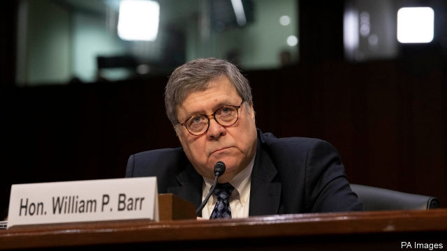

###### The law and the president

# America’s next attorney-general looks equipped for the trials ahead 

##### William Barr is no sheep 

 

> Jan 17th 2019 

 

UNDER ANY president but the current one, the appointment of William Barr as attorney-general would be uncontentious. The 68-year-old conservative lawyer is plainly up to a job he has already performed ably—for George H.W. Bush from 1991 to 1993. Yet the strains of being chief law-enforcement officer to Donald Trump are of a different order. And there were indications, ahead of his Senate confirmation hearing on January 15th and 16th, that Mr Barr might yield to them. 

The most alarming was his view, expressed last year in an unsolicited memo to the Justice Department, that Robert Mueller had no business investigating Mr Trump for possible obstruction of justice. Based on Mr Barr’s sketchy understanding of the special counsel’s inquiry into Mr Trump’s controversial decision to sack James Comey as FBI director, he described Mr Mueller’s obstruction theory as “fatally misconceived”. The president was entitled to sack Mr Comey, he argued, so he could not have obstructed justice by doing so. 

This was a dubious argument. Most legal scholars think that if Mr Trump fired his FBI director in a malign effort to stop him investigating the Russian election-hacking that is now central to Mr Mueller’s bigger probe, it could constitute obstruction. Yet Mr Barr’s view was consistent with his expansive view of presidential power, and within the boundaries of reasonable debate. The question before the Senate Judiciary Committee was therefore whether his comments represented ill-informed venting by a casual observer, or a more serious threat to Mr Mueller’s investigation. 

His testimony pointed to the former, with qualifications. Mr Barr praised Mr Mueller personally, describing him as a “good friend”, and said he would be “allowed to complete his work”. Refining his view, he also acknowledged instances in which Mr Trump might transgress while exercising his legal powers: for example, if he ended the Mueller probe to protect himself or his family. 

It seems safe to assume Mr Barr, whose confirmation looked unstoppable as The Economist went to press, will not meddle with the investigation. That makes him an improvement on the acting attorney-general, Matthew Whitaker, who seems to have fewer qualms. In some ways, too, he may improve on the policies of his permanent predecessor, Jeff Sessions. Mr Barr appears to have a more pragmatic view of marijuana policy, for example. Though against legalising pot, he said he would not enforce a federal prohibition in states that have done so, as Mr Sessions threatened to do. 

On sentencing and policing, he may also be less hardline than Mr Sessions. Though Mr Barr broadly shares the former attorney-general’s tough approach and focus on violent crime, he said his views had moderated a bit. He pledged to implement a criminal-justice reform passed by Congress last year, which Mr Sessions hated. Yet Mr Barr’s testimony did not allay another Mueller-related concern—about how he will manage the crucial endgame of the special counsel’s investigation. 

Asked whether he would make Mr Mueller’s final report public, Mr Barr said he would try to. He also rejected a suggestion by the president’s chief lawyer, Rudy Giuliani, that the White House could rewrite bits of it: “That will not happen.” Yet he noted that the special-counsel regulations would make the report “confidential” in the first instance. That is correct, and sections touching on sensitive national security matters might have to stay under wraps. Yet this is also the likely means by which Mr Trump, citing executive privilege, will try to limit whatever damage he faces from Mr Mueller’s findings. And it is not unreasonable to wonder whether Mr Barr will resist or abet him in that. 

