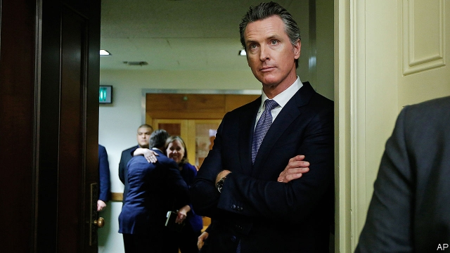

###### After Obamacare

# Democratic mayors and governors pitch reforms to health care 

##### Their ideas range from sensible to pie-in-the-sky 

 

> Jan 17th 2019 

 

NO WONK ASKED to describe their ideal health system would reach for the adjective American. Those who can afford it have access to the best care in the world, but costs are high and the country’s rate of health-insurance coverage is second to last among the OECD club of mostly rich countries—only Greece does a poorer job. Things would look worse had the Affordable Care Act (ACA), better known as Obamacare, not become law. In 2010, 15.5% of Americans lacked health insurance, compared with 8.7% in 2017. Reducing that to zero would require the kind of universal scheme Democrats crave. But that will not come soon. Meanwhile, Democrats in charge of big states and cities are taking it upon themselves to reduce their uninsured rates even further. Their ideas range from sensible to pie-in-the-sky. 

The share of people lacking health insurance varies enormously from state to state. Those that chose not to expand Medicaid (government health insurance for the very poor) out of their disdain for Obamacare have a higher proportion of uninsured people—more than twice as high as those that did expand. Having large numbers of illegal immigrants, who are four times likelier to be uninsured than citizens, also affects the number. Texas, a state with a large undocumented population and tight eligibility criteria for Medicaid, has the nation’s highest uninsured rate, at 17.3%. In Massachusetts, by contrast, it is 2.8%. 

Most Democrat-led states have already expanded their Medicaid programmes, though they must still contend with high health-care costs and the problem of uninsured, undocumented people. Gavin Newsom, the new governor of California, issued a plan on day one of the job. Mr Newsom would like to reinstate the requirement that everyone must have health insurance or else pay a penalty. Republicans killed that in the tax legislation of 2017. With those funds he would increase subsidies for people purchasing insurance on the exchanges set up under the ACA. He would use state funds to expand Medicaid coverage for young, undocumented people up to the age of 26 (the current cut-off is 19). Mr Newsom also suggested that California should negotiate directly with pharmaceutical firms over drug prices, a common tactic in other developed countries. 

Bill de Blasio, the mayor of New York, turned heads when he announced a seemingly groundbreaking proposal to guarantee health care for the city’s 600,000 uninsured people. Mr de Blasio, who appears to be flirting with a presidential run, chose “Morning Joe”, a television talk show, to unveil his “most comprehensive plan in the nation”—perhaps the kind of announcement aimed at Democratic primary voters who swoon at those three magic words, “Medicare for all”. It certainly seemed welcome to people like Michelle Fraser, a home-health aide in the city who looks after people for a living but cannot afford her own insurance. 

Yet, on inspection, the plan is less grand. It is a moderate expansion of existing programmes providing access to city hospitals, pharmacies, primary care and addiction-treatment services for the undocumented and uninsured. The estimated cost of the proposal, about $100m a year, also hints at its modesty. That works out at an expenditure of $167 per uninsured person. The average New Yorker spent $6,056 on health care in 2015, according to the Health Care Cost Institute, which collects data from large insurers. 

Other Democratic states are not sitting out. Jay Inslee, the governor of Washington, has proposed a public option on the state’s health-insurance exchanges, to provide choice in rural areas and control costs. From New Mexico to Minnesota, Democratic governors may allow residents to buy Medicaid. Each of these approaches could move America closer towards universal coverage, while avoiding the trap of trying to remake its health-care system overnight. Those Democrats vying for the presidential nomination are sure to run on a message of radical upheaval; their lesser-known comrades might actually get something done. 

