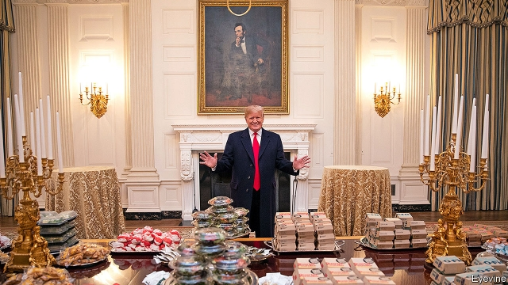
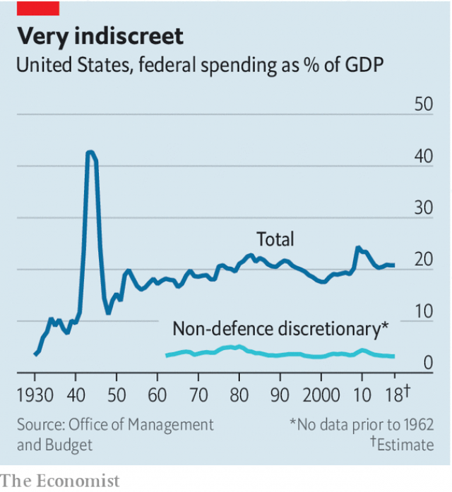

###### Who’s in charge?

# Donald Trump v Congress 

##### When it comes to domestic policy, the president is less powerful than he seems 

 

> Jan 17th 2019 

 

IN 1989 WILLIAM BARR, then a White House lawyer, wrote a memorandum warning the president to be mindful of attempts by Congress to encroach on his authority. Thirty years on Mr Barr, who will shortly become America’s attorney-general, has had to defend himself in his Senate confirmation hearings against the charge, which stems partly from the memo, that he holds an alarmingly expansionist theory of the presidency. Meanwhile, the actual president cannot extract funds from Congress to build a wall along the southern border. The president’s main set-piece, the State of the Union, may be postponed on the suggestion of Nancy Pelosi, the House speaker, who reminded the White House that the speech is given at the invitation of her office, and that perhaps a written version would be fine this time? 

The conflict between the legislative and executive branches that has given America its longest-ever shutdown is inherent to presidential systems. Juan Linz, a sociologist and political scientist at Yale who died in 2013, argued that though America’s constitution has been much-imitated, it only seemed to work in one place. Everywhere beyond America, making the legislative and executive branches coequal eventually resulted in stalemate. In Latin America, Linz observed, the deadlock was often broken by the army taking power. “The only presidential democracy with a long history of constitutional continuity is the United States,” he concluded in 1990. 

Since then, America’s government has suffered three prolonged shutdowns, and is therefore looking a bit less exceptional than it once did. When the two political parties were a jumbled collection of interest groups, conflict was easier to manage. Ronald Reagan could usually find enough like-minded Democrats to work with. Since then each party has become more ideologically uniform, with little overlap between them. The current president cannot find a single member of the House Democratic caucus who thinks that giving him $5.7bn for his wall so the shutdown can end is a reasonable deal. 

The dominant view of the presidency has long been that in the conflict with the legislature there is only one winner. Arthur Schlesinger argued in “The Imperial Presidency” that America had already passed the point of no return in the 1970s: the accretion of presidential power could not be undone, nor the office returned to something resembling what the founders intended. Bruce Ackerman, writing in 2010, echoed this in “The Decline and Fall of the American Republic”. Neomi Rao, whom President Donald Trump has nominated to be a judge on the DC circuit, published a paper in 2015 on “administrative collusion”, by which she meant the spineless tendency of lawmakers to give away powers to the executive. Yet the shutdown is a reminder of how powerful Congress remains. 

 

In some ways the presidency is less powerful domestically than it was 50 years ago. The White House has built up its own legal staff, suborning the Justice Department and pushing the limits of presidential authority wherever possible. Judged by spending, though, the executive branch is actually less imperial than under Eisenhower or Kennedy. The part of the budget that the executive actually spends (non-defence discretionary spending), accounts for a lower share of GDP now than in the 1960s. Congressional deadlock, which has been a feature of government since the mid-1990s, empowers the president in one way, inviting him to attempt rule by decree. It has also weakened the whole system that the president sits on top of. 

The concern that an overmighty POTUS is a threat to the republic is a staple of American politics. It is often accompanied by a side-order of hypocrisy. Thomas Jefferson insinuated that the first and second presidents harboured monarchical ambitions and then, when he held the office himself, concluded a deal doubling the territory of the republic without first asking Congress. Conservatives have tended to put up most resistance to presidential overreach, but find their party is now led by a president who has closed down a quarter of the federal government rather than bow to Congress, and wants to make extensive use of eminent domain to build his wall. 

Progressives cheered the expansion of presidential power in the 20th century up to the Vietnam war and Watergate. Since then they have worried more about circumscribing the powers of the White House. Before he published “The Imperial Presidency”, Schlesinger held a conventionally progressive view of the presidency, which during his lifetime had vanquished the Depression, the Nazis and Jim Crow. When Nixon left the White House, Democrats in Congress then set about codifying what presidents can and cannot do, to prevent future abuses. The first bill introduced by the new Democratic majority in the House is designed to accomplish a similar cleanup for the post-Trump era. 

That would be a sensible prophylactic. But it is also worth remembering that after Democrats lost their majority in the House in 2010, Barack Obama spent the remaining six years of his presidency issuing executive orders, most of which were then undone by his successor. Brendan Nyhan, a political scientist at the University of Michigan developed what he called the Green Lantern theory of the presidency, named after a DC Comics character. Mr Nyhan described this as, “the belief that the president can achieve any political or policy objective if only he tries hard enough or uses the right tactic.” Progressives who lamented the limitations of Mr Obama’s domestic power forgot all about this when Mr Trump took office, and assumed he could govern by force of will. He cannot, and so the shutdown goes on. 

