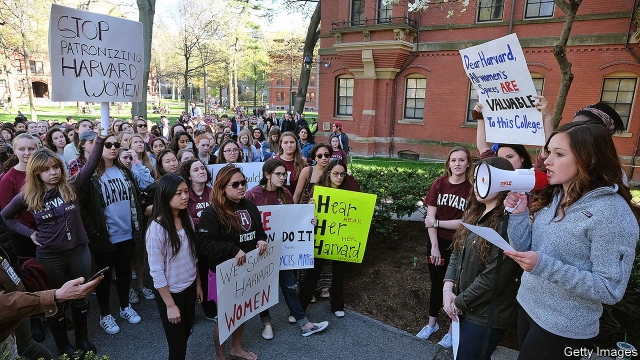

###### Toga, toga, to gone

# Harvard’s policy against single-sex clubs was meant to protect women 

##### It seems to be doing the opposite 

 

> Jan 17th 2019 

“I   JOINED [the Delta Gamma sorority at Harvard University] because I was looking for a group like my high-school friends that shared the same values and would come together regardless of major or extra-curriculars,” says Becca Ramos, who was chapter president of Delta Gamma in 2016. “There were so many nights when we studied together into the small hours. We’d go to each other’s thesis presentations. I went to one of my sisters’ presentation on volcanoes. I knew nothing about volcanoes except that they exploded, but I was so proud of her.” 

That support network is no longer available. Under new rules, introduced in 2016, members of what Harvard’s administration calls “unrecognised single-gender social organisations” are no longer eligible for campus leadership positions (such as captaincy of sports teams) or for dean’s letters of recommendation for scholarships. If the organisations went mixed, their members could escape these sanctions. Delta Gamma has closed; all but one of the other sororities have either followed suit or, in a few cases, gone mixed. But the remaining single-sex organisations have not given up. Last month, a group of them filed lawsuits, one in a federal court and one in a Massachusetts court. The university will respond next month. 

Despite scandals involving sexual misbehaviour and drunkenness, America’s fraternities and sororities are flourishing. Plenty of universities welcome them on campus for the support they provide to students, says Dani Weatherford, executive director of the National Panhellenic Conference, the biggest umbrella organisation of sororities. Undergraduate membership of the NPC’s sororities has increased by 60% over the past ten years. But a few universities have clamped down on fraternities. Amherst has banned them altogether; Harvard’s policy is nearly as stringent. 

The motivation for Harvard’s action seems mixed. In her letter to Harvard College’s dean, the university’s then president, Drew Faust, cited “deeply rooted gender attitudes and the related issues of sexual misconduct”, for which the sororities were presumably not being held responsible, as well as “forms of privilege and exclusion at odds with our deepest values” which she accused sororities, fraternities and final clubs (the most exclusive single-sex social clubs) of perpetuating. 

The policy has plenty of support. But many oppose it, too. Students marched in protest, and a sizeable minority of faculty are against it, including Harry Lewis, a former dean of the college and a computer-science professor for 44 years who taught both Bill Gates and Mark Zuckerberg. He has a lot of sympathy for the women in his discipline who join sororities. “It’s a way of getting away from the guys, who are always looking at them. There’ll be two women in a class of 20 men.” He characterises the battle as the old, liberal left, libertarians and the right against the new, more authoritarian left and the university authorities. 

The argument against the administration is in part one of principle. A former Harvard administrator who regards the clubs as “pretty obnoxious” (“If I had a kid at Harvard who belonged to one I’d tell him he could pay his own tuition”) nevertheless argues that freedom of association is important. “If we’d happily write letters for people who were members of the Communist Party or the NRA, it seems lunacy to say that we’d refuse that to somebody who wanted to join one of these clubs.” 

Opponents also argue that abolishing the organisations is not going to fulfil the administration’s aims. If the problem is “gender attitudes”, which presumably means discrimination against women, then the policy is counter-productive. Women are losing out more than men: while the sororities have almost all closed, the men’s organisations have not. “The men’s groups are older and therefore have a larger alumni base,” explains Ellen Rothschild, a former president of Harvard’s Alpha Phi chapter. “They’re able to turn away from the scholarships because they can rely on these outside networks.” 

If the aim is to reduce sexual harassment, there is little reason to believe that shutting down single-sex clubs would achieve that. A Harvard task force on combating sexual harassment, which urged Ms Faust to “address the distinctive problems presented by the final clubs”, based its concerns on a survey in which 47% of Harvard women who had taken part in final clubs’ events had experienced sexual harassment, compared with 31% of the female student body as a whole. Critics point out that correlation does not imply causation, and that the same survey showed that 87% of “non-consensual penetration involving physical force” at Harvard took place in dorms, which are run by the university. 

If the problem the university wants to address is class exclusivity, rather than gender discrimination, then the university’s policy would not mitigate it. There is no reason to believe that mixed-sex clubs would be any less socially exclusive than single-sex ones. Ms Ramos says she and her sisters at Delta Gamma surveyed the sorority and found that it was more socio-economically diverse than the university. 

Whoever wins in the courts, one sort of freedom will be the loser. If the administrators win, the students’ right to belong to whatever organisations they like will be constrained. If Harvard loses, the right of a private organisation to run itself as it pleases will be limited. 

