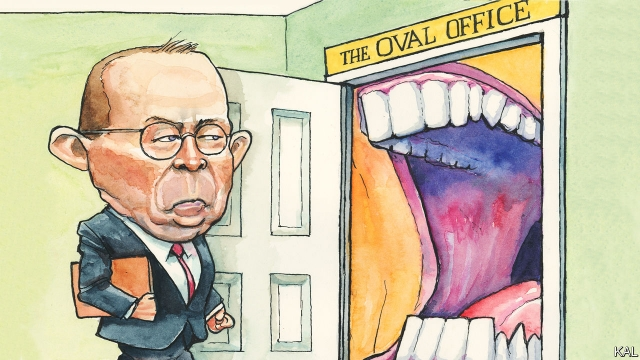

###### Lexington

# The wild rise of Mick Mulvaney 

##### Being Donald Trump’s chief-of-staff seems nasty, brutish and short 

 

> Jan 17th 2019 

 

MICK MULVANEY, the acting White House chief of staff, likes to speak of the political expertise he has brought to the monumental job he inherited in chaotic circumstances last month. “I absolutely believe there’s value to having political acumen in this position,” he told Lexington during a fireside chat (it was a cold day and the South Carolinian likes a log fire) in the West Wing. 

This makes sense, on the face of it. Mr Mulvaney served in Congress for six years before being picked by Donald Trump to run the Office of Management and Budget. He is personally genial, loves the cut and thrust of politics, and as a former congressman retains access to the House floor. He was there during Nancy Pelosi’s recent election as Speaker, jawing with his former Democratic sparring partners as the votes came in: “We talked about kids, talked sports, we also talked about politics.” By contrast, his predecessor, John Kelly, was a former general who disdained politicians, and was sometimes blindsided as a result. Yet the fact that Mr Mulvaney’s tenure as chief has coincided with the longest federal government shutdown on record, occasioned by Congress’s refusal to grant Mr Trump the billions he wants for a border wall, points to the limits of his political nous, or influence, or both. 

His expertise is to some degree limited by his politics. Mr Mulvaney rode the Tea Party wave into Congress, in 2010, and stuck to its principles. A founding member of the House Freedom Caucus, he was fiercely partisan, fiscally hawkish in his rhetoric, unstinting in his opposition to the Obama administration—and a fan of government shutdowns to that end. He says his experience of activist politics is helpful, because the president’s main opponent, Mrs Pelosi, “is going through her own Tea Party moment right now”. But the hard left, though troublesome for Mrs Pelosi, is less mutinous and obstructive than the populist right. Mr Mulvaney’s contrary view reflects a familiar misapprehension among partisans that the other side shares their pathologies. It appears to have led him to miscalculate Mrs Pelosi’s position. 

He initially encouraged Mr Trump to take a tough stance, arguing that Mrs Pelosi’s opposition to his demand was based on a fear of the left that would recede if and when she secured the Speakership. Yet Democratic resistance to the president’s demand has hardened across the board. This led Mr Mulvaney to push a compromise in which Congress would deliver half the $5.7bn of wall-funding Mr Trump wants. Yet that, by turn, overestimated the president’s willingness to concede an inch. In a meeting with Mrs Pelosi and other Democratic leaders, Mr Trump is reported to have yelled expletives at Mr Mulvaney for undermining him. 

The president is a much bigger problem for Mr Mulvaney than his political background. Even in a normal administration the job of chief of staff is thankless and relentless. James Baker, who did it for Ronald Reagan, called it “the worst fucking job in government”. Under Mr Trump, who resents discipline and contrary advice, dismisses expertise and often favours his relatives in the White House, Ivanka Trump and Jared Kushner, it is set up for failure. That was the fate of both Mr Kelly and, before him, Reince Priebus, Mr Trump’s first chief. Mr Mulvaney’s tenure will probably end the same way. This is why most of his rivals for the job ruled themselves out—including Mr Trump’s first choice, Nick Ayers, an ambitious 36-year-old who returned to Georgia rather than take up arguably the second-most-powerful position in Washington. 

Hence, too, Mr Mulvaney has kept his old job at the OMB, ensuring his new one is on a temporary footing, and makes modest claims for it: “No chief of staff has been successful in changing the president,” he says. Mr Kelly and other former aides to Mr Trump have described working for him as an exercise in damage limitation. Mr Mulvaney seems to be downplaying how much damage he can be expected to limit. 

Many doubt he will even try. Unlike Mr Kelly or Jim Mattis, the departed defence secretary, he has risen rapidly under Mr Trump from comparative obscurity. That probably makes him more reluctant to confront the president—a dispensation he shares with other Trump protégés such as Mike Pompeo, the secretary of state. It is not merely that the parvenus have more to lose by irking their patron. It is also that, having no experience of a normal administration, they are readier to accept the compromises that serving Mr Trump entails. That helps explain why the hawkish Mr Mulvaney has gone along with the president’s debt-fuelled spending boom. 

This is bad news. Mr Trump’s cabinet is getting less experienced, less committed, more pliant, and Mr Mulvaney’s rise reflects that. Yet he also has more attributes than his critics allow—including his willingness to compromise. While maintaining that he was at heart a “right-wing nut-job”, Mr Mulvaney won quiet plaudits at the OMB, which is no place for head-bangers. Despite his past professed enthusiasm for a “good shutdown”, he oversaw emergency funding measures there to help federal agencies cope with one. As a stopgap boss of the Consumer Financial Protection Bureau, which he had previously lobbied to abolish, he did less damage than some predicted. “If I shut it down, I would have been breaking the law,” Mr Mulvaney shrugs. Fierce critics of the administration—including Leon Panetta, another OMB director who became White House chief—reserve cautious praise for him. 

Mr Mulvaney has become less of an extremist. Perhaps his uncompromising former views said as much about the apoplectic state of his party as his view of government. Extremism was the quickest route to advancement for an ambitious Republican in 2010. And Mr Mulvaney’s manifest ability to know which way the wind is blowing is also faintly reassuring. Mr Trump’s embattled presidency will soon be held to account for the first time, by House Democrats and other investigators. Mr Mulvaney, a lawyer by training, will be careful what presidential actions he is associated with. 

