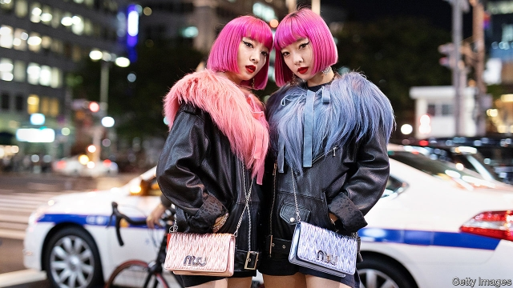

###### Defending the nail

# A Japanese court strikes a blow against exacting dress codes 

##### Could mandatory hair-dyeing be on its way out? 

 

> Jan 24th 2019 

 

JAPAN IS A country of conformity. As the saying goes, the nail that sticks up gets hammered down. For the most part, people obey rules without questioning their often flimsy or non-existent rationale. It was surprising, therefore, that two subway drivers in the city of Osaka refused to shave their beards to conform to the city’s “grooming standards”, despite receiving negative performance reviews and lower bonuses in punishment. It was even more surprising when, on January 16th, a court ordered the city to pay compensation to the pair for violating their “personal freedom”. Another court in Osaka is due to rule soon in a similar case brought by a female pupil against the city after her school obliged her to dye her naturally brown hair black to fit in with her classmates. 

Japan is rife with such rules about hair colour, style and facial hair. Schools and employers are the source of many of the silliest. Some go beyond appearance: many schools allow girls to wear only white underwear, as well as regulating the length of their skirts and the colour of their socks. Others are pointlessly hierarchical. A few companies reportedly ban new employees from using the lifts to begin with, making them climb the stairs to their offices instead. 

Over the years some bizarre but once common rules have disappeared, such as bans on drinking water during PE classes, which was thought to induce stomach pain. But others have become stricter. The Project to Eliminate “Black” School Rules, an NGO, found that students are more likely to encounter strict rules on hair length, eyebrow styling and the use of lip-balm and sunscreen today than they were ten years ago. 

It is no laughing matter. Annoying rules have been found to contribute to truancy, which is on the rise. Japan even has a word for suicide induced by onerous school rules—shidoshi. Pressure to shrug off pointless strictures is growing, as the court cases attest, but only slowly. For the moment, at least, rules still rule. 

-- 

 单词注释:

1.mandatory['mændәtәri]:a. 命令的, 托管的 [经] 受托者, 命令者 

2.Jan[dʒæn]:n. 一月 

3.conformity[kәn'fɒ:miti]:n. 遵照, 适合, 一致, 相似 [计] 符合度 

4.flimsy['flimzi]:a. 易坏的, 脆弱的, 浅薄的 n. 易损坏的东西(或材料), 薄纸, 描图用薄纸, 薄纸稿纸 

5.rationale[.ræʃә'nɑ:li]:n. 基本原理 [医] 原理, 理论 

6.Osaka[әu'sɑ:kә]:[经] 大阪 

7.conform[kәn'fɒ:m]:vt. 使一致, 使遵守, 使符合 vi. 一致, 符合, 适应 

8.groom[gru:m]:n. 马夫, 新郎, 男仆 vt. 喂马, 使...整洁, 推荐 vi. 打扮, 穿戴 

9.compensation[.kɒmpen'seiʃәn]:n. 补偿, 赔偿金, 工资 [医] 代偿(机能), 补偿 

10.rife[raif]:a. 流行的, 盛传的, 充满的 

11.pointlessly['pɔintlisli]:adv. 无意义地, 无用地, 无益地 

12.hierarchical[,haiә'rɑ:kikәl]:[计] 分级的, 分层的, 层次的 

13.reportedly[ri'pɒ:tidli]:adv. 根据传说, 根据传闻, 据报道 

14.bizarre[bi'zɑ:]:a. 奇异的 

15.PE[pei]:[计] 相位编码 [化] 磷脂酰乙醇胺 

16.induce[in'dju:s]:vt. 引诱, 招致, 归纳出, 感应 [医] 诱导, 感应 

17.ngo[]:abbr. 民间组织；非政府组织（Non-Governmental Organization） 

18.eyebrow['aibrau]:n. 眉毛 [医] 眉 

19.styling['stailiŋ]:n. 款式, 式样 

20.sunscreen['sʌnskri:n]:n. (防晒油中的)遮光剂 

21.truancy['tru:әnsi]:n. 玩忽职守, 旷课 [法] 旷学, 旷职, 玩忽职守 

22.suicide['sjuisaid]:n. 自杀, 自杀者 v. 自杀 a. 自杀的 

23.onerous['ɒnәrәs]:a. 繁重的, 负有法律责任的 [法] 负有义务的, 艰巨的, 繁重的 

24.pointless['pɒintlis]:a. 不尖的, 钝的, 不得要领的 

25.stricture['striktʃә]:n. 狭窄, 指责, 束缚 [医] 狭窄 

26.attest[ә'test]:vi. 证明, 表明, 作证 vt. 为...作证 

