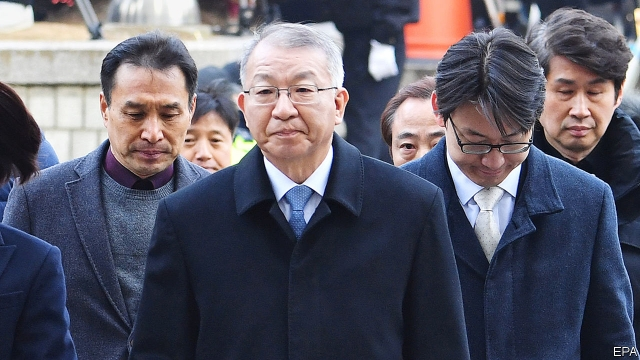

###### Judging the judges

# An influence-peddling scandal ensnares South Korea’s top court 

##### Prosecutors accuse a former chief justice of doing the president’s bidding 

 

> Jan 24th 2019 

 

FOR A MAN expressing remorse, Yang Seung-tae looked remarkably defiant. Standing outside South Korea’s Supreme Court on January 11th, the former chief justice said he felt sorry for “causing concern to people” regarding “events” during his term at the court, which ended in 2017. “I should take responsibility.” Even so, Mr Yang continued, nobody at the court had ever done anything “against the law” on his watch. Then he proceeded next door for questioning by prosecutors, to clear up all the things they had “misunderstood”. He failed: on January 24th he was arrested on some 40 charges stemming from his alleged abuse of his authority as a judge. 

Mr Yang’s indictment entangles the judiciary in the sprawling scandal that brought down Park Geun-hye, the previous president, and has implicated business tycoons, intelligence agencies and a grand university, among other pillars of the establishment. South Korean presidents wield huge authority with little oversight—a legacy of a long period of military dictatorship. Ms Park used her clout to get many supposedly upright and independent institutions to do her bidding. (She was impeached in 2017 and is serving a long prison sentence for corruption and abuse of power.) 

The prosecutors say that Mr Yang (pictured) neatly fitted this pattern, manipulating politically sensitive cases to suit Ms Park’s government. In return, they say he hoped for her backing for the creation of a new court of appeals to ease the workload of the Supreme Court. (Prosecutors say he hoped to take charge of the new court.) Mr Yang is also accused of forging documents, preventing the promotion of judges with left-wing views, passing confidential information to the president’s staff and misappropriating funds. 

The most prominent case Mr Yang is alleged to have interfered in concerns South Korean labourers’ claims for compensation for forced labour they performed at Japanese companies during the second world war. Mr Yang allegedly delayed proceedings so as not to jeopardise Ms Park’s efforts to improve diplomatic ties with Japan. The court ultimately ruled in favour of the plaintiffs after Mr Yang and Ms Park had both left office, causing the expected diplomatic ruckus. Mr Yang is also accused of trying, unsuccessfully, to move a trial related to the sinking of the Sewol ferry, in which 304 people died, to a different court. (The slow response of Ms Park’s government to the disaster sparked the protests that eventually led to her impeachment.) 

Documents which were made public last summer suggest that abuses were widespread. Investigators appointed by Kim Myeong-soo, Mr Yang’s successor, uncovered dozens of files with detailed instructions on how to consult with the government, rein in liberal judges and drag out certain cases. One document recommended Supreme Court judges consult the president’s office “unofficially and in advance” to preclude “unexpected” judgments in politically sensitive cases. Lim Jong-hun, another former Supreme Court justice, was arrested in October, accused of helping delay the forced-labour case, forging documents and manipulating other judgments. 

“The judiciary is one of the most privileged and exclusive institutions of the state,” says Kang Won-taek of Seoul National University. “It has changed little since democratisation; no government has ever attempted to reform the courts.” Park Jung-eun of People’s Solidarity for Participatory Democracy, a pressure group, goes further: “Officials feel they are above the people. Everything is done internally, without public scrutiny.” Senior judges belong to tight-knit networks that date back decades; many went to the same universities. Ms Park says this makes it difficult to uncover wrongdoing: “Whenever there are accusations, people stick together and the evidence disappears.” She expects more cases would come to light if the Supreme Court’s files were more closely scrutinised. 

Most South Koreans suspect that judges are too cosy with politicians and businessmen. They often complain that corrupt bosses get off too lightly. More than four-fifths believe the judiciary needs reform, and a majority say that serious crimes within institutions of the state should be investigated by an independent tribunal. 

Moon Jae-in, the president, has made the fight against corruption a central theme of his presidency, reiterating his support for judicial reform in his New Year’s speech. It is a hopeful sign that cases such as Mr Yang’s are now being investigated rather than swept under the carpet (the allegations against him were first aired while he was still in office, but not investigated until he had retired). Yet a constitutional amendment that aims to reduce abuses by curbing the power of the presidency failed to pass the National Assembly. Mr Moon invited Lee Jae-yong of Samsung, South Korea’s biggest conglomerate, to his official residence recently, though he is still serving a suspended sentence for paying bribes to Ms Park. It will take more than a few high-profile arrests to convince voters that things really are changing. 

-- 

 单词注释:

1.ensnare[in'snєә]:vt. 以陷阱捕捉, 诱入圈套, 诱捕 

2.prosecutor['prɒsikju:tә]:n. 实行者, 告发者, 公诉人 [法] 原告, 起诉人, 检举人 

3.Jan[dʒæn]:n. 一月 

4.remorse[ri'mɒ:s]:n. 懊悔, 良心不安, 自责, 同情 [法] 悔恨, 自责, 懊悔 

5.yang[jɑ:ŋ,jæŋ]:n. 杨（姓氏） 

6.remarkably[ri'mɑ:kәbli]:adv. 显著地, 引人注目地, 非常地 

7.defiant[di'faiәnt]:a. 挑衅的, 目中无人的 

8.allege[ә'ledʒ]:vt. 宣称, 主张, 提出, 断言 [法] 断言, 指称, 指证 

9.indictment[in'daitmәnt]:n. 起诉, 控告, 起诉状 [经] 起诉书 

10.entangle[in'tæŋgl]:vt. 使纠缠, 卷入, 使混乱 

11.judiciary[dʒu:'diʃiәri]:a. 司法的, 法院的, 法官的 n. 司法部, 司法系统, 法官 

12.sprawl[sprɒ:l]:vi. 伸开手足躺, 爬行, 蔓生, 蔓延 vt. 懒散地伸开, 使蔓生, 使不规则地伸展 n. 伸开手足躺卧姿势 

13.implicate['implikeit]:vt. 涉及, 含意, 暗示, 牵连 n. 包含的东西 

14.tycoon[tai'ku:n]:n. 企业界大亨, 将军 [经] 企业界巨头, 企业家 

15.Korean[kә'riәn]:n. 朝鲜人, 朝鲜语 a. 朝鲜人的, 朝鲜语的 

16.wield[wi:ld]:vt. 挥舞, 运用 

17.legacy['legәsi]:n. 祖先传下来之物, 遗赠物 [经] 遗产, 遗赠物 

18.dictatorship[dik'teitәʃip]:n. 独裁者之职位, 独裁, 独裁政权 [法] 专攻, 独裁权 

19.clout[klaut]:n. 敲击, 破布 vt. 打补钉 

20.supposedly[sә'pәuzidli]:adv. 想象上, 看上去像, 被认为是, 恐怕, 按照推测 

21.impeach[im'pi:tʃ]:vt. 控告, 怀疑, 检举, 弹劾 [法] 控告, 检举, 弹劾 

22.corruption[kә'rʌpʃәn]:n. 腐败, 堕落, 贪污 [计] 论误 

23.neatly['ni:tli]:adv. 整洁地, 干净地, 匀称地 

24.manipulate[mә'nipjuleit]:vt. 操纵, 利用, 操作, 巧妙地处理, 假造 

25.politically[]:adv. 政治上 

26.creation[kri:'eiʃәn]:n. 创造, 创作物, 发明 [化] 产生 

27.workload['wә:klәud]:n. 工作量 [化] 工作量 

28.forge[fɒ:dʒ]:n. 熔炉, 铁工厂 vt. 打制, 锻造, 伪造 vi. 锻造, 伪造 

29.promotion[prәu'mәuʃәn]:n. 晋级, 创建, 增进 [经] 推广, 推销, 促进 

30.misappropriate[.misә'prәuprieit]:vt. 侵占, 霸占, 盗用 [法] 侵占, 私吞, 贪污 

31.compensation[.kɒmpen'seiʃәn]:n. 补偿, 赔偿金, 工资 [医] 代偿(机能), 补偿 

32.allegedly[ә'ledʒidli]:adv. 依其申述 

33.proceeding[prәu'si:diŋ]:n. 进行, 程序, 行动, 诉讼程序, 事项 [化] 会议论文集 

34.jeopardise[]:vt. 使受危险, 危及, 危害 [法] 使受危害, 使陷入危险, 危及 

35.diplomatic[.diplә'mætik]:a. 外交的, 老练的 [法] 外交的, 外交上的, 文献上的 

36.plaintiff['pleintif]:n. 原告, 起诉人 [经] 原告, 原起诉人 

37.ruckus['rʌkәs]:n. 喧闹, 骚动 

38.unsuccessfully[]:adv. 无用；失败地 

39.Sewol[]:[网络] 岁月 

40.impeachment[im'pi:tʃmәnt]:[法] 控告, 检举, 弹劾 

41.investigator[in'vestigeitә]:n. 调查者, 审查者 [法] 审查员, 侦查员, 调查员 

42.kim[]:n. 金姆（人名） 

43.successor[sәk'sesә]:n. 继承者, 接任者 [计] 后继 

44.unofficially[]:adv. 非公认地；非正式地 

45.preclude[pri'klu:d]:vt. 预先排除, 预防, 阻止, 妨碍 [法] 预防, 排除, 消除 

46.unexpect[]:[网络] 意想不到；使意外 

47.judgment['dʒʌdʒmәnt]:n. 裁判, 宣告, 判决书 [医] 判断 

48.lim[]:abbr. 潜象存储器（Latent Image Memory）；秘鲁利马机场的代号 

49.kang[kɑ:ŋ]:n. （汉）炕 

50.Seoul[sәul]:n. 汉城 

51.democratisation[]:民主化 

52.solidarity[.sɒli'dæriti]:n. 团结, 团结一致, 共同一致 [法] 团结, 共同责任 

53.participatory[pɑ:'tisipeitәri]:a. 吸引参与的, 供人分享的 

54.internally[in'tәnәli]:[计] 内部的 

55.scrutiny['skru:tini]:n. 细看, 仔细检查, 监视, 选票检查 [经] 复查, 评核, 仔细检查 

56.accusation[ækju:'zeiʃәn]:n. 控告, 指控, 指责 [法] 控告, 起诉, 告发 

57.scrutinise[]:vt.vi. 细看, 仔细检查, 审查, 细阅 [经] 详细检查, 细细地看 

58.Korean[kә'riәn]:n. 朝鲜人, 朝鲜语 a. 朝鲜人的, 朝鲜语的 

59.tribunal[trai'bju:nl]:n. 法庭, 法官席, 裁决 [法] 法庭, 裁判所, 裁判 

60.presidency['prezidәnsi]:n. 总统职权, 总裁职位 

61.reiterate[ri:'itәreit]:vt. 反复地说, 重申, 反复地做 [法] 重述, 重申, 反覆地做 

62.judicial[dʒu:'diʃәl]:a. 法庭的, 公正的, 审判上的, 司法的 [法] 司法的, 审判上的, 法官的 

63.allegation[.æli'geiʃәn]:n. 断言, 主张, 申辩 [法] 声明, 事实陈述, 断言 

64.constitutional[.kɒnsti'tju:ʃәnl]:a. 宪法的, 立宪的, 体质的 [医] 全身的; 体质的 

65.amendment[ә'mendmәnt]:n. 修订, 改善, 改良, 改正 [化] 调理剂; 修正 

66.curb[kә:b]:n. 抑制, 勒马绳, 边石 vt. 抑制, 束缚, 勒住 

67.lee[li:]:n. 背风处, 避风处, 下风处, 保护, 庇护 a. 避风的, 背风的, 下风的, 保护的 

68.samsung[]:n. 三星电子（韩国电子公司） 

69.conglomerate[kәn'glɒmәrit]:a. 聚成球形的, 砾岩性的 n. 集成物, 混合体, 砾岩 v. (使)凝聚成团 

70.bribe[braib]:n. 贿赂 vt. 贿赂, 收买 vi. 行贿 

71.voter['vәutә]:n. 选民, 投票人 [法] 选民, 选举人, 投票人 

